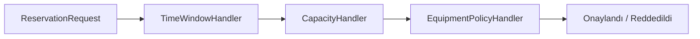

# Chain of Responsibility

## 1. Kısa Tanım

Chain of Responsibility, bir isteği handler zinciri boyunca işler.

Bu desenin en güzel yanı şu: “Bu kararı kim verecek?” sorusunu tek bir sınıfa kilitlemek yerine, sorumluluğu akış içinde yaşayan küçük parçalara dağıtır. Her handler kendi uzmanlık alanında konuşur, kalan işi sıradakine paslar.

## 2. Çözdüğü Problem

Bu desen, kod içinde sorumlulukların dağılması, tekrar eden karar bloklarının çoğalması, test edilebilirliğin azalması veya teknik detayların iş akışına karışması gibi problemleri azaltmak için kullanılır.

Özellikle .NET tabanlı kurumsal API projelerinde amaç şudur:

- Controller veya endpoint seviyesini sade tutmak
- Application katmanında use-case akışını okunabilir hale getirmek
- Domain davranışlarını teknik detaylardan korumak
- Değişen davranışları izole etmek
- Kod tekrarını kontrollü biçimde azaltmak
- Unit test yazılabilecek küçük bileşenler üretmek

## 3. Gerçek Hayat Senaryosu: Kampüs Etkinlik Salonu Rezervasyonu

Bir üniversite kampüsünde öğrenci kulüpleri etkinlik salonu rezerve ediyor olsun. Rezervasyon onaya gitmeden önce şu kontroller sırayla çalışıyor:

- Zaman aralığı mantıklı mı?
- Salon kapasitesi katılımcı sayısını karşılıyor mu?
- Projektör talebi varsa salonun teknik ekipmanı uygun mu?

Bu akış, kampüs yaşamındaki somut bir problemi sade ama güçlü biçimde modellediği için Chain of Responsibility’yi anlatmak için idealdir.

## 4. .NET İçinde Kullanım Yaklaşımı

ASP.NET Core middleware pipeline, MediatR pipeline behavior ve validation chain yapılarında görülür.

Uygulama yapılırken aşağıdaki kurallar korunmalıdır:

- Interface ve class isimleri açık ve niyet belirten şekilde seçilmelidir.
- `Manager`, `Helper`, `Util` gibi belirsiz isimlerden kaçınılmalıdır.
- Public class ve public üyelerde XML Documentation Comment standardı uygulanmalıdır.
- Async operasyonlarda `CancellationToken` kullanılmalıdır.
- Domain entity doğrudan API contract olarak dışarı açılmamalıdır.
- Test edilebilirlik için somut bağımlılıklar yerine abstraction kullanılmalıdır.

## 5. Mermaid Diyagramı



## 6. C# Örnek Kod (Derlenebilir)

```csharp
using System;
using System.Threading;
using System.Threading.Tasks;

/// <summary>
/// Kampüs etkinlik salonu rezervasyon isteğini temsil eder.
/// </summary>
public sealed record ReservationRequest(
    Guid StudentId,
    string RoomId,
    DateTime StartUtc,
    DateTime EndUtc,
    int ParticipantCount,
    bool RequiresProjector);

/// <summary>
/// Zincir sonucunda dönen doğrulama sonucunu temsil eder.
/// </summary>
public sealed record ValidationResult(bool IsApproved, string? Reason)
{
    /// <summary>
    /// Başarılı sonucu üretir.
    /// </summary>
    public static ValidationResult Approved() => new(true, null);

    /// <summary>
    /// Başarısız sonucu üretir.
    /// </summary>
    /// <param name="reason">Reddetme nedeni.</param>
    public static ValidationResult Rejected(string reason) => new(false, reason);
}

/// <summary>
/// Rezervasyon doğrulama zincirindeki handler sözleşmesidir.
/// </summary>
public interface IReservationValidationHandler
{
    /// <summary>
    /// Zincire bir sonraki handler'ı ekler.
    /// </summary>
    /// <param name="next">Bir sonraki handler.</param>
    IReservationValidationHandler SetNext(IReservationValidationHandler next);

    /// <summary>
    /// İsteği işler veya sıradaki handler'a aktarır.
    /// </summary>
    /// <param name="request">Rezervasyon isteği.</param>
    /// <param name="cancellationToken">İptal belirteci.</param>
    Task<ValidationResult> HandleAsync(ReservationRequest request, CancellationToken cancellationToken);
}

/// <summary>
/// Handler zincirinin temel davranışını sağlar.
/// </summary>
public abstract class ReservationValidationHandlerBase : IReservationValidationHandler
{
    private IReservationValidationHandler? _next;

    /// <inheritdoc />
    public IReservationValidationHandler SetNext(IReservationValidationHandler next)
    {
        _next = next;
        return next;
    }

    /// <inheritdoc />
    public async Task<ValidationResult> HandleAsync(ReservationRequest request, CancellationToken cancellationToken)
    {
        var currentResult = await ValidateAsync(request, cancellationToken);

        if (!currentResult.IsApproved)
        {
            return currentResult;
        }

        return _next is null
            ? ValidationResult.Approved()
            : await _next.HandleAsync(request, cancellationToken);
    }

    /// <summary>
    /// Handler'a özgü doğrulama adımını çalıştırır.
    /// </summary>
    protected abstract Task<ValidationResult> ValidateAsync(ReservationRequest request, CancellationToken cancellationToken);
}

/// <summary>
/// Zaman aralığı doğrulamasını yapar.
/// </summary>
public sealed class TimeWindowHandler : ReservationValidationHandlerBase
{
    /// <inheritdoc />
    protected override Task<ValidationResult> ValidateAsync(ReservationRequest request, CancellationToken cancellationToken)
    {
        if (request.StartUtc >= request.EndUtc)
        {
            return Task.FromResult(ValidationResult.Rejected("Başlangıç zamanı bitişten önce olmalıdır."));
        }

        if (request.StartUtc < DateTime.UtcNow)
        {
            return Task.FromResult(ValidationResult.Rejected("Geçmiş bir zaman aralığına rezervasyon açılamaz."));
        }

        return Task.FromResult(ValidationResult.Approved());
    }
}

/// <summary>
/// Katılımcı sayısına göre salon kapasite kontrolü yapar.
/// </summary>
public sealed class CapacityHandler : ReservationValidationHandlerBase
{
    private readonly int _maxCapacity;

    /// <summary>
    /// CapacityHandler sınıfının yeni bir örneğini başlatır.
    /// </summary>
    /// <param name="maxCapacity">Salonun maksimum kapasitesi.</param>
    public CapacityHandler(int maxCapacity) => _maxCapacity = maxCapacity;

    /// <inheritdoc />
    protected override Task<ValidationResult> ValidateAsync(ReservationRequest request, CancellationToken cancellationToken)
    {
        return request.ParticipantCount > _maxCapacity
            ? Task.FromResult(ValidationResult.Rejected("Katılımcı sayısı salon kapasitesini aşıyor."))
            : Task.FromResult(ValidationResult.Approved());
    }
}

/// <summary>
/// Teknik ekipman gereksinimlerini doğrular.
/// </summary>
public sealed class EquipmentPolicyHandler : ReservationValidationHandlerBase
{
    private readonly bool _projectorAvailable;

    /// <summary>
    /// EquipmentPolicyHandler sınıfının yeni bir örneğini başlatır.
    /// </summary>
    /// <param name="projectorAvailable">Salonda projektör olup olmadığı.</param>
    public EquipmentPolicyHandler(bool projectorAvailable) => _projectorAvailable = projectorAvailable;

    /// <inheritdoc />
    protected override Task<ValidationResult> ValidateAsync(ReservationRequest request, CancellationToken cancellationToken)
    {
        return request.RequiresProjector && !_projectorAvailable
            ? Task.FromResult(ValidationResult.Rejected("Projektör talebi karşılanamıyor."))
            : Task.FromResult(ValidationResult.Approved());
    }
}
```

## 7. Ne Zaman Kullanılır?

- Aynı davranış birden fazla yerde tekrar etmeye başladıysa
- Değişen kararları merkezi veya açık bir modele almak gerekiyorsa
- Unit test yazmak için davranışın izole edilmesi gerekiyorsa
- Controller, handler veya servis sınıfı fazla sorumluluk almaya başladıysa
- Yeni davranış eklerken mevcut kodu bozma riski yükseldiyse

## 8. Ne Zaman Kullanılmamalıdır?

- Problem henüz basitse ve desen gereksiz soyutlama üretecekse
- Tek kullanımlık, değişmeyecek ve kritik olmayan bir kod parçası için ağır bir yapı kurulacaksa
- Ekip deseni anlamadan sadece “pattern kullanmış olmak” için uygulanacaksa
- Daha sade bir method veya küçük class ayrımı yeterliyse

## 9. Avantajlar

- Kodun okunabilirliğini artırır.
- Sorumlulukları daha net ayırır.
- Test edilebilirliği güçlendirir.
- Değişiklik etkisini sınırlar.
- Clean Architecture yaklaşımını destekler.
- Domain ve application sınırlarını korumaya yardımcı olur.

## 10. Riskler

- Zincir gereğinden fazla uzarsa takip edilmesi zorlaşabilir.
- Handler sırası yanlış kurgulanırsa beklenmeyen sonuçlar üretilebilir.
- Her küçük kontrol için ayrı sınıf açmak, basit senaryolarda gereksiz karmaşıklık yaratabilir.

## 11. Test Edilebilirlik Notları

- Her handler tek bir sorumluluk taşıdığı için birim testleri yalın olur.
- Başarısız bir handler’ın zinciri durdurduğunu ve doğru mesaj döndürdüğünü izole testlerle doğrulayabilirsiniz.
- `SetNext` ile farklı zincir kombinasyonları kurup edge-case senaryolarını kolayca test edebilirsiniz.
