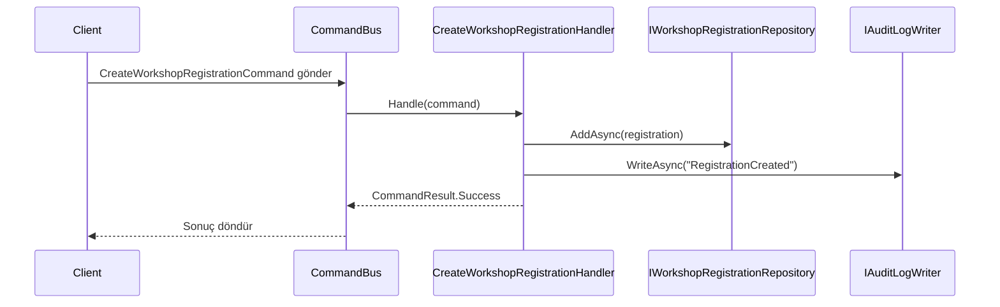

# Command

## 1. Kısa Tanım

Command, bir isteği nesneye dönüştürür. Böylece “hangi iş yapılacak?” sorusu, işi çağıran koddan ayrılır; kuyruklama, loglama, geri alma (undo) ve yeniden yürütme (redo) gibi yetenekler daha doğal hale gelir.

## 2. Çözdüğü Problem

Bazı kodlarda aynı sahneyi tekrar tekrar görürüz: endpoint bir karar verir, servis başka bir karar verir, ardından iş kuralları dağılıp gider. Birkaç sprint sonra aynı akışa yeni adım eklemek küçük bir düzenleme olmaktan çıkar.

Command bu dağınıklığı toplar:

- İstek bir `Command` nesnesinde taşınır.
- İşin nasıl yapılacağı `Handler` içinde yaşar.
- Çağıran taraf (API/UI) yalnızca komutu üretir ve gönderir.

Bu ayrım .NET tarafında özellikle CQRS/MediatR yaklaşımıyla çok iyi oturur.

## 3. Ne Zaman Kullanılır?

- Aynı iş akışı farklı kanallardan (API, worker, zamanlanmış görev) tetikleniyorsa
- İşlemleri kuyruklamak veya geçmişe dönük izlemek gerekiyorsa
- “Geri al” veya “yeniden dene” beklentisi varsa
- Controller/Application Service sınıfları gereğinden fazla şişmeye başladıysa

## 4. Avantajlar ve Riskler

### Avantajlar

- Sorumlulukları net ayırır, kodu okunur kılar.
- İş akışlarını bağımsız test etmeyi kolaylaştırır.
- Kuyruklama, loglama, retry gibi çapraz ihtiyaçlara alan açar.
- Yeni komut eklerken mevcut akışa dokunma ihtiyacını azaltır.

### Riskler

- Çok basit senaryolarda gereksiz soyutlama üretebilir.
- Yanlış isimlendirme (`DoWorkCommand` gibi belirsiz adlar) modeli hızla anlaşılmaz hale getirir.
- Handler içinde fazla teknik detay birikirse desenin sağladığı sadelik kaybolur.

## 5. Mermaid Diyagramı



## 6. C# Örnek Kodu (.NET)

```csharp
using System;
using System.Threading;
using System.Threading.Tasks;

/// <summary>
/// Atölye kaydı oluşturma isteğini temsil eden komuttur.
/// </summary>
/// <param name="WorkshopId">Kayıt yapılacak atölye kimliği.</param>
/// <param name="ParticipantEmail">Katılımcı e-posta adresi.</param>
public sealed record CreateWorkshopRegistrationCommand(
    Guid WorkshopId,
    string ParticipantEmail);

/// <summary>
/// Komut işleyicileri için temel sözleşmeyi tanımlar.
/// </summary>
/// <typeparam name="TCommand">İşlenecek komut türü.</typeparam>
public interface ICommandHandler<in TCommand>
{
    /// <summary>
    /// Verilen komutu işler.
    /// </summary>
    /// <param name="command">İşlenecek komut.</param>
    /// <param name="cancellationToken">İşlemi iptal etmek için kullanılan token.</param>
    /// <returns>İşlem sonucunu temsil eden değer.</returns>
    Task<CommandResult> HandleAsync(TCommand command, CancellationToken cancellationToken);
}

/// <summary>
/// Atölye kayıt ekleme operasyonunu yürüten command handler'dır.
/// </summary>
public sealed class CreateWorkshopRegistrationHandler
    : ICommandHandler<CreateWorkshopRegistrationCommand>
{
    private readonly IWorkshopRegistrationRepository _repository;
    private readonly IAuditLogWriter _auditLogWriter;

    /// <summary>
    /// Handler bağımlılıklarını alır.
    /// </summary>
    /// <param name="repository">Kayıtların kalıcı olarak saklandığı depo.</param>
    /// <param name="auditLogWriter">Denetim kaydı yazıcısı.</param>
    public CreateWorkshopRegistrationHandler(
        IWorkshopRegistrationRepository repository,
        IAuditLogWriter auditLogWriter)
    {
        _repository = repository;
        _auditLogWriter = auditLogWriter;
    }

    /// <inheritdoc />
    public async Task<CommandResult> HandleAsync(
        CreateWorkshopRegistrationCommand command,
        CancellationToken cancellationToken)
    {
        WorkshopRegistration registration;
        try
        {
            registration = WorkshopRegistration.Create(command.WorkshopId, command.ParticipantEmail);
        }
        catch (ArgumentException exception)
        {
            return CommandResult.Failure(exception.Message);
        }

        await _repository.AddAsync(registration, cancellationToken);

        try
        {
            await _auditLogWriter.WriteAsync(
                $"Workshop registration created: {registration.Id}",
                cancellationToken);
        }
        catch (Exception)
        {
            return CommandResult.Failure("Audit logging failed after registration creation.");
        }

        return CommandResult.Success();
    }
}

/// <summary>
/// Komut işleme sonucunu temsil eder.
/// </summary>
public sealed record CommandResult(bool IsSuccess, string? ErrorMessage)
{
    /// <summary>
    /// Başarılı bir sonuç üretir.
    /// </summary>
    /// <returns>Başarılı command sonucu.</returns>
    public static CommandResult Success() => new(true, null);

    /// <summary>
    /// Başarısız bir sonuç üretir.
    /// </summary>
    /// <param name="errorMessage">Hata detayını açıklayan mesaj.</param>
    /// <returns>Başarısız command sonucu.</returns>
    public static CommandResult Failure(string errorMessage) => new(false, errorMessage);
}

/// <summary>
/// Atölye kayıt deposu sözleşmesini tanımlar.
/// </summary>
public interface IWorkshopRegistrationRepository
{
    /// <summary>
    /// Yeni kaydı kalıcı depoya ekler.
    /// </summary>
    /// <param name="registration">Eklenecek kayıt nesnesi.</param>
    /// <param name="cancellationToken">İşlemi iptal etmek için kullanılan token.</param>
    Task AddAsync(WorkshopRegistration registration, CancellationToken cancellationToken);
}

/// <summary>
/// Audit kayıt yazma sözleşmesini tanımlar.
/// </summary>
public interface IAuditLogWriter
{
    /// <summary>
    /// Verilen mesajı audit kaydı olarak yazar.
    /// </summary>
    /// <param name="message">Yazılacak açıklama metni.</param>
    /// <param name="cancellationToken">İşlemi iptal etmek için kullanılan token.</param>
    Task WriteAsync(string message, CancellationToken cancellationToken);
}

/// <summary>
/// Atölye kaydını temsil eden domain modelidir.
/// </summary>
public sealed class WorkshopRegistration
{
    /// <summary>
    /// Kayıt kimliğini alır.
    /// </summary>
    public Guid Id { get; private init; }

    /// <summary>
    /// Atölye kimliğini alır.
    /// </summary>
    public Guid WorkshopId { get; private init; }

    /// <summary>
    /// Katılımcı e-posta adresini alır.
    /// </summary>
    public string ParticipantEmail { get; private init; } = string.Empty;

    private WorkshopRegistration()
    {
    }

    /// <summary>
    /// Yeni bir atölye kaydı oluşturur.
    /// </summary>
    /// <param name="workshopId">Atölye kimliği.</param>
    /// <param name="participantEmail">Katılımcı e-posta adresi.</param>
    /// <returns>Yeni oluşturulan kayıt nesnesi.</returns>
    public static WorkshopRegistration Create(Guid workshopId, string participantEmail)
    {
        if (workshopId == Guid.Empty)
        {
            throw new ArgumentException("Workshop ID cannot be empty.", nameof(workshopId));
        }

        if (string.IsNullOrWhiteSpace(participantEmail))
        {
            throw new ArgumentException("Participant email is required.", nameof(participantEmail));
        }

        return new WorkshopRegistration
        {
            Id = Guid.NewGuid(),
            WorkshopId = workshopId,
            ParticipantEmail = participantEmail
        };
    }
}
```

## 7. Gerçek Hayat Senaryosu

Bir eğitim platformunda kullanıcılar atölyelere kayıt oluyor. Web uygulaması, mobil uygulama ve bir partner portalı aynı kaydı farklı noktalardan tetikleyebiliyor.  

`CreateWorkshopRegistrationCommand` kullanıldığında tüm kanallar tek bir iş akışına bağlanır. Böylece:

- Kayıt adımı her kanalda aynı kurallarla çalışır.
- Audit log her işlemde standart şekilde tutulur.
- Yarın “kayıt sonrası hoş geldin e-postası kuyruğa yazılsın” denildiğinde yalnızca ilgili handler akışı genişletilir.
- Üretimde kalıcılık ve audit adımlarını atomik yürütmek için Transactional Outbox yaklaşımı eklenebilir.

## 8. Test Edilebilirlik Notları

- Handler bağımlılıkları interface üzerinden geçtiği için mock/fake ile kolayca izole edilir.
- “Repository çağrıldı mı, audit yazıldı mı?” gibi doğrulamalar unit testte net biçimde yapılır.
- Hata senaryolarında `CommandResult` üzerinden davranış kontrolü sağlanır; exception ve sonuç politikası açıkça test edilir.
