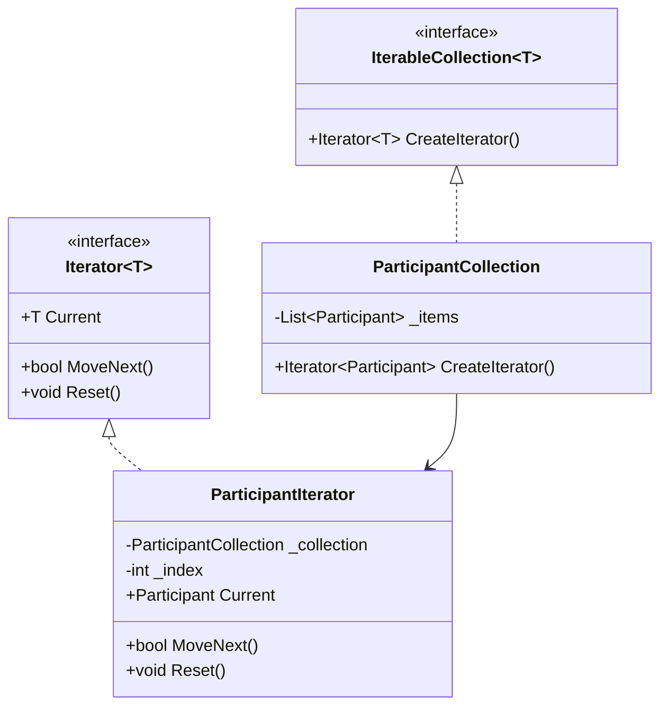

# Iterator

Iterator, bir koleksiyonun iç yapısını açmadan elemanları sırayla dolaşmayı sağlar. Yani "veriyi nasıl tuttuğunu" değil, "veriyi nasıl gezeceğini" konuşursunuz.

**Kategori:** Application Design Patterns → Behavioral Patterns  
**Seviye:** Easy  
**Odak:** .NET / C#

## Problem Tanımı

Koleksiyon büyüdükçe dolaşım kuralları da çeşitlenir: sadece aktif kayıtlar, sayfalı gezinme, ters sıra, filtrelenmiş akış, asenkron okuma...

Bu kurallar doğrudan koleksiyon sınıfına ya da servis metodlarına gömülünce kod hızla hantallaşır. Iterator deseni, dolaşım davranışını ayrı bir soyutlamaya alarak hem koleksiyonun hem de tüketen kodun sade kalmasını sağlar.

## Ne Zaman Kullanılır?

- Aynı veri üzerinde birden fazla gezinme stratejisi gerekiyorsa (normal, ters, filtreli, sayfalı)
- Tüketen kodun koleksiyonun iç temsilini bilmesini istemiyorsanız
- `foreach`, `yield return`, `IEnumerable<T>`, `IAsyncEnumerable<T>` gibi .NET mekanizmalarını net bir tasarımla kullanmak istiyorsanız
- Testlerde veri akışını kontrollü şekilde simüle etmek istiyorsanız

## Gerçek Hayat Senaryosu (Finans Dışı)

Bir etkinlik yönetim platformunda organizatör paneli düşünün. Panel, katılımcıları tek seferde yüklemek yerine sayfa sayfa geziyor:

- İlk iterasyon: sadece check-in yapmamış katılımcılar
- İkinci iterasyon: VIP katılımcılar
- Üçüncü iterasyon: son 24 saatte kayıt olanlar

Panelin ekran kodu, bu listelerin veritabanından nasıl çekildiğini bilmeden yalnızca iterator üzerinden kayıtları işler. Böylece veri kaynağı değişse bile (SQL, API, cache), ekran tarafı büyük ölçüde aynı kalır.

## UML / Mermaid Diyagramı



## C# Örnek Kodu (.NET)

Aşağıdaki örnek derlenebilir bir iterator akışı gösterir:

```csharp
using System;
using System.Collections;
using System.Collections.Generic;

namespace PatternCraft.IteratorExample;

/// <summary>
/// Etkinlik katılımcısını temsil eder.
/// </summary>
public sealed record Participant(string FullName, bool CheckedIn);

/// <summary>
/// Katılımcı koleksiyonunu dış dünyaya yalnızca iterator davranışıyla açar.
/// </summary>
public sealed class ParticipantCollection : IEnumerable<Participant>
{
    private readonly List<Participant> _items = new();

    /// <summary>
    /// Koleksiyona yeni bir katılımcı ekler.
    /// </summary>
    /// <param name="participant">Eklenecek katılımcı.</param>
    public void Add(Participant participant) => _items.Add(participant);

    /// <summary>
    /// Koleksiyonun iterator'ını döner.
    /// </summary>
    /// <returns>Katılımcılar üzerinde dolaşan enumerator.</returns>
    public IEnumerator<Participant> GetEnumerator()
    {
        foreach (var participant in _items)
        {
            yield return participant;
        }
    }

    IEnumerator IEnumerable.GetEnumerator() => GetEnumerator();
}

public static class Demo
{
    public static void Main()
    {
        var participants = new ParticipantCollection();
        participants.Add(new Participant("Aylin Demir", CheckedIn: false));
        participants.Add(new Participant("Kerem Yıldız", CheckedIn: true));
        participants.Add(new Participant("Mina Kaya", CheckedIn: false));

        foreach (var participant in participants)
        {
            if (!participant.CheckedIn)
            {
                Console.WriteLine($"Bekleyen check-in: {participant.FullName}");
            }
        }
    }
}
```

## Avantajlar

- Koleksiyon yapısı ile dolaşım davranışını ayırır
- `foreach` uyumluluğu sayesinde tüketen kodu sadeleştirir
- Yeni gezinme kuralları eklenirken mevcut kodu daha az etkiler
- Birim testlerde farklı iterator davranışlarını izole etmeyi kolaylaştırır

## Riskler ve Sınırlamalar

- Basit bir liste ihtiyacı için gereksiz soyutlama oluşturabilir
- Çok sayıda özel iterator tipi, kod tabanında dağınıklık yaratabilir
- Uzun ömürlü iteratorlarda koleksiyonun eşzamanlı değişimi dikkatle yönetilmelidir

## Test Edilebilirlik Notları

- Iterator kullanan servisler, `IEnumerable<T>`/`IAsyncEnumerable<T>` üzerinden kolayca mock/fake edilebilir
- Sınır durumları özellikle test edilmelidir: boş koleksiyon, tek eleman, büyük veri seti
- Akış temelli testlerde "sıra" beklentisi açıkça doğrulanmalıdır
