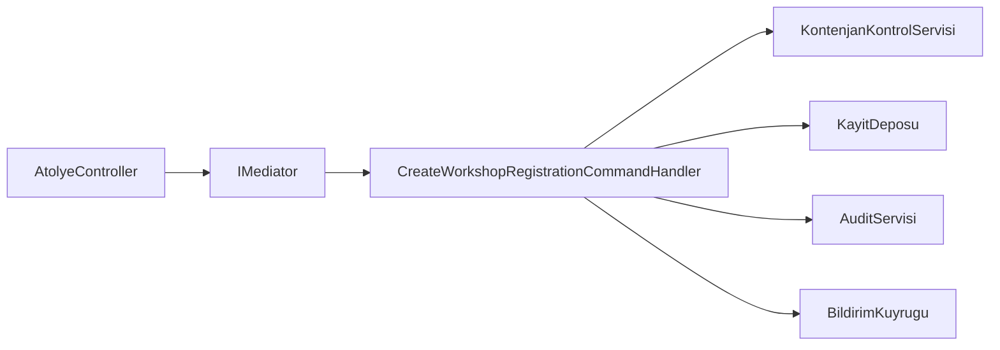

# Mediator

## 1. Kısa Tanım

Mediator, sınıfların birbirine doğrudan tutunmasını engelleyip iletişimi tek bir merkezde toplar.
Böylece ekip, “kim kimi çağırıyordu?” sorusunu kod avına çıkmadan cevaplayabilir.

## 2. Çözdüğü Problem

Bir uygulama büyüdükçe istek akışları farklı sınıflara dağılır: doğrulama başka yerde, iş kuralı başka yerde, bildirim ve log başka yerde.
Bu dağılım kontrolsüz olduğunda sınıflar birbirini tanımaya başlar ve küçük bir değişiklik domino etkisi yaratır.

Mediator bu karmaşayı şu şekilde sakinleştirir:

- İstek gönderen taraf (ör. Controller) sadece mediator'ı bilir.
- İşin nasıl çözüleceğini ilgili handler üstlenir.
- Akışa yeni davranış eklemek, mevcut sınıfları zincirleme değiştirmeden mümkün olur.

## 3. Gerçek Hayat Senaryosu: Etkinlik Atölye Kayıt Akışı

Bir belediye kültür merkezinin etkinlik platformunu düşünelim:

- Kullanıcı bir atölyeye kayıt olmak için istek gönderir.
- Sistem kontenjanı kontrol eder.
- Kayıt başarılıysa bilgilendirme e-postası kuyruğa alınır.
- Aynı anda denetim kaydı oluşturulur.

Bu akışta controller'ın kontenjan servisini, bildirim servisini ve audit bileşenini tek tek yönetmesi yerine, istek mediator'a gider; ilgili handler tüm orkestrasyonu yönetir.

## 4. .NET İçinde Kullanım Yaklaşımı

.NET tarafında MediatR gibi bir kütüphane ile command/query ayrımı yapılarak temiz bir uygulama akışı kurulabilir.
Özellikle şu durumlarda etkisi yüksektir:

- API katmanını ince tutmak istiyorsanız
- Use-case bazlı handler organizasyonu arıyorsanız
- Unit testlerde davranışı izole etmek istiyorsanız

## 5. Mermaid Diyagramı



## 6. C# Örnek Kodu

```csharp
using MediatR;

namespace PatternCraft.Application.Workshops;

/// <summary>
/// Bir kullanıcının belirli bir atölyeye kaydolma isteğini temsil eder.
/// </summary>
/// <param name="WorkshopId">Kayıt olunmak istenen atölye kimliği.</param>
/// <param name="UserId">Kaydı başlatan kullanıcı kimliği.</param>
public sealed record CreateWorkshopRegistrationCommand(Guid WorkshopId, Guid UserId) : IRequest<RegistrationResult>;

/// <summary>
/// Atölye kayıt komutunu işleyerek kontenjan kontrolü ve kayıt operasyonunu yürütür.
/// </summary>
public sealed class CreateWorkshopRegistrationCommandHandler : IRequestHandler<CreateWorkshopRegistrationCommand, RegistrationResult>
{
    private readonly IWorkshopQuotaService _quotaService;
    private readonly IWorkshopRegistrationRepository _repository;

    /// <summary>
    /// Handler bağımlılıklarını başlatır.
    /// </summary>
    public CreateWorkshopRegistrationCommandHandler(
        IWorkshopQuotaService quotaService,
        IWorkshopRegistrationRepository repository)
    {
        _quotaService = quotaService;
        _repository = repository;
    }

    /// <summary>
    /// Kayıt isteğini doğrular, kontenjan uygunsa kaydı oluşturur.
    /// </summary>
    /// <param name="request">İşlenecek kayıt komutu.</param>
    /// <param name="cancellationToken">İptal sinyali.</param>
    /// <returns>İşlem sonucu.</returns>
    public async Task<RegistrationResult> Handle(CreateWorkshopRegistrationCommand request, CancellationToken cancellationToken)
    {
        var hasQuota = await _quotaService.HasQuotaAsync(request.WorkshopId, cancellationToken);
        if (!hasQuota)
        {
            return RegistrationResult.Failed("Atölye kontenjanı dolu.");
        }

        await _repository.AddAsync(request.WorkshopId, request.UserId, cancellationToken);
        return RegistrationResult.Success();
    }
}

/// <summary>
/// Atölye kontenjan bilgisini sağlayan sözleşme.
/// </summary>
public interface IWorkshopQuotaService
{
    /// <summary>
    /// İlgili atölyede kayıt için boş kontenjan olup olmadığını döner.
    /// </summary>
    Task<bool> HasQuotaAsync(Guid workshopId, CancellationToken cancellationToken);
}

/// <summary>
/// Atölye kayıt işlemlerinin kalıcı hale getirilmesinden sorumlu sözleşme.
/// </summary>
public interface IWorkshopRegistrationRepository
{
    /// <summary>
    /// Atölye kaydını veri kaynağına ekler.
    /// </summary>
    Task AddAsync(Guid workshopId, Guid userId, CancellationToken cancellationToken);
}

/// <summary>
/// Atölye kayıt akışının çıktı modelini temsil eder.
/// </summary>
public sealed record RegistrationResult(bool IsSuccess, string? Error)
{
    /// <summary>
    /// Başarılı sonuç üretir.
    /// </summary>
    public static RegistrationResult Success() => new(true, null);

    /// <summary>
    /// Hatalı sonuç üretir.
    /// </summary>
    public static RegistrationResult Failed(string error) => new(false, error);
}
```

## 7. Ne Zaman Kullanılır?

- İstek akışları büyüyüp sınıflar arası bağımlılıklar dolaşık hale geldiyse
- API katmanında aynı orkestrasyon adımları tekrar ediyorsa
- Use-case bazlı, okunabilir bir uygulama katmanı hedefleniyorsa
- Testlerde bağımlılıkları mock'layıp davranışı tek noktada doğrulamak isteniyorsa

## 8. Ne Zaman Kullanılmamalıdır?

- Problem çok küçükken ekstra soyutlama maliyeti yaratıyorsa
- Ekipte desenin sınırları net değilse ve aşırı kullanım riski varsa
- Basit bir servis metodu ile çözülebilecek senaryoya gereğinden fazla yapı ekleniyorsa

## 9. Avantajlar ve Riskler

### Avantajlar

- Sorumlulukları use-case etrafında düzenler.
- Controller ve benzeri giriş noktalarını sadeleştirir.
- Değişiklik etkisini dar bir alanda tutar.
- Test yazmayı kolaylaştırır.

### Riskler

- Gereksiz kullanıldığında sınıf sayısını hızla artırabilir.
- Akış tek merkezde toplandığı için yanlış tasarımda “god handler” kokusu oluşabilir.
- Ekip ortak isimlendirme/disiplin standardı kurmazsa desen beklenen faydayı vermez.

## 10. Test Edilebilirlik Notları

- Handler testlerinde `IWorkshopQuotaService` ve `IWorkshopRegistrationRepository` kolayca mock'lanabilir.
- Başarılı ve başarısız kayıt akışları dış bağımlılıklara gitmeden doğrulanabilir.
- `CancellationToken` akışını testlere dahil etmek, üretim davranışına daha yakın senaryolar sağlar.
