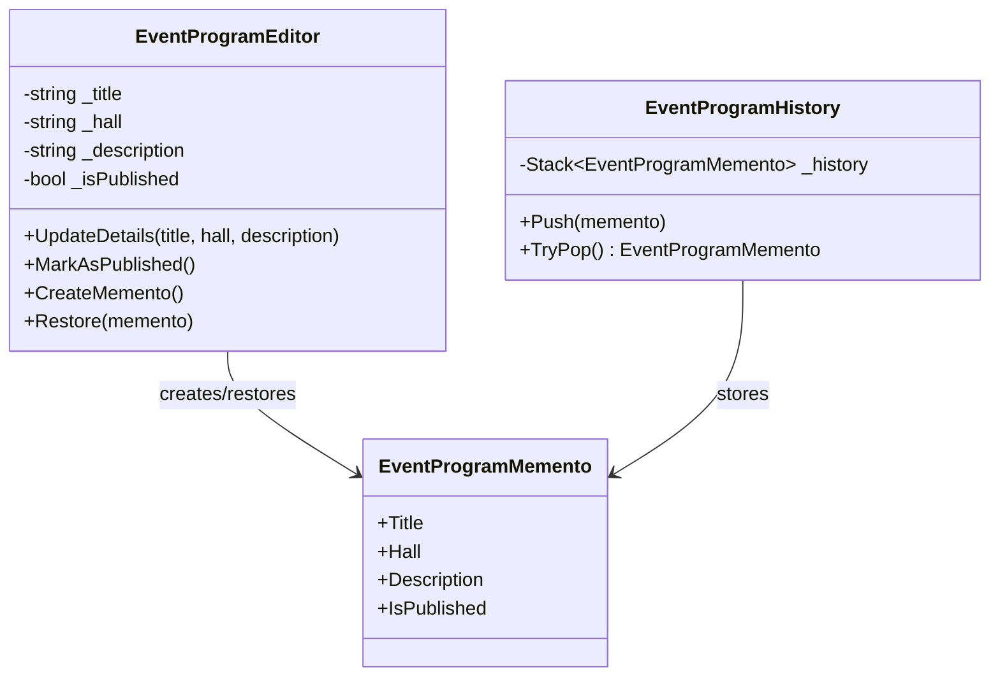

# Memento

## Kısa Tanım

Memento, bir nesnenin iç durumunu dışarıya açmadan saklamayı ve gerektiğinde o ana geri dönmeyi sağlar. Özellikle “bir adım geri al”, “taslağı eski haline döndür”, “yanlış güncellemeyi sessizce telafi et” gibi anlarda sahneye çıkar.

Bu desenin güzelliği şuradadır: geçmişi korur, ama bunu nesnenin mahremiyetini bozarak yapmaz. Yani nesnenin iç alanlarını herkesin eline tutuşturmaz; yalnızca güvenli bir anı bırakır.

## Hangi Problemi Çözer?

Bazı nesneler zaman içinde çok sık değişir. Bir editör taslağı, bir planlama ekranı, bir iş akışı tanımı ya da kullanıcı tarafından adım adım düzenlenen herhangi bir veri modeli buna örnek verilebilir.

Sorun genelde şöyle başlar:

- Kullanıcı bir değişiklik yapar.
- Bir sonraki adımda fikrini değiştirir.
- Sistemden önceki hale dönmesini ister.
- Ama mevcut nesnenin tüm iç durumunu dışarı açmak da istemezsin.

İşte Memento tam burada devreye girer. Nesnenin kendi içinde “geri dönülebilir bir an” üretmesini sağlar. Böylece kapsülleme korunur, geri alma mekanizması da temiz kalır.

## Gerçek Hayattan Bir Sahne

Bir kültür merkezi için hazırlanan **etkinlik akışı editörünü** düşün. Editör, program başlığını değiştiriyor, salonu güncelliyor, açıklama metnini yeniden yazıyor ve bir yandan da yayına hazır olup olmadığını işaretliyor.

Her değişiklik doğru gitmeyebilir. Bazen son düzenleme fazla agresif olur, bazen ekip “bir önceki versiyon daha iyiydi” der. Böyle bir ekranda tüm alanları tek tek geri yazmak yerine, taslağın belirli anlarını saklayıp tek hareketle geri dönmek çok daha pratiktir.

Memento, tam olarak bu deneyimi pürüzsüz hale getirir.

## Yapı

Desende genellikle üç rol bulunur:

- **Originator**: Durumu taşıyan ana nesnedir.
- **Memento**: O anki durumun saklandığı anıdır.
- **Caretaker**: Bu anıları tutar; ama içeriğini kurcalamaz.



## C# Örneği

Aşağıdaki örnek, etkinlik programı taslağını düzenleyen bir editör nesnesinin önceki durumlarını saklayıp geri yüklemesini gösterir. Kod, tek dosyada derlenebilir olacak şekilde hazırlanmıştır.

```csharp
using System;
using System.Collections.Generic;

namespace PatternCraft.Behavioral.Memento;

/// <summary>
/// Etkinlik programı düzenleme ekranındaki mevcut taslağı temsil eder.
/// </summary>
public sealed class EventProgramEditor
{
    private string _title;
    private string _hall;
    private string _description;
    private bool _isPublished;

    /// <summary>
    /// Yeni bir program editörü oluşturur.
    /// </summary>
    /// <param name="title">Başlangıç başlığı.</param>
    /// <param name="hall">Başlangıç salon bilgisi.</param>
    /// <param name="description">Başlangıç açıklaması.</param>
    public EventProgramEditor(string title, string hall, string description)
    {
        _title = title;
        _hall = hall;
        _description = description;
    }

    /// <summary>
    /// Program başlığı, salonu ve açıklamasını günceller.
    /// </summary>
    /// <param name="title">Yeni başlık.</param>
    /// <param name="hall">Yeni salon bilgisi.</param>
    /// <param name="description">Yeni açıklama.</param>
    public void UpdateDetails(string title, string hall, string description)
    {
        _title = title;
        _hall = hall;
        _description = description;
    }

    /// <summary>
    /// Programı yayına hazır olarak işaretler.
    /// </summary>
    public void MarkAsPublished()
    {
        _isPublished = true;
    }

    /// <summary>
    /// Mevcut durumun güvenli bir anlık görüntüsünü üretir.
    /// </summary>
    /// <returns>Geri yükleme için kullanılacak memento nesnesi.</returns>
    public EventProgramMemento CreateMemento()
    {
        return new EventProgramMemento(_title, _hall, _description, _isPublished);
    }

    /// <summary>
    /// Daha önce kaydedilmiş bir durumu geri yükler.
    /// </summary>
    /// <param name="memento">Geri yüklenecek durum.</param>
    /// <exception cref="ArgumentNullException">
    /// <paramref name="memento"/> değeri <see langword="null"/> ise fırlatılır.
    /// </exception>
    public void Restore(EventProgramMemento memento)
    {
        ArgumentNullException.ThrowIfNull(memento);

        _title = memento.Title;
        _hall = memento.Hall;
        _description = memento.Description;
        _isPublished = memento.IsPublished;
    }

    /// <summary>
    /// Mevcut durumu okunabilir bir metne dönüştürür.
    /// </summary>
    /// <returns>Programın özet görünümü.</returns>
    public override string ToString()
    {
        return $"Başlık: {_title} | Salon: {_hall} | Yayında: {_isPublished} | Açıklama: {_description}";
    }
}

/// <summary>
/// Etkinlik programının geri yüklenebilir durumunu taşır.
/// </summary>
/// <param name="Title">Program başlığı.</param>
/// <param name="Hall">Salon bilgisi.</param>
/// <param name="Description">Program açıklaması.</param>
/// <param name="IsPublished">Yayın durumu.</param>
public sealed record EventProgramMemento(
    string Title,
    string Hall,
    string Description,
    bool IsPublished);

/// <summary>
/// Oluşturulan memento nesnelerini saklayan geçmiş yöneticisidir.
/// </summary>
public sealed class EventProgramHistory
{
    private readonly Stack<EventProgramMemento> _history = new();

    /// <summary>
    /// Geçmişe yeni bir anlık görüntü ekler.
    /// </summary>
    /// <param name="memento">Saklanacak durum.</param>
    public void Push(EventProgramMemento memento)
    {
        ArgumentNullException.ThrowIfNull(memento);
        _history.Push(memento);
    }

    /// <summary>
    /// Son kaydı çıkarır.
    /// </summary>
    /// <returns>Varsa son memento; yoksa <see langword="null"/>.</returns>
    public EventProgramMemento? TryPop()
    {
        return _history.Count > 0 ? _history.Pop() : null;
    }
}

internal static class Program
{
    private static void Main()
    {
        var editor = new EventProgramEditor(
            title: "Yaz Akşamı Söyleşileri",
            hall: "Açık Hava Sahnesi",
            description: "Şehrin farklı yazarlarını buluşturan akşam programı.");

        var history = new EventProgramHistory();
        history.Push(editor.CreateMemento());

        editor.UpdateDetails(
            title: "Yaz Akşamı Söyleşileri - Güncellenmiş Program",
            hall: "Taş Salon",
            description: "Yağmur ihtimali nedeniyle program kapalı alana taşındı.");
        editor.MarkAsPublished();

        Console.WriteLine("Güncel Durum:");
        Console.WriteLine(editor);

        var previousState = history.TryPop();
        if (previousState is not null)
        {
            editor.Restore(previousState);
        }

        Console.WriteLine("Geri Yüklenen Durum:");
        Console.WriteLine(editor);
    }
}
```

## Ne Zaman Kullanılır?

- Kullanıcıya **undo/redo** deneyimi sunmak istediğinde
- Bir nesnenin önceki halini audit veya taslak yönetimi amacıyla kısa süreli saklaman gerektiğinde
- Karmaşık bir nesnenin alanlarını dışarı açmadan durum geri yükleme yapmak istediğinde
- İş akışındaki geçici değişiklikleri güvenli şekilde geri alman gerektiğinde

## Avantajlar

- Kapsüllemeyi bozmadan durum saklamaya izin verir.
- Geri alma senaryolarını okunabilir ve düzenli hale getirir.
- Originator ile geçmiş yönetimini ayırdığı için kodun niyeti daha rahat anlaşılır.
- Testlerde “şu değişiklikten sonra eski hale döndü mü?” sorusunu net biçimde doğrulamayı kolaylaştırır.

## Riskler ve Sınırlar

- Çok büyük nesnelerde sık snapshot almak bellek maliyeti oluşturabilir.
- Geçmiş uzun süre tutulursa yönetim yükü artar.
- Memento içeriği fazla büyürse desenin sadeliği kaybolabilir.
- Her problem için gerekmez; bazen küçük bir versiyon alanı ya da basit bir geri alma kuralı yeterli olur.

## Test Edilebilirlik Notları

Memento, test yazarken oldukça sevilen desenlerden biridir; çünkü davranışı ölçmek kolaydır. Tipik birim testlerinde şu akış rahatça doğrulanabilir:

1. Originator belirli bir başlangıç durumunda oluşturulur.
2. Memento alınır.
3. Nesne değiştirilir.
4. Restore çağrılır.
5. Nesnenin yeniden ilk beklenen duruma döndüğü doğrulanır.

Özellikle .NET tarafında bu desen, xUnit veya NUnit ile yazılan testlerde oldukça yalın senaryolar üretir. Testin asıl odağı alanların tek tek nasıl değiştiği değil, “geri yükleme sonrası sistem doğru hikâyeye döndü mü?” sorusu olur.

## Kısa Özet

Memento, geçmişi saklamanın zarif yoludur. Nesne kendi sırrını korur, dış dünya ise yalnızca doğru anda o sırrı geri çağırır. Eğer uygulamanda “keşke bir önceki hale dönebilsek” cümlesi sık duyuluyorsa, Memento masaya davet edilmesi gereken desenlerden biridir.
