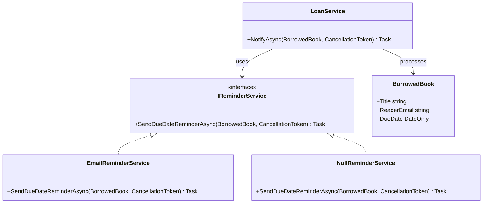

# Null Object

Null Object, sistemde gerçekten “eksik” olan bir şeyi kodun her köşesinde `null` diye kovalamak yerine, sessizce görevini yapan bir temsilciyle karşılar. Sahneye çıkıp alkış toplamaz; ama akışı da yarıda bırakmaz. Özellikle .NET projelerinde bu yaklaşım, `if (x != null)` kalabalığını dağıtırken davranışı daha okunur ve test edilebilir hale getirir.

## 1. Problem Tanımı

Bazı nesneler uygulamanın her senaryosunda gerçekten gerekli değildir. Örneğin bir kullanıcı için hatırlatma servisi tanımlı olabilir, başka bir kullanıcı için ise hiç olmayabilir. Eğer bu farklılık doğrudan `null` ile temsil edilirse, uygulama akışı kısa süre içinde şöyle bir manzaraya dönüşür:

- Her çağrıdan önce ekstra null kontrolü gerekir.
- “Bildirim varsa gönder” gibi küçük kararlar iş akışının içine dağılır.
- Yeni bir geliştirici için hangi bağımlılığın gerçekten opsiyonel olduğu belirsizleşir.
- Unit testlerde hem davranışı hem de null senaryosunu ayrı ayrı düşünmek gerekir.

Null Object burada devreye girer: gerçek implementasyon ile aynı sözleşmeye sahip, ama güvenli ve boş davranış sergileyen bir nesne kullanılır. Böylece çağıran taraf “var mı, yok mu?” sorusunu sormaz; sadece işini yapar.

## 2. Ne Zaman Kullanılır?

- Bir bağımlılık opsiyonelse ama çağıran kodun akışı sade kalmalıysa
- `null` kontrolleri birden fazla sınıfa yayılmaya başladıysa
- “Hiçbir şey yapma” davranışı iş açısından geçerli ve güvenliyse
- Varsayılan davranış ile özel davranış aynı abstraction üzerinden yönetilmek isteniyorsa
- Testlerde gerçek implementasyon yerine zararsız bir alternatif kullanmak fayda sağlıyorsa

## 3. UML (Mermaid)



## 4. C# Örneği (.NET)

```csharp
using System;
using System.Threading;
using System.Threading.Tasks;

namespace PatternCraft.Behavioral.NullObject;

/// <summary>
/// Kütüphaneden ödünç alınan bir kitabın hatırlatma için gerekli bilgilerini taşır.
/// </summary>
/// <param name="Title">Kitabın görünen başlığı.</param>
/// <param name="ReaderEmail">Okuyucuya ait iletişim adresi.</param>
/// <param name="DueDate">Kitabın iade edilmesi gereken tarih.</param>
public sealed record BorrowedBook(string Title, string ReaderEmail, DateOnly DueDate);

/// <summary>
/// İade tarihi yaklaşan kitaplar için hatırlatma davranışını tanımlar.
/// </summary>
public interface IReminderService
{
    /// <summary>
    /// Verilen ödünç kayıt için hatırlatma gönderir.
    /// </summary>
    /// <param name="book">Hatırlatma gönderilecek ödünç kayıt.</param>
    /// <param name="cancellationToken">İptal sinyali.</param>
    Task SendDueDateReminderAsync(BorrowedBook book, CancellationToken cancellationToken);
}

/// <summary>
/// Hatırlatma e-postasını gerçekten gönderen servistir.
/// </summary>
public sealed class EmailReminderService : IReminderService
{
    /// <inheritdoc />
    public Task SendDueDateReminderAsync(BorrowedBook book, CancellationToken cancellationToken)
    {
        Console.WriteLine(
            $"Reminder mail sent to {book.ReaderEmail} for '{book.Title}' due on {book.DueDate:yyyy-MM-dd}.");

        return Task.CompletedTask;
    }
}

/// <summary>
/// Hatırlatma kapalı olduğunda kullanılan boş davranış nesnesidir.
/// </summary>
public sealed class NullReminderService : IReminderService
{
    /// <inheritdoc />
    public Task SendDueDateReminderAsync(BorrowedBook book, CancellationToken cancellationToken)
    {
        return Task.CompletedTask;
    }
}

/// <summary>
/// Ödünç kitaplar için hatırlatma akışını yöneten uygulama servisidir.
/// </summary>
public sealed class LoanService
{
    private readonly IReminderService _reminderService;

    /// <summary>
    /// LoanService örneğini verilen hatırlatma davranışıyla başlatır.
    /// </summary>
    /// <param name="reminderService">Gerçek ya da boş hatırlatma servisi.</param>
    public LoanService(IReminderService reminderService)
    {
        _reminderService = reminderService;
    }

    /// <summary>
    /// İade tarihi yaklaşan kitap için hatırlatma akışını çalıştırır.
    /// </summary>
    /// <param name="book">İşlenecek ödünç kayıt.</param>
    /// <param name="cancellationToken">İptal sinyali.</param>
    public Task NotifyAsync(BorrowedBook book, CancellationToken cancellationToken)
    {
        return _reminderService.SendDueDateReminderAsync(book, cancellationToken);
    }
}

/// <summary>
/// Örnek akışın nasıl çalıştığını gösteren giriş noktasıdır.
/// </summary>
public static class Program
{
    /// <summary>
    /// Gerçek ve boş hatırlatma nesneleriyle örnek bildirimi çalıştırır.
    /// </summary>
    public static async Task Main()
    {
        var borrowedBook = new BorrowedBook(
            Title: "Martı",
            ReaderEmail: "reader@library.local",
            DueDate: new DateOnly(2026, 06, 01));

        IReminderService enabledReminder = new EmailReminderService();
        IReminderService disabledReminder = new NullReminderService();

        var activeLoanService = new LoanService(enabledReminder);
        var silentLoanService = new LoanService(disabledReminder);

        await activeLoanService.NotifyAsync(borrowedBook, CancellationToken.None);
        await silentLoanService.NotifyAsync(borrowedBook, CancellationToken.None);
    }
}
```

Bu örnekte `LoanService`, hatırlatmanın açık mı kapalı mı olduğunu hiç umursamaz. Elindeki nesneye mesajını verir ve yoluna devam eder. Asıl rahatlık tam da burada doğar: akışın ritmi bozulmaz.

## 5. Gerçek Hayat Senaryosu (Finans Dışı)

Bir şehir kütüphanesi uygulamasında bazı üyeler e-posta hatırlatmalarını açar, bazıları ise özellikle kapatır. Eğer sistem bu farkı `null` ile temsil ederse, kitap iade süresini kontrol eden her servis önce “hatırlatma servisi var mı?” diye bakmak zorunda kalır. Null Object ile bu soru ortadan kalkar. Hatırlatma açık üyelerde gerçek servis çalışır; kapalı üyelerde ise `NullReminderService` sessizce devrededir. Sonuç olarak uygulama tarafı aynı metodu çağırır, ama davranış kullanıcı tercihine göre akıllıca şekillenir.

## 6. Avantajlar

- Null kontrollerini azaltır ve iş akışını düzleştirir.
- İstemci kodu gerçek implementasyon ile boş davranışı ayırt etmek zorunda kalmaz.
- Testlerde güvenli varsayılan nesneler kullanmayı kolaylaştırır.
- Opsiyonel bağımlılıkları daha görünür ve anlamlı hale getirir.

## 7. Riskler

- “Hiçbir şey yapmama” davranışı gerçekten iş açısından güvenli değilse hataları gizleyebilir.
- Geliştiriciler boş davranışın devrede olduğunu fark etmezse debugging süresi uzayabilir.
- Her opsiyonel durum için düşünmeden Null Object üretmek, gereksiz sınıf kalabalığı oluşturabilir.

## 8. Test Edilebilirlik Notları

- `LoanService` için null kontrolü test etmek yerine doğrudan `IReminderService` davranışı test edilir.
- `NullReminderService` testinde metodun exception atmadan tamamlandığı doğrulanabilir.
- `EmailReminderService` ve `NullReminderService` aynı sözleşmeyi kullandığı için parametrik test senaryoları yazmak kolaylaşır.
