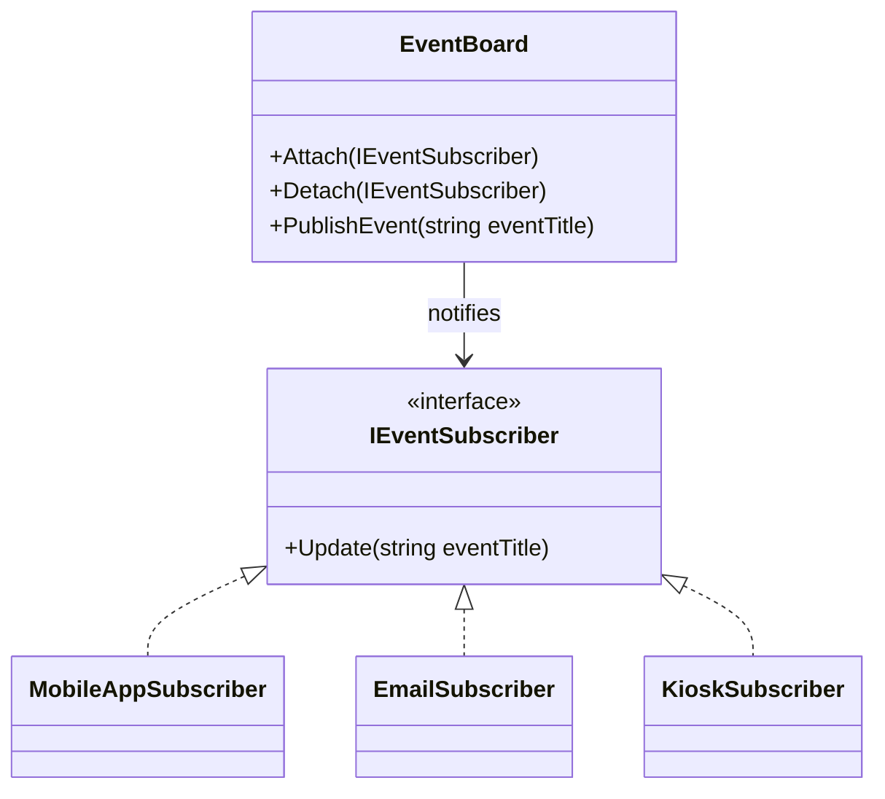

# Observer

## 1. Kısa Tanım

Observer, bir nesnenin durumu değiştiğinde o nesneyi izleyen tüm abonelerin otomatik olarak haberdar edilmesini sağlar. Böylece “değişiklik olduysa herkese tek tek haber ver” yükü tek bir noktada toplanır.

## 2. Çözdüğü Problem

Bir ekranda veya süreçte aynı veriyi takip eden birden fazla bileşen olduğunda kod hızla dağılır:

- Değişiklik sonrası bildirimler farklı yerlere kopyalanır.
- Yeni bir abone eklendiğinde mevcut akışa müdahale etmek gerekir.
- Yayınlayan nesne, dinleyicilerin teknik detaylarına bağımlı hale gelir.

Observer bu düğümü çözer: yayınlayan taraf sadece “değişiklik oldu” der, aboneler kendi reaksiyonunu kendi dünyasında yönetir.

## 3. Ne Zaman Kullanılır?

- Tek bir olayın birden fazla çıktısı varsa (bildirim, log, metrik, UI güncellemesi).
- Yeni abonelerin mevcut akışı bozmadan eklenmesi gerekiyorsa.
- Publisher ile subscriber arasında gevşek bağlılık hedefleniyorsa.
- Domain event veya uygulama içi event mimarisi kuruluyorsa.

## 4. İş Modeli Örneği (Finans Dışı)

Bir kampüs etkinlik uygulaması düşünelim: yeni bir etkinlik yayınlandığında mobil uygulama bildirimi, e-posta özeti ve dijital kiosk ekranı aynı anda güncellenmeli.  
Etkinlik panosu sadece “yeni etkinlik eklendi” bilgisini yayınlar; her kanal kendi formatına göre işi tamamlar. Yeni bir kanal (ör. akıllı saat bildirimi) geldiğinde mevcut kodun kalbi kırılmaz, sadece yeni bir observer eklenir.

## 5. Mermaid Diyagramı



## 6. C# Örnek Kodu (.NET)

```csharp
using System;
using System.Collections.Generic;

namespace PatternCraft.Behavioral.Observer;

/// <summary>
/// Publisher tarafı için ortak sözleşmeyi temsil eder.
/// </summary>
public interface IEventPublisher
{
    /// <summary>
    /// Yeni bir abone ekler.
    /// </summary>
    /// <param name="subscriber">Bildirim alacak abone.</param>
    void Attach(IEventSubscriber subscriber);

    /// <summary>
    /// Aboneliği kaldırır.
    /// </summary>
    /// <param name="subscriber">Kaldırılacak abone.</param>
    void Detach(IEventSubscriber subscriber);

    /// <summary>
    /// Yeni bir etkinlik yayımlar ve tüm aboneleri bilgilendirir.
    /// </summary>
    /// <param name="eventTitle">Yayımlanan etkinliğin başlığı.</param>
    void PublishEvent(string eventTitle);
}

/// <summary>
/// Observer tarafı için ortak sözleşmeyi temsil eder.
/// </summary>
public interface IEventSubscriber
{
    /// <summary>
    /// Publisher güncellendiğinde çağrılır.
    /// </summary>
    /// <param name="eventTitle">Yayımlanan etkinlik başlığı.</param>
    void Update(string eventTitle);
}

/// <summary>
/// Kampüs etkinlik panosunu temsil eden concrete subject.
/// </summary>
public sealed class EventBoard : IEventPublisher
{
    private readonly List<IEventSubscriber> _subscribers = new();

    /// <inheritdoc />
    public void Attach(IEventSubscriber subscriber)
    {
        if (!_subscribers.Contains(subscriber))
        {
            _subscribers.Add(subscriber);
        }
    }

    /// <inheritdoc />
    public void Detach(IEventSubscriber subscriber)
    {
        _subscribers.Remove(subscriber);
    }

    /// <inheritdoc />
    public void PublishEvent(string eventTitle)
    {
        foreach (var subscriber in _subscribers)
        {
            subscriber.Update(eventTitle);
        }
    }
}

/// <summary>
/// Mobil uygulama kanalına bildirim gönderen observer.
/// </summary>
public sealed class MobileAppSubscriber : IEventSubscriber
{
    /// <inheritdoc />
    public void Update(string eventTitle)
    {
        Console.WriteLine($"[Mobile] Yeni etkinlik: {eventTitle}");
    }
}

/// <summary>
/// E-posta kanalına bildirim gönderen observer.
/// </summary>
public sealed class EmailSubscriber : IEventSubscriber
{
    /// <inheritdoc />
    public void Update(string eventTitle)
    {
        Console.WriteLine($"[Email] Etkinlik özeti güncellendi: {eventTitle}");
    }
}

/// <summary>
/// Kampüs içi kiosk ekranını güncelleyen observer.
/// </summary>
public sealed class KioskSubscriber : IEventSubscriber
{
    /// <inheritdoc />
    public void Update(string eventTitle)
    {
        Console.WriteLine($"[Kiosk] Panoya eklendi: {eventTitle}");
    }
}

public static class Demo
{
    public static void Main()
    {
        var board = new EventBoard();

        board.Attach(new MobileAppSubscriber());
        board.Attach(new EmailSubscriber());
        board.Attach(new KioskSubscriber());

        board.PublishEvent("Açık Hava Sinema Gecesi");
    }
}
```

## 7. Avantajlar

- Publisher ve subscriber gevşek bağlı kalır.
- Yeni kanal eklemek mevcut akışı bozmaz.
- Olay tabanlı mimariye geçişi kolaylaştırır.
- Uygulama akışının okunabilirliğini artırır.

## 8. Riskler

- Abone sayısı arttıkça olay akışını takip etmek zorlaşabilir.
- Yanlış tasarımda beklenmeyen bildirim sıralaması sorun yaratabilir.
- Çok sık event üretimi performans ve log gürültüsü oluşturabilir.
- Yaşam döngüsü doğru yönetilmezse gereksiz abonelikler kalabilir.

## 9. Test Edilebilirlik Notları

- `EventBoard` testlerinde fake subscriber ile `Update` çağrı sayısı doğrulanabilir.
- Her observer bağımsız test edilebilir; tek sorumluluk ilkesi korunur.
- `Attach`/`Detach` davranışı için birim testler kolayca yazılabilir.
- Senaryo testlerinde tek bir publish ile farklı çıktı kanallarının tetiklenmesi doğrulanabilir.
