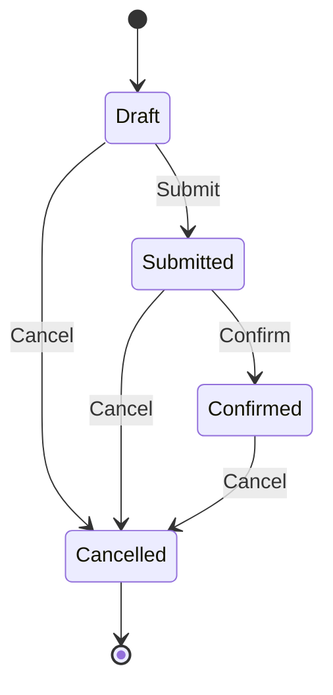

# State

*Kategori: Application Design Patterns → Behavioral Patterns*

State deseni, bir nesnenin davranışını içindeki güncel duruma göre değiştirmesini sağlar. Dışarıdan bakınca aynı nesneyle konuşursunuz; ama perde arkasında sahne değişmiştir. Taslak hâlindeki bir kayıtla onaylanmış bir kaydın aynı komutlara aynı tepkiyi vermemesi tam da bu desenin doğal yaşam alanıdır.

## 1. Problem Tanımı

Bir nesnenin yaşam döngüsü ilerledikçe kurallar da değişiyorsa, kod hızla `if`, `switch` ve “bu durumda şunu yap, diğer durumda bunu engelle” cümleleriyle dolmaya başlar. İlk başta masum görünen bu karar ağaçları zamanla şunlara yol açar:

- Aynı durum kontrolünün farklı sınıflarda tekrar etmesine
- Geçersiz geçişlerin gözden kaçmasına
- Yeni durum eklemenin mevcut akışı kırma riskini artırmasına
- Testlerin, tek bir sınıfın içindeki çok sayıda senaryoya sıkışmasına

State, bu yükü tek bir sınıfa yığmak yerine her durumu kendi davranışıyla temsil eder. Böylece “nesnenin şu an ne yaptığı” ile “bir sonraki adımda ne yapabileceği” aynı yerde toplanır.

## 2. Ne Zaman Kullanılır?

State özellikle şu anlarda parlamaya başlar:

- Nesnenin farklı aşamalarda farklı iş kurallarına uyması gerektiğinde
- Geçiş kurallarının açıkça modellenmesi istendiğinde
- `if/else` blokları yeni durumlar geldikçe uzayıp okunmaz hâle geldiğinde
- Aynı yaşam döngüsünün farklı adımlarını bağımsız test etmek istendiğinde
- Domain dilinde “taslak”, “yayında”, “iptal”, “beklemede” gibi belirgin durumlar varsa

Kısacası, davranış gerçekten duruma bağlıysa ve bu ilişki görünür kılınmak isteniyorsa State iyi bir adaydır.

## 3. Gerçek Hayat Senaryosu

Bir yaratıcı yazarlık atölyesi için kayıt sistemi düşünün. Katılımcı kaydı önce `Draft` olarak oluşturulur. Form tamamlanınca `Submitted` olur. Eğitmen kontenjanı ayırdığında kayıt `Confirmed` durumuna geçer. Etkinlik başlamadan önce vazgeçilirse `Cancelled` olur.

Buradaki kritik nokta şudur: `Submit`, `Confirm` ve `Cancel` komutları her durumda aynı anlama gelmez. Örneğin:

- `Draft` durumundaki bir kayıt gönderilebilir.
- `Submitted` durumundaki kayıt tekrar gönderilemez ama onaylanabilir.
- `Confirmed` durumundaki bir kayıt artık yeniden onaylanmaz.
- `Cancelled` durumundaki bir kayıt ise akışın dışına çıkmıştır.

State deseni bu farkları tek merkezde toplayıp “hangi durumda ne mümkündür?” sorusunu anlaşılır bir modele dönüştürür.

## 4. .NET/C# İçinde Kullanım Yaklaşımı

.NET tarafında en yaygın yaklaşım; bir context sınıfı, bir state arayüzü ve her durum için ayrı sınıflar tanımlamaktır. Context, aktif state nesnesini tutar; gelen komutları ona delegasyonla iletir. State nesnesi hem geçerli davranışı üretir hem de gerekiyorsa bir sonraki state'e geçişi yönetir.

Bu yaklaşım özellikle şu kazanımları getirir:

- Domain davranışı okunur hâle gelir.
- Geçiş kuralları gizli koşullar yerine adlandırılmış sınıflarda yaşar.
- Yeni durum eklemek mevcut durumların içine dağılmış koşulları kurcalamaktan daha güvenli olur.
- Unit test yazarken her state sınıfı izole biçimde doğrulanabilir.

## 5. Mermaid Diyagramı



## 6. C# Örnek Kod

Aşağıdaki örnek, atölye kaydının durumuna göre davranışın nasıl değiştiğini gösterir. Kod tek dosyada derlenebilir durumdadır ve public yüzeyde XML documentation comments bulunur.

```csharp
namespace PatternCraft.StateSample;

/// <summary>
/// Bir atölye kaydının o anki davranışını temsil eder.
/// </summary>
public interface IRegistrationState
{
    /// <summary>
    /// Durumun ekranda gösterilecek adını döndürür.
    /// </summary>
    string Name { get; }

    /// <summary>
    /// Kaydı gönderir.
    /// </summary>
    RegistrationResult Submit(WorkshopRegistration registration);

    /// <summary>
    /// Kaydı onaylar.
    /// </summary>
    RegistrationResult Confirm(WorkshopRegistration registration);

    /// <summary>
    /// Kaydı iptal eder.
    /// </summary>
    RegistrationResult Cancel(WorkshopRegistration registration);
}

/// <summary>
/// State nesnelerinin ortak davranışlarını sadeleştiren temel sınıftır.
/// </summary>
public abstract class RegistrationStateBase : IRegistrationState
{
    /// <inheritdoc />
    public abstract string Name { get; }

    /// <inheritdoc />
    public virtual RegistrationResult Submit(WorkshopRegistration registration)
        => RegistrationResult.Fail($"'{Name}' durumundayken kayıt gönderilemez.");

    /// <inheritdoc />
    public virtual RegistrationResult Confirm(WorkshopRegistration registration)
        => RegistrationResult.Fail($"'{Name}' durumundayken kayıt onaylanamaz.");

    /// <inheritdoc />
    public virtual RegistrationResult Cancel(WorkshopRegistration registration)
    {
        registration.TransitionTo(new CancelledState());
        return RegistrationResult.Success("Kayıt iptal edildi.");
    }
}

/// <summary>
/// Kayıt akışını yöneten context sınıfıdır.
/// </summary>
public sealed class WorkshopRegistration
{
    private IRegistrationState _state = new DraftState();

    /// <summary>
    /// Katılımcının görünen adını alır.
    /// </summary>
    public string ParticipantName { get; }

    /// <summary>
    /// Kaydın mevcut durum adını alır.
    /// </summary>
    public string CurrentState => _state.Name;

    /// <summary>
    /// Yeni bir atölye kaydı oluşturur.
    /// </summary>
    /// <param name="participantName">Katılımcı adı.</param>
    public WorkshopRegistration(string participantName)
    {
        ParticipantName = participantName;
    }

    /// <summary>
    /// Kayıt formunu gönderir.
    /// </summary>
    public RegistrationResult Submit() => _state.Submit(this);

    /// <summary>
    /// Kaydı kontenjan için onaylar.
    /// </summary>
    public RegistrationResult Confirm() => _state.Confirm(this);

    /// <summary>
    /// Kaydı iptal eder.
    /// </summary>
    public RegistrationResult Cancel() => _state.Cancel(this);

    internal void TransitionTo(IRegistrationState newState)
    {
        _state = newState;
    }
}

/// <summary>
/// Taslak durumundaki kaydı temsil eder.
/// </summary>
public sealed class DraftState : RegistrationStateBase
{
    /// <inheritdoc />
    public override string Name => "Draft";

    /// <inheritdoc />
    public override RegistrationResult Submit(WorkshopRegistration registration)
    {
        registration.TransitionTo(new SubmittedState());
        return RegistrationResult.Success("Kayıt değerlendirme kuyruğuna gönderildi.");
    }
}

/// <summary>
/// Gönderilmiş kaydı temsil eder.
/// </summary>
public sealed class SubmittedState : RegistrationStateBase
{
    /// <inheritdoc />
    public override string Name => "Submitted";

    /// <inheritdoc />
    public override RegistrationResult Confirm(WorkshopRegistration registration)
    {
        registration.TransitionTo(new ConfirmedState());
        return RegistrationResult.Success("Kayıt kontenjana yerleştirildi.");
    }
}

/// <summary>
/// Onaylanmış kaydı temsil eder.
/// </summary>
public sealed class ConfirmedState : RegistrationStateBase
{
    /// <inheritdoc />
    public override string Name => "Confirmed";
}

/// <summary>
/// İptal edilmiş kaydı temsil eder.
/// </summary>
public sealed class CancelledState : RegistrationStateBase
{
    /// <inheritdoc />
    public override string Name => "Cancelled";

    /// <inheritdoc />
    public override RegistrationResult Cancel(WorkshopRegistration registration)
        => RegistrationResult.Fail("Kayıt zaten iptal edilmiş durumda.");
}

/// <summary>
/// İşlem sonucunu sade bir değer nesnesi olarak taşır.
/// </summary>
/// <param name="Succeeded">İşlemin başarılı olup olmadığını belirtir.</param>
/// <param name="Message">İşlem sonucuna ilişkin açıklamayı içerir.</param>
public sealed record RegistrationResult(bool Succeeded, string Message)
{
    /// <summary>
    /// Başarılı bir sonuç üretir.
    /// </summary>
    public static RegistrationResult Success(string message) => new(true, message);

    /// <summary>
    /// Başarısız bir sonuç üretir.
    /// </summary>
    public static RegistrationResult Fail(string message) => new(false, message);
}
```

## 7. Avantajlar

- Duruma bağlı davranışları tek bir dev koşul bloğu yerine anlamlı sınıflara böler.
- Geçiş kurallarını görünür hâle getirir; “hangi adım nereden sonra gelir?” sorusu netleşir.
- Yeni durum eklemeyi, var olan akışları daha az sarsan bir değişikliğe dönüştürür.
- Her state ayrı test edilebildiği için hata ayıklamayı kolaylaştırır.
- Domain dilini koda daha doğal taşır.

## 8. Riskler ve Trade-off'lar

- Durum sayısı çok arttığında sınıf sayısı da artar; küçük problemler için fazla gelebilir.
- Geçişler iyi adlandırılmazsa desen işleri sadeleştirmek yerine dağıtabilir.
- Context ile state arasındaki sorumluluk sınırı belirsiz bırakılırsa “geçişi kim yönetiyor?” sorusu karmaşa yaratabilir.
- Sadece iki sabit davranış varsa, State yerine daha sade bir model yeterli olabilir.

Bu yüzden State'i, gerçekten yaşayan bir yaşam döngüsü olan alanlarda kullanmak en sağlıklı yaklaşımdır.

## 9. Test Edilebilirlik Notları

State deseninin en güzel yanlarından biri testlere nefes aldırmasıdır. `DraftState`, `SubmittedState` ve `CancelledState` gibi sınıflar ayrı ayrı ele alınabilir. Örneğin:

- `Draft` durumunda `Submit` çağrısının başarıyla `Submitted` durumuna geçtiği
- `Submitted` durumunda ikinci kez `Submit` çağrısının reddedildiği
- `Confirmed` durumunda `Cancel` çağrısının izinli olup olmadığı
- `Cancelled` durumunda tüm tekrar işlemlerinin beklenen hata mesajını verdiği

Bu yapı sayesinde testler “büyük akış testi” olmak zorunda kalmaz; her durumun kuralı kendi başına doğrulanabilir. Özellikle xUnit, NUnit veya MSTest ile state bazlı senaryoları kısa ve anlaşılır testlerle modellemek oldukça rahattır.
