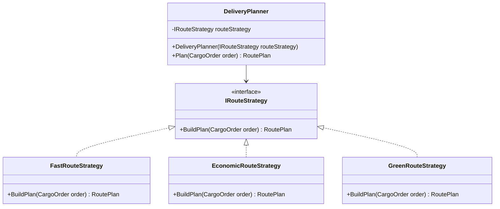

# Strategy

## 1. Kısa Tanım

Strategy, değişebilen bir algoritma ailesini ortak bir arayüz arkasına alır ve çalışma anında uygun algoritmayı seçilebilir hale getirir. Böylece “aynı işi farklı kurallarla yapma” ihtiyacı geldiğinde mevcut akışı parçalamadan ilerleyebilirsin.

## 2. Çözdüğü Problem

Bir akışta art arda büyüyen `if/else` veya `switch` blokları genellikle şu sinyali verir: “Kurallar değişiyor ama kod tek yerde sıkıştı.”

Strategy bu sıkışıklığı açar:

- Algoritmaları birbirinden ayırır.
- Yeni bir kural eklerken mevcut kodu daha az etkilersin.
- Testlerde her algoritmayı tek başına doğrulamak kolaylaşır.
- Context sınıfı “hangi adımlar var?” ile ilgilenir, “nasıl hesaplanıyor?” detayı stratejiye taşınır.

## 3. Ne Zaman Kullanılır?

- Aynı işin farklı varyasyonları varsa (ör. hızlı rota, ekonomik rota, dengeli rota).
- Yeni varyasyonların düzenli olarak eklendiği bir ürün geliştiriliyorsa.
- Kuralların bağımsız test edilmesi önemliyse.
- İş akışını sade tutup karar detayını ayrı sınıflara taşımak isteniyorsa.

## 4. Ne Zaman Kullanılmamalıdır?

- Sadece tek algoritma varsa ve yakın vadede değişim beklenmiyorsa.
- Soyutlama maliyeti, problemin kendisinden daha büyük kalıyorsa.
- Ekipte desenin kullanım amacı netleşmeden “sırf pattern olsun” diye ekleniyorsa.

## 5. Gerçek Hayat Senaryosu (Finans Dışı)

Bir şehir içi teslimat uygulaması düşün:

- Kullanıcı siparişi oluşturuyor.
- Sistem teslimat yöntemi seçiyor: **Hızlı**, **Ekonomik**, **Yeşil Rota**.
- Her yöntemin rota ve süre hesaplama yaklaşımı farklı.

Bu senaryoda `IRouteStrategy` arayüzü tanımlanır. Her rota türü kendi stratejisiyle hesaplanır. Yeni bir “Gece Teslimatı” modeli geldiğinde, mevcut stratejilere dokunmadan yeni sınıf eklemek yeterli olur.

## 6. UML / Mermaid Diyagramı



## 7. C# Örnek Kod

```csharp
namespace PatternCraft.Behavioral.Strategy;

/// <summary>
/// Teslimat planı için gerekli temel sipariş bilgilerini temsil eder.
/// </summary>
/// <param name="DistanceInKm">Teslimat mesafesi (km).</param>
/// <param name="IsFragile">Paket kırılgan mı?</param>
public sealed record CargoOrder(decimal DistanceInKm, bool IsFragile);

/// <summary>
/// Strateji sonucunda üretilen rota planı bilgisini temsil eder.
/// </summary>
/// <param name="Mode">Teslimat modu.</param>
/// <param name="EstimatedMinutes">Tahmini teslimat süresi (dakika).</param>
public sealed record RoutePlan(string Mode, int EstimatedMinutes);

/// <summary>
/// Sipariş için rota planı üreten stratejilerin ortak sözleşmesini tanımlar.
/// </summary>
public interface IRouteStrategy
{
    /// <summary>
    /// Verilen sipariş için rota planı oluşturur.
    /// </summary>
    /// <param name="order">Planlanacak sipariş.</param>
    /// <returns>Hesaplanan rota planı.</returns>
    RoutePlan BuildPlan(CargoOrder order);
}

/// <summary>
/// Teslimatı en kısa sürede tamamlamayı hedefleyen stratejidir.
/// </summary>
public sealed class FastRouteStrategy : IRouteStrategy
{
    /// <inheritdoc />
    public RoutePlan BuildPlan(CargoOrder order)
    {
        var baseMinutes = order.DistanceInKm <= 5m ? 20 : 35;
        var fragilePenalty = order.IsFragile ? 10 : 0;

        return new RoutePlan("Fast", baseMinutes + fragilePenalty);
    }
}

/// <summary>
/// Yakıt ve operasyon maliyetini dengeleyen stratejidir.
/// </summary>
public sealed class EconomicRouteStrategy : IRouteStrategy
{
    /// <inheritdoc />
    public RoutePlan BuildPlan(CargoOrder order)
    {
        var baseMinutes = order.DistanceInKm <= 5m ? 35 : 55;
        var fragilePenalty = order.IsFragile ? 5 : 0;

        return new RoutePlan("Economic", baseMinutes + fragilePenalty);
    }
}

/// <summary>
/// Karbon ayak izini azaltmayı hedefleyen stratejidir.
/// </summary>
public sealed class GreenRouteStrategy : IRouteStrategy
{
    /// <inheritdoc />
    public RoutePlan BuildPlan(CargoOrder order)
    {
        var baseMinutes = order.DistanceInKm <= 5m ? 40 : 60;
        var fragilePenalty = order.IsFragile ? 5 : 0;

        return new RoutePlan("Green", baseMinutes + fragilePenalty);
    }
}

/// <summary>
/// Context: Seçilen stratejiye göre teslimat planını oluşturur.
/// </summary>
public sealed class DeliveryPlanner
{
    private readonly IRouteStrategy _routeStrategy;

    /// <summary>
    /// Yeni bir <see cref="DeliveryPlanner"/> örneği oluşturur.
    /// </summary>
    /// <param name="routeStrategy">Kullanılacak rota stratejisi.</param>
    public DeliveryPlanner(IRouteStrategy routeStrategy)
    {
        _routeStrategy = routeStrategy;
    }

    /// <summary>
    /// Sipariş için stratejiye delegasyon yaparak rota planı üretir.
    /// </summary>
    /// <param name="order">Planlanacak sipariş.</param>
    /// <returns>Seçilen stratejiye göre üretilmiş plan.</returns>
    public RoutePlan Plan(CargoOrder order)
    {
        return _routeStrategy.BuildPlan(order);
    }
}
```

## 8. Avantajlar

- Değişen algoritmalar birbirinden bağımsız geliştirilir.
- Yeni strateji eklemek, mevcut stratejileri bozma riskini azaltır.
- Context sınıfı sade kalır; okunabilirlik artar.
- Birim testte her stratejiyi ayrı doğrulamak kolaydır.

## 9. Riskler

- Çok küçük bir problemde gereksiz soyutlama hissi oluşturabilir.
- Strateji sayısı arttıkça doğru stratejinin seçimi için ek orkestrasyon gerekebilir.
- İsimlendirme zayıf yapılırsa “hangi strateji ne yapıyor?” görünürlüğü düşer.

## 10. Test Edilebilirlik Notları

- Her strateji sınıfı için ayrı unit test yazılmalıdır.
- Context testlerinde gerçek strateji yerine test double/fake strateji kullanılabilir.
- Kenar durumları (0 km, uzun mesafe, kırılgan paket) ayrı test case olarak ele alınmalıdır.
- Strateji seçme mekanizması farklı bir factory veya resolver’da ise o bileşen de bağımsız test edilmelidir.
