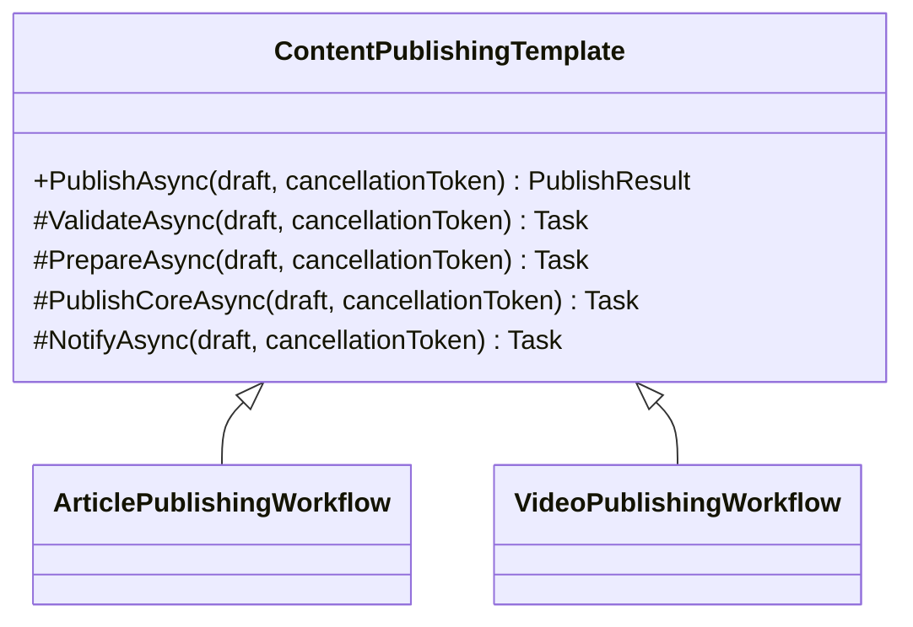

# Template Method

Bazı akışlar vardır; omurgası neredeyse hiç değişmez, ama o omurganın içindeki birkaç adım ürüne, kanala ya da senaryoya göre başka bir ritimde çalışır. Template Method tam burada devreye girer: iskeleti korur, yorumu ise alt sınıflara bırakır.

## 1. Kısa Tanım

Template Method, algoritmanın ana akışını bir üst sınıfta tanımlar ve değişebilen adımları alt sınıfların özelleştirmesine açar.

.NET tarafında bu desen özellikle “aynı sırayla çalışan ama bazı duraklarda farklı davranan” süreçlerde parıldar. Böylece akış okunabilir kalır, tekrar eden kod azalır ve yeni varyasyon eklemek için mevcut akışı dağıtmak gerekmez.

## 2. Çözdüğü Problem

Bir uygulamada şu manzarayla sık karşılaşılır:

- Her işlem aynı doğrulama ve hazırlık adımlarıyla başlar.
- Asıl işin yapıldığı bölüm senaryoya göre değişir.
- İşlem sonunda loglama, bildirim veya sonuç üretimi yine ortak kalır.

Bu yapı if-else bloklarıyla büyüdüğünde algoritmanın niyeti bulanıklaşır. Template Method, “hangi adımlar sabit, hangileri değişken?” sorusuna temiz bir cevap verir.

Özellikle C# projelerinde şu ihtiyaçlar için uygundur:

- Application service veya handler seviyesinde tekrar eden akışları toplamak
- Domain davranışını teknik detaylardan ayırmak
- Yeni varyasyon eklerken mevcut akışın sırasını korumak
- Ortak kuralları tek yerde tutup test kapsamını sadeleştirmek

## 3. Ne Zaman Kullanılır?

- Birden fazla sınıf aynı işlem sırasını izliyor, sadece bazı adımları değiştiriyorsa
- Sürecin sırası kritikse ve geliştiricilerin bu sırayı yanlışlıkla bozmasını istemiyorsanız
- Ortak davranışları merkezi tutup özel davranışları genişletilebilir bırakmak istiyorsanız
- Kod tekrarını azaltırken akışın okunabilirliğini korumak istiyorsanız

## 4. Gerçek Hayat Senaryosu

Bir dijital içerik platformu düşünün. Makale, video ve podcast yayına alınırken aynı genel yolculuktan geçer:

1. İçerik doğrulanır.
2. Yayın için hazırlanır.
3. Kanalına uygun biçimde yayınlanır.
4. Ekip üyelerine bildirim geçilir.

Ama makalenin hazırlık adımı SEO başlığı üretmek olabilir, videonun hazırlık adımı ise kapak görseli ve çözünürlük kontrolü yapmak olabilir. İşte burada akışın ana omurgası sabit kalırken her içerik tipi kendi karakterini korur.

## 5. İş Modeli Örneği

Atölye, eğitim ve yaratıcı içerik üreten bir platformda “yayınlama” iş akışı sık tekrar eder. Ürün ister yazı dizisi olsun ister video serisi, ekip aynı kalite kapılarından geçmek ister: içerik boş mu, metadata hazır mı, yayın kanalı uygun mu, ekip bilgilendirildi mi?

Template Method bu iş modelinde iki nedenle değerlidir:

- Editoryal standartları merkezi biçimde korur.
- Yeni içerik türü eklendiğinde tüm akışı kopyalamadan yalnızca değişen adımları yazmayı sağlar.

## 6. UML / Mermaid Diyagramı



## 7. C# Örnek Kod

```csharp
using System;
using System.Threading;
using System.Threading.Tasks;

namespace PatternCraft.TemplateMethod;

/// <summary>
/// Yayınlanacak içerik taslağını temsil eder.
/// </summary>
/// <param name="Title">İçerik başlığını belirtir.</param>
/// <param name="Body">İçerik gövdesini belirtir.</param>
public sealed record ContentDraft(string Title, string Body);

/// <summary>
/// Yayın sonucunun özetini temsil eder.
/// </summary>
/// <param name="Title">Yayınlanan içeriğin başlığını belirtir.</param>
/// <param name="PublishedAt">Yayın zamanını belirtir.</param>
public sealed record PublishResult(string Title, DateTimeOffset PublishedAt);

/// <summary>
/// İçerik yayınlama akışının değişmeyen iskeletini tanımlar.
/// </summary>
public abstract class ContentPublishingTemplate
{
    /// <summary>
    /// İçeriği sabit işlem sırasını izleyerek yayına alır.
    /// </summary>
    /// <param name="draft">Yayınlanacak içerik taslağını belirtir.</param>
    /// <param name="cancellationToken">İşlemi iptal etmek için kullanılan belirteci belirtir.</param>
    /// <returns>Yayın sonucunu döner.</returns>
    public async Task<PublishResult> PublishAsync(ContentDraft draft, CancellationToken cancellationToken)
    {
        ArgumentNullException.ThrowIfNull(draft);

        await ValidateAsync(draft, cancellationToken);
        await PrepareAsync(draft, cancellationToken);
        await PublishCoreAsync(draft, cancellationToken);
        await NotifyAsync(draft, cancellationToken);

        return new PublishResult(draft.Title, DateTimeOffset.UtcNow);
    }

    /// <summary>
    /// İçeriğin yayın için uygun olup olmadığını doğrular.
    /// </summary>
    /// <param name="draft">Doğrulanacak içerik taslağını belirtir.</param>
    /// <param name="cancellationToken">İşlemi iptal etmek için kullanılan belirteci belirtir.</param>
    /// <returns>Asenkron işlemi temsil eden görevi döner.</returns>
    protected abstract Task ValidateAsync(ContentDraft draft, CancellationToken cancellationToken);

    /// <summary>
    /// İçeriği yayın öncesinde hazırlar.
    /// </summary>
    /// <param name="draft">Hazırlanacak içerik taslağını belirtir.</param>
    /// <param name="cancellationToken">İşlemi iptal etmek için kullanılan belirteci belirtir.</param>
    /// <returns>Asenkron işlemi temsil eden görevi döner.</returns>
    protected virtual Task PrepareAsync(ContentDraft draft, CancellationToken cancellationToken) => Task.CompletedTask;

    /// <summary>
    /// İçeriği hedef kanalda yayınlar.
    /// </summary>
    /// <param name="draft">Yayınlanacak içerik taslağını belirtir.</param>
    /// <param name="cancellationToken">İşlemi iptal etmek için kullanılan belirteci belirtir.</param>
    /// <returns>Asenkron işlemi temsil eden görevi döner.</returns>
    protected abstract Task PublishCoreAsync(ContentDraft draft, CancellationToken cancellationToken);

    /// <summary>
    /// Yayın sonrasında ilgili ekiplere bildirim gönderir.
    /// </summary>
    /// <param name="draft">Bildirimi gönderilecek içerik taslağını belirtir.</param>
    /// <param name="cancellationToken">İşlemi iptal etmek için kullanılan belirteci belirtir.</param>
    /// <returns>Asenkron işlemi temsil eden görevi döner.</returns>
    protected virtual Task NotifyAsync(ContentDraft draft, CancellationToken cancellationToken) => Task.CompletedTask;
}

/// <summary>
/// Makale yayınlama akışını özelleştirir.
/// </summary>
public sealed class ArticlePublishingWorkflow : ContentPublishingTemplate
{
    /// <inheritdoc />
    protected override Task ValidateAsync(ContentDraft draft, CancellationToken cancellationToken)
    {
        if (string.IsNullOrWhiteSpace(draft.Title))
        {
            throw new InvalidOperationException("Makale başlığı boş olamaz.");
        }

        if (string.IsNullOrWhiteSpace(draft.Body))
        {
            throw new InvalidOperationException("Makale içeriği boş olamaz.");
        }

        return Task.CompletedTask;
    }

    /// <inheritdoc />
    protected override Task PrepareAsync(ContentDraft draft, CancellationToken cancellationToken)
    {
        return Task.CompletedTask;
    }

    /// <inheritdoc />
    protected override Task PublishCoreAsync(ContentDraft draft, CancellationToken cancellationToken)
    {
        return Task.CompletedTask;
    }
}
```

Bu örnekte `PublishAsync` metodu ritmi hiç bozmuyor. Alt sınıf ise yalnızca gerçekten değişmesi gereken yerlere dokunuyor. Desenin en güzel yanı da bu: ana melodi sabit, düzenleme serbest.

## 8. Avantajlar

- Algoritmanın sırasını merkezi biçimde korur.
- Tekrar eden akış kodunu azaltır.
- Yeni varyasyonların eklenmesini kolaylaştırır.
- Ortak adımları bir üst sınıfta topladığı için bakım maliyetini düşürür.
- Testlerde hem üst akışı hem de özelleşen adımları ayrı ayrı doğrulamayı kolaylaştırır.

## 9. Riskler

- Yanlış kullanıldığında gereğinden fazla kalıtım üretir.
- Değişken adım sayısı arttıkça üst sınıf fazla şey bilen bir yapıya dönüşebilir.
- Sadece küçük bir tekrar için uygulanırsa kodu olduğundan daha ağır gösterebilir.
- Alt sınıfların davranışı iyi isimlendirilmezse akışın niyeti yine bulanıklaşabilir.

## 10. Test Edilebilirlik Notları

Template Method testlerinde iki seviyeli düşünmek faydalıdır:

- Üst sınıfın akış sırasını koruduğunu doğrulayan testler
- Alt sınıfın kendi özelleştirilmiş adımını doğru uyguladığını doğrulayan testler

Örneğin `PublishAsync` çağrısında doğrulama başarısız olduğunda yayın adımına geçilmediğini, başarılı durumda ise beklenen sıranın izlendiğini rahatlıkla test edebilirsiniz. Gerekirse hook metotları izleyen test doubles veya spy sınıfları kullanılarak akış görünür hale getirilebilir.
