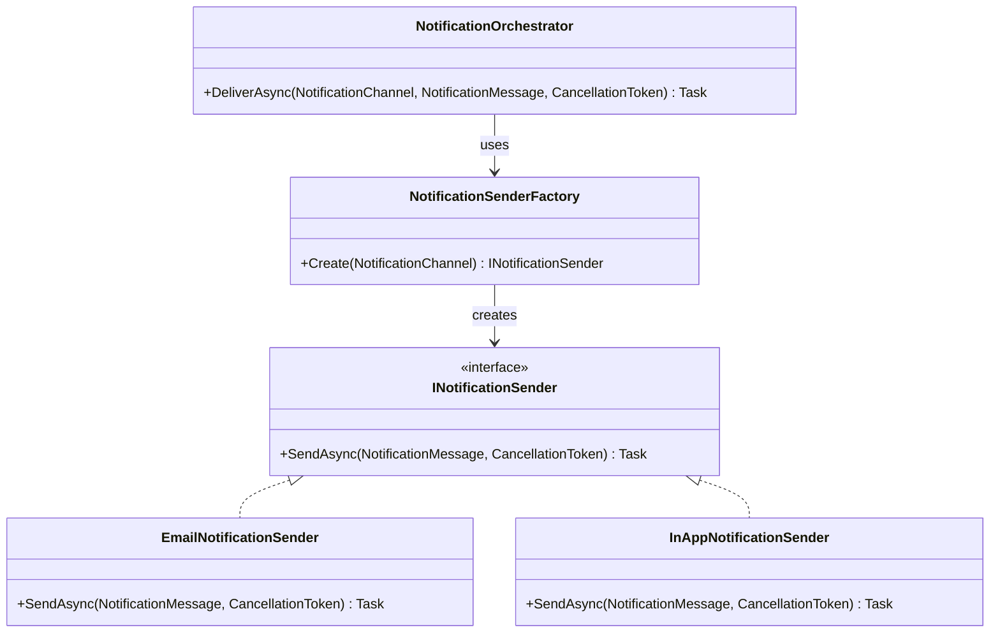

# Factory Method

Factory Method, “hangi nesne üretilecek?” kararını kodun her köşesine yaymak yerine tek bir noktada toplar. Böylece akış daha temiz kalır; yeni bir varyasyon eklendiğinde mevcut kodu kırmadan ilerlemek kolaylaşır.

## 1. Problem Tanımı

Bir uygulamada davranış, gelen tipe göre değişiyorsa (`Email`, `InApp`, `Sms` gibi), bu seçim çoğu zaman `if/else` veya `switch` bloklarıyla farklı katmanlara dağılır. Bir süre sonra:

- Üretim kararı tekrar eder,
- Yeni tür eklemek riskli hale gelir,
- Unit testlerde senaryoları izole etmek zorlaşır.

Factory Method bu dağınıklığı toparlar: üretim kararını factory’ye taşır, kullanım tarafını sadeleştirir.

## 2. Ne Zaman Kullanılır?

- Aynı nesne üretim kararı birden fazla yerde tekrar ediyorsa
- Yeni tiplerin sık eklendiği bir akış varsa
- Uygulama katmanında “ne yapılacak” ile “hangi sınıf üretilecek” ayrıştırılmak isteniyorsa
- Testlerde fake/stub implementasyonları kolayca devreye almak gerekiyorsa

## 3. UML (Mermaid)



## 4. C# Örneği (.NET)

```csharp
using System;
using System.Threading;
using System.Threading.Tasks;

namespace PatternCraft.Creational.FactoryMethod;

/// <summary>
/// Kullanıcılara gönderilecek bildirim kanallarını temsil eder.
/// </summary>
public enum NotificationChannel
{
    Email = 1,
    InApp = 2
}

/// <summary>
/// Uygulama içindeki bildirim verisini taşır.
/// </summary>
/// <param name="Recipient">Bildirimin hedefi (ör. kullanıcı kimliği veya e-posta adresi).</param>
/// <param name="Content">Gönderilecek mesaj metni.</param>
public sealed record NotificationMessage(string Recipient, string Content);

/// <summary>
/// Bildirim gönderen tüm kanallar için ortak davranışı tanımlar.
/// </summary>
public interface INotificationSender
{
    /// <summary>
    /// Bildirimi seçilen kanal üzerinden asenkron olarak gönderir.
    /// </summary>
    /// <param name="message">Gönderilecek bildirim verisi.</param>
    /// <param name="cancellationToken">İşlem iptal sinyali.</param>
    Task SendAsync(NotificationMessage message, CancellationToken cancellationToken);
}

/// <summary>
/// Bildirim kanalına göre uygun gönderici üreten factory sözleşmesini tanımlar.
/// </summary>
public interface INotificationSenderFactory
{
    /// <summary>
    /// Kanal bilgisine göre <see cref="INotificationSender"/> üretir.
    /// </summary>
    /// <param name="channel">Kullanılacak bildirim kanalı.</param>
    /// <returns>Kanal ile eşleşen gönderici implementasyonu.</returns>
    INotificationSender Create(NotificationChannel channel);
}

/// <summary>
/// E-posta kanalından bildirim gönderir.
/// </summary>
public sealed class EmailNotificationSender : INotificationSender
{
    /// <inheritdoc />
    public Task SendAsync(NotificationMessage message, CancellationToken cancellationToken)
    {
        Console.WriteLine($"[EMAIL] {message.Recipient}: {message.Content}");
        return Task.CompletedTask;
    }
}

/// <summary>
/// Uygulama içi kanalından bildirim gönderir.
/// </summary>
public sealed class InAppNotificationSender : INotificationSender
{
    /// <inheritdoc />
    public Task SendAsync(NotificationMessage message, CancellationToken cancellationToken)
    {
        Console.WriteLine($"[IN-APP] {message.Recipient}: {message.Content}");
        return Task.CompletedTask;
    }
}

/// <summary>
/// Bildirim kanalına göre uygun gönderici implementasyonunu üretir.
/// </summary>
public sealed class NotificationSenderFactory : INotificationSenderFactory
{
    /// <summary>
    /// Kanal bilgisini kullanarak uygun <see cref="INotificationSender"/> nesnesini oluşturur.
    /// </summary>
    /// <param name="channel">Kullanılacak bildirim kanalı.</param>
    /// <returns>Kanal ile eşleşen gönderici implementasyonu.</returns>
    /// <exception cref="NotSupportedException">Desteklenmeyen bir kanal geldiğinde fırlatılır.</exception>
    public INotificationSender Create(NotificationChannel channel)
    {
        return channel switch
        {
            NotificationChannel.Email => new EmailNotificationSender(),
            NotificationChannel.InApp => new InAppNotificationSender(),
            _ => throw new NotSupportedException($"Unsupported channel: {channel}")
        };
    }
}

/// <summary>
/// Bildirim gönderim akışını yöneten uygulama servisi örneğidir.
/// </summary>
public sealed class NotificationOrchestrator
{
    private readonly INotificationSenderFactory _factory;

    /// <summary>
    /// Bildirim orkestratörünü factory bağımlılığı ile başlatır.
    /// </summary>
    /// <param name="factory">Kanal bazlı gönderici üreten factory.</param>
    public NotificationOrchestrator(INotificationSenderFactory factory)
    {
        _factory = factory;
    }

    /// <summary>
    /// Kanal tipine göre göndericiyi üretir ve bildirimi gönderir.
    /// </summary>
    /// <param name="channel">Bildirim kanalı.</param>
    /// <param name="message">Gönderilecek bildirim.</param>
    /// <param name="cancellationToken">İptal sinyali.</param>
    public Task DeliverAsync(
        NotificationChannel channel,
        NotificationMessage message,
        CancellationToken cancellationToken)
    {
        var sender = _factory.Create(channel);
        return sender.SendAsync(message, cancellationToken);
    }
}
```

## 5. Gerçek Hayat Senaryosu (Finans Dışı)

Bir etkinlik yönetim platformu düşünelim: konser, atölye ve seminer duyuruları kullanıcıya farklı kanallardan iletiliyor. Pazarlama ekibi yeni bir kanal (“SMS”) istediğinde mevcut gönderim akışı bozulmadan sadece yeni bir sender implementasyonu ve factory eşlemesi ekleniyor. Uygulama tarafı aynı metodu çağırmaya devam ediyor; yani orkestrasyon sabit, üretim kararı esnek.

## 6. Avantajlar

- Üretim kararını merkezileştirir, kod tekrarını azaltır.
- Açık/kapalı prensibine (OCP) daha yakın bir yapı kurar.
- Uygulama akışını sadeleştirir; “hangi sınıf?” detayı gizlenir.
- Testlerde factory veya sender kolayca taklit edilebilir.

## 7. Riskler

- Çok küçük bir problem için gereksiz soyutlama oluşturabilir.
- Factory sınıfı büyürse bakım yükü artabilir.
- Ekip deseni doğru sınırda kullanmazsa yapı karmaşıklaşabilir.

## 8. Test Edilebilirlik Notları

- Factory davranışı için kanal bazlı unit test yazılmalıdır.
- Uygulama servisinde concrete sınıf yerine interface kullanılarak mock/fake ile test yapılabilir.
- Desteklenmeyen tiplerde beklenen exception davranışı ayrı test edilmelidir.
