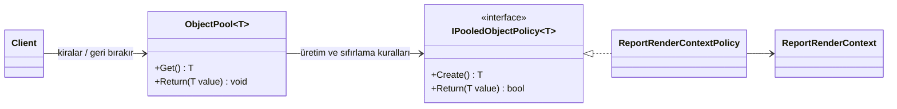

# Object Pool

**Kategori:** Application Design Patterns / Creational Patterns | **Platform:** .NET / C# | **Seviye:** Orta

---

## 1. Kısa Tanım

**Object Pool**, oluşturulması maliyetli nesneleri her seferinde yeniden üretmek yerine kontrollü bir havuzda tutup tekrar kullanmayı amaçlayan tasarım desenidir.

Kulağa teknik geliyor ama fikri oldukça gündelik: Sahne arkasında aynı işi yapan ekipmanı her gösteri öncesi sıfırdan satın almazsınız; bakımını yapar, hazır tutar ve sırası gelince yeniden kullanırsınız. Object Pool da uygulama içinde tam olarak bunu yapar.

---

## 2. Temel Problem

Bazı nesneler küçük görünür ama üretim maliyetleri düşündüğünüzden daha yüksektir. Büyük buffer'lar, yoğun konfigürasyon yükleyen yardımcı nesneler, render context'leri, parser'lar veya dış kaynakla çalışan client benzeri bileşenler sık oluşturulup yok edildiğinde:

- GC baskısı artar
- Yoğun trafikte yanıt süresi dalgalanır
- Kaynak kullanımı öngörülmesi zor hale gelir
- Kodun kritik anlarında gereksiz allocation maliyeti oluşur

Object Pool, bu pahalı nesneleri kontrollü biçimde elde tutarak sistemin nefesini düzenler.

---

## 3. Ne Zaman Kullanılır?

Aşağıdaki durumlarda Object Pool iyi bir adaydır:

- Nesne oluşturma maliyeti gerçekten yüksekse
- Aynı tip nesneler kısa süreli kullanılıp sık sık tekrar üretiliyorsa
- Yük altında allocation sayısı performans problemi yaratıyorsa
- Nesne tekrar kullanıma hazırlanabilecek kadar güvenli şekilde sıfırlanabiliyorsa
- Üst sınırı belli bir kaynak tüketimi isteniyorsa

Özellikle .NET tarafında `StringBuilder`, buffer taşıyan yardımcı sınıflar, render context'leri veya bağlantı benzeri pahalı nesneler için güçlü bir araçtır.

---

## 4. Ne Zaman Kullanılmamalıdır?

Her nesneyi havuza koymak iyi fikir değildir. Şu durumlarda desen gereksiz yük oluşturabilir:

- Nesne üretimi zaten ucuzsa
- Nesnenin doğru şekilde sıfırlanması zorsa
- Kullanım ömrü uzun olup havuza geri dönme ihtimali düşükse
- Havuz yönetimi, çözülen problemden daha karmaşık hale geliyorsa

Kısacası: Ortada gerçek bir maliyet yoksa, pool bazen tasarruftan çok bakım borcu üretir.

---

## 5. Gerçek Hayattan Senaryo

Bir şehir festivali platformu düşünün. Gün boyunca binlerce ziyaretçi, kendi etkinlik rotasını oluşturup “günlük plan kartı” çıktısı alıyor. Bu kartlar hazırlanırken sistem; başlıkları biçimlendiriyor, zaman çizelgesi ekliyor, açıklamaları birleştiriyor ve son çıktıyı tek bir metin bloğu halinde üretiyor.

Her istek için sıfırdan büyük bir render context oluşturmak mümkün, ama yoğun saatlerde bu yaklaşım gereksiz allocation fırtınası çıkarır. Bunun yerine uygulama, render context nesnelerini bir havuzda tutar; iş bitince temizler ve sıradaki ziyaretçi için yeniden kullanır. Perde kapanmaz, kuyruk uzamaz, uygulama da daha sakin çalışır.

---

## 6. Mermaid Diyagramı



---

## 7. C# / .NET Örneği

Aşağıdaki örnek, festival plan kartı üreten pahalı bir render context nesnesini yeniden kullanır. Kod örneği tek başına derlenebilir ve public API yüzeyinde XML documentation comment içerir.

```csharp
using System;
using System.Collections.Generic;
using System.Text;

namespace PatternCraft.Application.Creational.ObjectPool;

/// <summary>
/// Havuzdaki nesnelerin nasıl oluşturulacağını ve geri dönerken nasıl temizleneceğini tanımlar.
/// </summary>
/// <typeparam name="T">Havuzda tutulacak referans tipidir.</typeparam>
public interface IPooledObjectPolicy<T> where T : class
{
    /// <summary>
    /// Havuz boş olduğunda yeni nesne üretir.
    /// </summary>
    /// <returns>Yeni oluşturulmuş nesne örneği.</returns>
    T Create();

    /// <summary>
    /// Nesneyi havuza dönmeden önce tekrar kullanıma hazır hale getirir.
    /// </summary>
    /// <param name="value">Havuza geri verilecek nesne.</param>
    /// <returns>
    /// Nesne havuzda tutulmaya uygunsa <see langword="true"/>,
    /// tamamen elden çıkarılmalıysa <see langword="false"/> döner.
    /// </returns>
    bool Return(T value);
}

/// <summary>
/// Anlatımı sade tutan temel bir object pool implementasyonudur.
/// </summary>
/// <typeparam name="T">Havuzda saklanacak referans tipidir.</typeparam>
public sealed class ObjectPool<T> where T : class
{
    private readonly Queue<T> _items = new();
    private readonly IPooledObjectPolicy<T> _policy;
    private readonly int _maximumRetained;
    private readonly object _sync = new();

    /// <summary>
    /// Yeni bir <see cref="ObjectPool{T}"/> örneği oluşturur.
    /// </summary>
    /// <param name="policy">Nesne oluşturma ve sıfırlama kuralları.</param>
    /// <param name="maximumRetained">Havuzda tutulacak en yüksek nesne sayısı.</param>
    public ObjectPool(IPooledObjectPolicy<T> policy, int maximumRetained = 8)
    {
        if (maximumRetained <= 0)
        {
            throw new ArgumentOutOfRangeException(nameof(maximumRetained));
        }

        _policy = policy ?? throw new ArgumentNullException(nameof(policy));
        _maximumRetained = maximumRetained;
    }

    /// <summary>
    /// Havuzdan kullanılabilir bir nesne alır.
    /// </summary>
    /// <returns>Yeniden kullanılan veya yeni oluşturulan nesne.</returns>
    public T Get()
    {
        lock (_sync)
        {
            if (_items.Count > 0)
            {
                return _items.Dequeue();
            }
        }

        return _policy.Create();
    }

    /// <summary>
    /// Kullanımı tamamlanan nesneyi havuza geri verir.
    /// </summary>
    /// <param name="value">Geri verilecek nesne.</param>
    public void Return(T value)
    {
        if (value is null)
        {
            throw new ArgumentNullException(nameof(value));
        }

        if (!_policy.Return(value))
        {
            return;
        }

        lock (_sync)
        {
            if (_items.Count < _maximumRetained)
            {
                _items.Enqueue(value);
            }
        }
    }
}

/// <summary>
/// Festival ziyaretçileri için günlük plan kartı hazırlayan render context nesnesidir.
/// </summary>
public sealed class ReportRenderContext
{
    private readonly StringBuilder _builder = new(capacity: 512);

    /// <summary>
    /// Kart başlığını oluşturur.
    /// </summary>
    /// <param name="title">Plan kartının başlığı.</param>
    public void BeginCard(string title)
    {
        _builder.AppendLine($"=== {title} ===");
    }

    /// <summary>
    /// Plan kartına yeni satır ekler.
    /// </summary>
    /// <param name="time">Etkinliğin saati.</param>
    /// <param name="activity">Etkinlik açıklaması.</param>
    public void AddItem(string time, string activity)
    {
        _builder.AppendLine($"{time} - {activity}");
    }

    /// <summary>
    /// Oluşturulan kart metnini döndürür.
    /// </summary>
    /// <returns>Render edilmiş plan kartı.</returns>
    public string Build()
    {
        return _builder.ToString();
    }

    /// <summary>
    /// Nesneyi bir sonraki kullanım için temizler.
    /// </summary>
    public void Reset()
    {
        _builder.Clear();
    }
}

/// <summary>
/// <see cref="ReportRenderContext"/> nesneleri için havuz politikası sağlar.
/// </summary>
public sealed class ReportRenderContextPolicy : IPooledObjectPolicy<ReportRenderContext>
{
    /// <summary>
    /// Yeni bir render context nesnesi oluşturur.
    /// </summary>
    /// <returns>Hazır durumdaki render context.</returns>
    public ReportRenderContext Create()
    {
        return new ReportRenderContext();
    }

    /// <summary>
    /// Render context'i temizleyip tekrar kullanıma hazırlar.
    /// </summary>
    /// <param name="value">Havuza geri dönen nesne.</param>
    /// <returns>Her zaman <see langword="true"/> döner.</returns>
    public bool Return(ReportRenderContext value)
    {
        value.Reset();
        return true;
    }
}

/// <summary>
/// Object Pool kullanımını gösteren örnek uygulama giriş noktasıdır.
/// </summary>
public static class Program
{
    /// <summary>
    /// Festival plan kartı üretimini çalıştırır.
    /// </summary>
    public static void Main()
    {
        var pool = new ObjectPool<ReportRenderContext>(new ReportRenderContextPolicy());
        var cards = new List<string>();

        for (var i = 1; i <= 2; i++)
        {
            var context = pool.Get();

            try
            {
                context.BeginCard($"Festival Rotası {i}");
                context.AddItem("10:00", "Açık hava sergisi");
                context.AddItem("13:30", "Atölye buluşması");
                context.AddItem("19:00", "Ana sahne konseri");
                cards.Add(context.Build());
            }
            finally
            {
                pool.Return(context);
            }
        }

        foreach (var card in cards)
        {
            Console.WriteLine(card);
        }
    }
}
```

---

## 8. Avantajlar

- Tekrarlanan allocation maliyetini azaltır.
- Yoğun trafikte daha öngörülebilir performans sağlar.
- Kaynak kullanımına üst sınır koymayı kolaylaştırır.
- Özellikle kısa ömürlü ama pahalı nesnelerde sistemi rahatlatır.

---

## 9. Riskler ve Trade-off'lar

Object Pool güçlüdür ama biraz disiplin ister:

- Nesne doğru sıfırlanmazsa bir önceki kullanımın verisi sızabilir.
- Havuz çok büyük tutulursa gereksiz bellek işgali yaratabilir.
- Thread-safe gereksinimi varsa implementasyon dikkatle tasarlanmalıdır.
- Ucuz nesnelerde kullanıldığında faydadan çok karmaşıklık getirebilir.

Bu yüzden Object Pool, “her şeyi paylaşalım” deseni değil; “gerçekten pahalı olanı akıllıca yönetelim” desenidir.

---

## 10. Test Edilebilirlik Notları

Object Pool testlerinde odak genellikle üç soruda toplanır:

1. Aynı nesne gerçekten tekrar kullanılıyor mu?
2. Nesne havuza dönerken temizleniyor mu?
3. Havuz sınırı aşıldığında beklenen davranış korunuyor mu?

Bunları doğrulamak için:

- Fake veya spy bir `IPooledObjectPolicy<T>` kullanılabilir.
- `Return` çağrısında `Reset` benzeri temizleme davranışı assert edilebilir.
- Aynı referansın tekrar dönüp dönmediği `ReferenceEquals` ile kontrol edilebilir.
- Çok iş parçacıklı senaryolarda ayrı concurrency testleri yazılmalıdır.

---

## 11. Kısa Özet

Object Pool, pahalı nesneleri tekrar kullanarak uygulamanın ritmini korur. Doğru yerde kullanıldığında performans kazanımı sağlar; yanlış yerde kullanıldığında ise görünmez bir karmaşıklık üretir. Bu nedenle önce maliyeti görün, sonra havuzu kurun.
