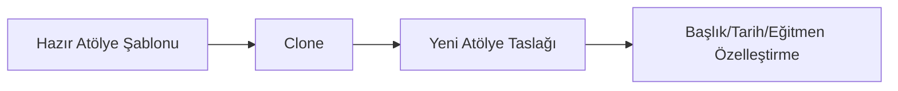

# Prototype

## 1. Kısa Tanım

Prototype, yeni nesne üretimini `new` ile sıfırdan kurmak yerine, eldeki güvenilir bir örneği kopyalayarak hızlandırır.

Özellikle "aynı iskelet, farklı detay" senaryolarında akışı ciddi biçimde sadeleştirir: önce temel şablonu alır, sonra sadece değişecek alanları güncellersiniz.

## 2. Çözdüğü Problem

Bazı nesneler pahalı kurulur: varsayılan ayarlar, doğrulamalar, alt koleksiyonlar, kurallar derken üretim adımı uzar. Bu yapı her seferinde tekrarlandığında kod gürültüsü artar ve hata riski yükselir.

Prototype bu noktada devreye girer:

- Karmaşık başlangıç kurulumunu tek bir referans örnekte toplar.
- Yeni varyasyonları kopya üstünden üreterek kod tekrarını azaltır.
- Üretim akışını kısa, okunur ve test edilebilir tutar.

## 3. İş Modeli Örneği (Etkinlik Atölyesi Şablonlama)

Bir etkinlik platformunda sık kullanılan atölye planları olduğunu düşünün: "Başlangıç", "İleri Seviye", "Hafta Sonu Hızlandırılmış" gibi.

Her yeni atölye için süre, kontenjan, materyal listesi ve oturum yapısını sıfırdan yazmak yerine, uygun şablon klonlanır ve yalnızca eğitmen, tarih, başlık gibi alanlar güncellenir. Böylece ekip hem daha hızlı ilerler hem de her yeni kayıt için aynı temel kalite çizgisini korur.

## 4. .NET İçinde Kullanım Yaklaşımı

.NET tarafında Prototype çoğunlukla `record` tipleri, kopya kurucular veya özel `Clone()` metotlarıyla uygulanır.

- Public API yüzeyinde XML documentation comments kullanın.
- Kopyalama sırasında paylaşılan mutable referanslara dikkat edin (gerekirse deep copy uygulayın).
- Kopya sonrası özelleştirme adımlarını niyet odaklı metotlarla görünür tutun.

## 5. Basit Akış



## 6. Örnek Kod / Taslak

```csharp
/// <summary>
/// Atölye şablonlarının klonlanması için ortak davranışı tanımlar.
/// </summary>
public interface IPrototype<out T>
{
    /// <summary>
    /// Geçerli örneğin kopyasını üretir.
    /// </summary>
    T Clone();
}

/// <summary>
/// Etkinlik platformunda tekrar kullanılabilir atölye şablonunu temsil eder.
/// </summary>
public sealed record WorkshopTemplate(
    string Title,
    TimeSpan Duration,
    int Capacity,
    IReadOnlyList<string> Materials) : IPrototype<WorkshopTemplate>
{
    /// <summary>
    /// Atölye şablonunun güvenli bir kopyasını üretir.
    /// Materials listesi shallow copy olarak çoğaltılır; string immutable olduğu için bu yaklaşım güvenlidir.
    /// </summary>
    public WorkshopTemplate Clone()
    {
        return new WorkshopTemplate(
            Title,
            Duration,
            Capacity,
            Materials.ToArray());
    }

    /// <summary>
    /// Kopyadan yeni bir atölye taslağı üretir ve başlığı günceller.
    /// </summary>
    public WorkshopTemplate CloneWithTitle(string title)
    {
        return this with { Title = title };
    }
}
```

## 7. Ne Zaman Kullanılır?

- Başlangıç konfigürasyonu uzun ve tekrar ediyorsa
- Aynı nesnenin küçük farklarla çok sayıda varyasyonu üretiliyorsa
- Üretim sürecini basitleştirirken mevcut doğrulanmış ayarları korumak isteniyorsa
- Testlerde hızlı ve tutarlı fixture üretimi gerekiyorsa

## 8. Ne Zaman Kullanılmamalıdır?

- Nesne yapısı zaten çok basitse ve doğrudan constructor yeterliyse
- Kopyalama maliyeti, sıfırdan üretmekten daha yüksekse
- Mutable iç durum güvenle ayrıştırılamıyorsa ve yan etki riski yüksekse

## 9. Avantajlar

- Üretim adımlarını kısaltır, geliştirici hızını artırır.
- Tekrarlanan başlangıç kodunu azaltır.
- Doğrulanmış şablonlardan ilerleyerek tutarlılığı artırır.
- Test verisi üretimini kolaylaştırır.

## 10. Riskler

- Yanlış kopyalama stratejisi (shallow/deep copy) beklenmeyen paylaşımlara neden olabilir.
- Klonlanan nesnenin kritik alanları sonradan fark edilmeden taşınabilir.
- Gereksiz kullanıldığında basit bir modeli gereksiz karmaşık hale getirebilir.
