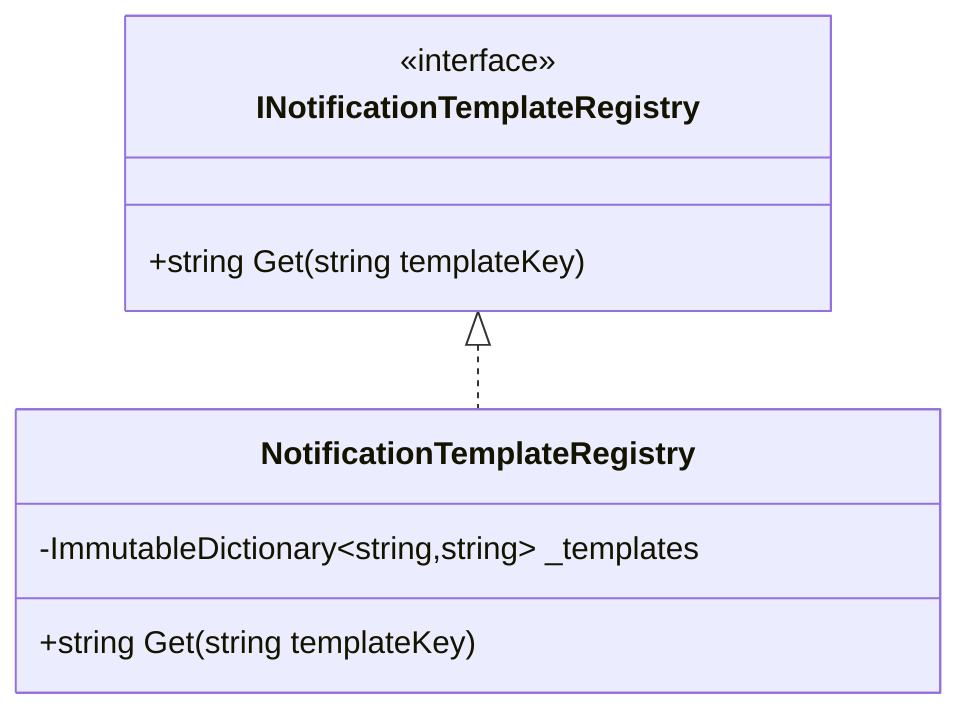

# Singleton

## 1. Kısa Tanım

Singleton, bir sınıfın uygulama yaşam döngüsü boyunca tek bir örnekle çalışmasını sağlar.

İyi uygulandığında “her yerde yeni nesne üretme” alışkanlığını keser, paylaşılan davranışı merkezi hale getirir ve ekipte “bu sorumluluğun sahibi neresi?” sorusuna net cevap verir.

## 2. Çözdüğü Problem

Bazı bileşenler doğası gereği uygulama boyunca tek bir merkezden yönetilmelidir: örneğin şablon kayıtları, uygulama içi sabit konfigürasyon yorumlayıcıları veya tek noktadan çalışan isimlendirme stratejileri.

Bu noktada Singleton aşağıdaki dağınıklığı azaltır:

- Aynı sorumluluk için birden fazla nesnenin farklı state üretmesi
- Global davranışın rastgele noktalardan değiştirilebilmesi
- “Bu veri nereden geliyor?” sorusunun kod içinde izini kaybetmek

## 3. İş Modeli Örneği (Etkinlik Bildirim Merkezi)

Bir etkinlik platformunda düşünelim: sistemde konser, konferans ve atölye yayınları için bildirim metin şablonları kullanılıyor. Bu şablonların aynı versiyonla ve aynı kurallarla uygulanması gerekiyor.

Eğer her handler kendi şablon sözlüğünü üretirse metinler farklılaşır, bazı kullanıcılar eski içerik görür, bazıları yeni. Singleton bir `NotificationTemplateRegistry` ile bu karmaşayı bitirir: tek merkezden yükleme yapılır, herkes aynı kaynağı okur.

## 4. .NET İçinde Kullanım Yaklaşımı

ASP.NET Core DI içinde `AddSingleton<TService, TImplementation>()` lifetime karşılığıdır.

Uygulama yapılırken bu denge önemlidir:

- Singleton sınıfı gerçekten tekil bir sorumluluk taşımalıdır.
- Mümkünse stateless veya kontrollü state ile çalışmalıdır.
- Public API yüzeyi XML documentation comments ile açık olmalıdır.
- Testlerde doğrudan singletona kilitlenmek yerine arayüz üzerinden bağımlılık verilmelidir.

## 5. Mermaid Diyagramı



## 6. Örnek Kod / Taslak

```csharp
using System;
using System.Collections.Generic;
using System.Collections.Immutable;
using Microsoft.Extensions.DependencyInjection;

/// <summary>
/// Bildirim şablonlarına tek merkezden erişim sağlayan kayıt sözleşmesi.
/// </summary>
public interface INotificationTemplateRegistry
{
    /// <summary>
    /// Anahtara karşılık gelen şablon metnini döndürür.
    /// </summary>
    string Get(string templateKey);
}

/// <summary>
/// Uygulama genelinde tek örnek olarak çalışan şablon kayıt merkezi.
/// </summary>
public sealed class NotificationTemplateRegistry : INotificationTemplateRegistry
{
    private readonly ImmutableDictionary<string, string> _templates =
        ImmutableDictionary.CreateRange(
            StringComparer.OrdinalIgnoreCase,
            new[]
            {
                new KeyValuePair<string, string>("event-published", "Yeni etkinlik yayında: {eventTitle}"),
                new KeyValuePair<string, string>("event-reminder", "Etkinlik başlamak üzere: {eventTitle}")
            });

    /// <summary>
    /// İstenen anahtar için ham şablon metnini getirir.
    /// Dönen metindeki `{eventTitle}` gibi placeholder'lar çağıran tarafta
    /// `template.Replace("{eventTitle}", value)` benzeri bir yaklaşımla doldurulur.
    /// </summary>
    public string Get(string templateKey)
    {
        if (!_templates.TryGetValue(templateKey, out var template))
        {
            throw new KeyNotFoundException($"Template not found: {templateKey}.");
        }

        return template;
    }
}

/// <summary>
/// DI kaydında Singleton lifetime kullanım örneğini gösterir.
/// </summary>
public static class NotificationRegistrationExtensions
{
    /// <summary>
    /// Bildirim şablon kayıt servisini Singleton yaşam döngüsü ile ekler.
    /// </summary>
    public static IServiceCollection AddNotificationTemplateRegistry(this IServiceCollection services)
    {
        services.AddSingleton<INotificationTemplateRegistry, NotificationTemplateRegistry>();
        return services;
    }
}
```

Bu örnek bilerek sabit bir şablon kümesiyle tutuldu. Üretimde şablonları veritabanı veya konfigürasyondan yüklemek isterseniz, aynı sınıf DI üzerinden gerekli bağımlılıkları constructor ile alacak şekilde genişletilebilir.

## 7. Ne Zaman Kullanılır?

- Uygulama boyunca tek bir merkezi davranışın korunması gerekiyorsa
- Aynı verinin farklı sınıflarda tekrar tekrar yüklenmesi maliyet üretiyorsa
- Tutarlılık için tek kaynak yaklaşımı kritikse

## 8. Avantajlar

- Tek bir erişim noktası sunar.
- Paylaşılan davranışta tutarlılık sağlar.
- Gereksiz nesne üretimini azaltarak performansı destekleyebilir.
- Mimari niyeti görünür hale getirir.

## 9. Riskler ve Trade-off'lar

- Aşırı kullanıldığında global state hissi oluşturabilir.
- Gizli bağımlılıklara yol açarsa testleri kırılganlaştırabilir.
- Yaşam döngüsü yanlış seçilirse bellek ve eşzamanlılık sorunları üretebilir.

## 10. Test Edilebilirlik Notları

- Singleton sınıfını doğrudan her yere çağırmak yerine arayüzü enjekte edin.
- Test senaryolarında `INotificationTemplateRegistry` için fake/stub kullanın.
- Paylaşılan state varsa test başlangıcında deterministik reset stratejisi uygulayın.
