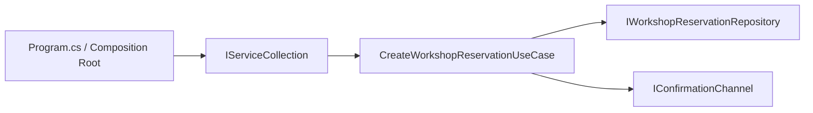

# Dependency Injection

Dependency Injection, bir sınıfın ihtiyaç duyduğu bağımlılıkları kendi içinde üretmek yerine dışarıdan almasını sağlar. Kulağa teknik bir ayrıntı gibi gelse de etkisi çok somuttur: kod daha esnek olur, test yazmak kolaylaşır ve zamanla büyüyen projelerde “bu sınıf neden her şeyi biliyor?” hissi ciddi biçimde azalır.

## 1. Kısa Tanım

Dependency Injection, nesnelerin ihtiyaç duyduğu servislerin constructor, method veya property üzerinden verilmesi yaklaşımıdır. .NET tarafında en yaygın kullanım biçimi constructor injection'dır ve özellikle ASP.NET Core uygulamalarında built-in container ile doğal şekilde çalışır.

## 2. Çözdüğü Problem

Bir sınıf bağımlılıklarını `new` ile kendi üretmeye başladığında ilk bakışta işler hızlı ilerler. Fakat kod büyüdükçe tablo değişir:

- Sınıf hem iş kuralını yürütür hem de altyapı nesnelerini oluşturur.
- Somut implementasyonlara bağımlılık arttığı için değişiklik maliyeti yükselir.
- Unit test yazarken gerçek e-posta servisi, gerçek repository veya gerçek dış servis çağrıları araya girer.
- Farklı ortamlarda farklı implementasyon kullanmak zorlaşır.

Dependency Injection bu düğümü çözer. Sınıf yalnızca “neye ihtiyacı olduğunu” söyler; “onu kimin sağlayacağı” sorumluluğu uygulamanın composition root noktasına taşınır.

## 3. Ne Zaman Kullanılır?

- Bir use-case birden fazla servisle iş birliği yapıyorsa
- Repository, cache, mesajlaşma, bildirim veya dış API soyutlamaları kullanılıyorsa
- Aynı iş akışı için test ortamında farklı, production ortamında farklı implementasyon çalıştırılacaksa
- Sınıfları küçük ve odaklı tutmak istiyorsanız
- Mock, stub veya fake nesnelerle kolay test yazmak önemliyse

## 4. Gerçek Hayattan Bir Senaryo

Yaratıcı bir atölye rezervasyon platformu düşünün. Kullanıcı bir seramik atölyesi için rezervasyon yaptığında sistemin iki temel işi vardır: rezervasyonu kaydetmek ve katılımcıya onay mesajı göndermek.

Eğer `WorkshopReservationService` bu servislerin hepsini kendi içinde üretürse, sınıf kısa sürede küçük bir orkestradan çok tek kişilik bir sahne gösterisine dönüşür. Oysa bağımlılıklar dışarıdan verildiğinde servis yalnızca akışı yönetir: “rezervasyonu kaydet, mesajı gönder, işlem tamam.” Bu yapı hem okunur hem de kolayca test edilir.

## 5. .NET İçinde Kullanım Yaklaşımı

.NET ekosisteminde Dependency Injection çoğunlukla şu yapı üzerinden ilerler:

- Arayüzler bağımlılık sözleşmesini tanımlar.
- Somut sınıflar bu sözleşmeleri uygular.
- `Program.cs` veya bir extension method içinde servis kayıtları yapılır.
- Tüketici sınıflar bağımlılıklarını constructor üzerinden alır.

Servis ömürleri doğru seçilmelidir:

- `AddTransient`: Hafif ve kısa ömürlü servisler
- `AddScoped`: Request veya işlem kapsamı boyunca paylaşılması gereken servisler
- `AddSingleton`: Uygulama boyunca tek örnek yeterliyse

Yanlış lifetime seçimi, DI kullanımında en sık rastlanan risklerden biridir.

## 6. Basit Akış



## 7. C# Örneği

Aşağıdaki örnek, atölye rezervasyon akışında constructor injection kullanımını gösterir. Onay mesajı tarafı gerçek bir entegrasyon yerine konsola yazan simüle bir kanal ile temsil edilir. Böylece örnek kısa kalırken bağımlılıkların nasıl enjekte edildiği net biçimde görülebilir.

```csharp
using System;
using System.Threading;
using System.Threading.Tasks;

namespace PatternCraft.DependencyInjectionSample;

/// <summary>
/// Represents a workshop reservation request created by a participant.
/// </summary>
public sealed record WorkshopReservationRequest
{
    /// <summary>
    /// Initializes a new instance of the <see cref="WorkshopReservationRequest"/> class.
    /// </summary>
    /// <param name="workshopCode">The code of the selected workshop.</param>
    /// <param name="participantEmail">The participant email address.</param>
    /// <exception cref="ArgumentException">
    /// Thrown when the workshop code or participant email is empty.
    /// </exception>
    public WorkshopReservationRequest(string workshopCode, string participantEmail)
    {
        WorkshopCode = string.IsNullOrWhiteSpace(workshopCode)
            ? throw new ArgumentException("Workshop code is required.", nameof(workshopCode))
            : workshopCode;

        ParticipantEmail = string.IsNullOrWhiteSpace(participantEmail)
            ? throw new ArgumentException("Participant email is required.", nameof(participantEmail))
            : participantEmail;
    }

    /// <summary>
    /// Gets the code of the selected workshop.
    /// </summary>
    public string WorkshopCode { get; }

    /// <summary>
    /// Gets the participant email address.
    /// </summary>
    public string ParticipantEmail { get; }
}

/// <summary>
/// Persists workshop reservations.
/// </summary>
public interface IWorkshopReservationRepository
{
    /// <summary>
    /// Saves a reservation asynchronously.
    /// </summary>
    /// <param name="request">The reservation request to persist.</param>
    /// <param name="cancellationToken">Token used to cancel the operation.</param>
    /// <returns>A task that represents the asynchronous save operation.</returns>
    Task SaveAsync(WorkshopReservationRequest request, CancellationToken cancellationToken);
}

/// <summary>
/// Sends confirmation messages after a reservation is created.
/// </summary>
public interface IConfirmationChannel
{
    /// <summary>
    /// Sends a reservation confirmation message.
    /// </summary>
    /// <param name="emailAddress">The recipient email address.</param>
    /// <param name="workshopCode">The reserved workshop code.</param>
    /// <param name="cancellationToken">Token used to cancel the operation.</param>
    /// <returns>A task that represents the asynchronous send operation.</returns>
    Task SendReservationConfirmedAsync(
        string emailAddress,
        string workshopCode,
        CancellationToken cancellationToken);
}

/// <summary>
/// Coordinates the workshop reservation workflow.
/// </summary>
public sealed class CreateWorkshopReservationUseCase
{
    private readonly IWorkshopReservationRepository _repository;
    private readonly IConfirmationChannel _confirmationChannel;

    /// <summary>
    /// Initializes a new instance of the <see cref="CreateWorkshopReservationUseCase"/> class.
    /// </summary>
    /// <param name="repository">The reservation repository dependency.</param>
    /// <param name="confirmationChannel">The confirmation channel dependency.</param>
    public CreateWorkshopReservationUseCase(
        IWorkshopReservationRepository repository,
        IConfirmationChannel confirmationChannel)
    {
        ArgumentNullException.ThrowIfNull(repository, nameof(repository));
        ArgumentNullException.ThrowIfNull(confirmationChannel, nameof(confirmationChannel));

        _repository = repository;
        _confirmationChannel = confirmationChannel;
    }

    /// <summary>
    /// Creates a reservation and sends its confirmation.
    /// </summary>
    /// <param name="request">The reservation request to process.</param>
    /// <param name="cancellationToken">Token used to cancel the operation.</param>
    /// <returns>A task that represents the asynchronous workflow.</returns>
    public async Task HandleAsync(
        WorkshopReservationRequest request,
        CancellationToken cancellationToken)
    {
        ArgumentNullException.ThrowIfNull(request, nameof(request));

        await _repository.SaveAsync(request, cancellationToken);
        await _confirmationChannel.SendReservationConfirmedAsync(
            request.ParticipantEmail,
            request.WorkshopCode,
            cancellationToken);
    }
}

/// <summary>
/// Creates application objects in a single composition point.
/// </summary>
public static class ApplicationComposition
{
    /// <summary>
    /// Creates a ready-to-use reservation workflow.
    /// </summary>
    /// <returns>A configured use-case instance.</returns>
    public static CreateWorkshopReservationUseCase CreateReservationUseCase()
    {
        IWorkshopReservationRepository repository = new InMemoryWorkshopReservationRepository();
        IConfirmationChannel confirmationChannel = new ConsoleConfirmationChannel();

        return new CreateWorkshopReservationUseCase(repository, confirmationChannel);
    }
}

/// <summary>
/// Stores reservations in memory for demonstration purposes.
/// </summary>
internal sealed class InMemoryWorkshopReservationRepository : IWorkshopReservationRepository
{
    public Task SaveAsync(WorkshopReservationRequest request, CancellationToken cancellationToken)
    {
        return Task.CompletedTask;
    }
}

/// <summary>
/// Simulates a confirmation channel by writing the result to the console.
/// </summary>
internal sealed class ConsoleConfirmationChannel : IConfirmationChannel
{
    public Task SendReservationConfirmedAsync(
        string emailAddress,
        string workshopCode,
        CancellationToken cancellationToken)
    {
        Console.WriteLine($"{workshopCode} reservation confirmed for {emailAddress}.");
        return Task.CompletedTask;
    }
}
```

Bu örnekte use-case sınıfı herhangi bir somut repository veya onay kanalı üretmiyor. Bu küçük tercih çok büyük bir rahatlık sağlar: altyapı değişse bile iş akışının kendisi yerinden oynamaz. Gerçek bir ASP.NET Core uygulamasında bu bağlama çoğunlukla `Program.cs` içindeki DI container kayıtlarıyla yapılır; burada ise örneğin kısa ve tek başına derlenebilir kalması için manuel bir composition noktası gösterilmiştir.

## 8. Avantajlar

- Gevşek bağlılık sağlar.
- Test doubles kullanarak unit test yazmayı kolaylaştırır.
- Değişen altyapı detaylarını application akışından ayırır.
- Sınıfların tek sorumluluğa daha yakın kalmasına yardımcı olur.
- Composition root üzerinden merkezi yapılandırma sağlar.

## 9. Riskler ve Sınırlar

- Gereğinden fazla soyutlama, küçük projelerde kodu gereksiz karmaşık hale getirebilir.
- Yanlış servis ömrü seçimi beklenmeyen state paylaşımı veya performans sorunları doğurabilir.
- Constructor'a çok fazla bağımlılık geliyorsa bu, sınıfın fazla sorumluluk taşıdığını gösterebilir.
- DI container'ı her problemi çözen sihirli kutu gibi görmek, kötü tasarımı gizleyebilir.

## 10. Test Edilebilirlik Notları

Dependency Injection'ın en güçlü yanı test tarafında hissedilir. `CreateWorkshopReservationUseCase` sınıfı gerçek veritabanına veya gerçek mesaj altyapısına bağlı olmadığı için testte fake bir repository ve spy bir confirmation channel verilebilir.

Böylece şu sorular kolayca doğrulanır:

- Rezervasyon kaydı gerçekten tetiklendi mi?
- Onay mesajı doğru e-posta adresine gönderildi mi?
- Hata durumunda hangi bağımlılık hangi sırayla çağrıldı?

Kısacası DI, testleri “sistemi kurmaya çalışma” egzersizinden çıkarıp “davranışı doğrulama” pratiğine dönüştürür.
