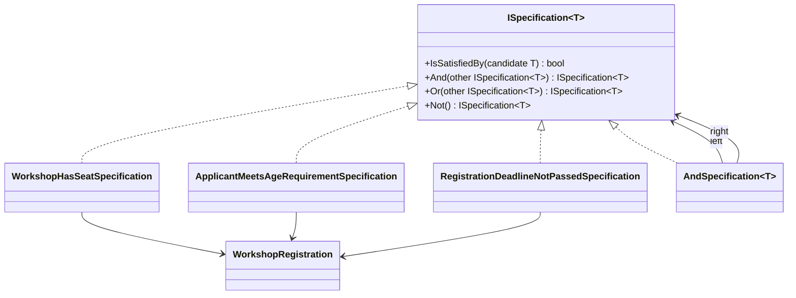

# Specification Pattern

Specification Pattern, iş kurallarını küçük, okunabilir ve birleştirilebilir parçalara ayırır. Böylece "bu kayıt kabul edilir mi?", "bu içerik yayınlanabilir mi?" gibi kararlar; servislerin içinde dağılmak yerine tek bir dilde konuşmaya başlar.

**Ana Kategori:** Application Design Patterns  
**Alt Kategori:** Behavioral Patterns  
**Pattern:** Specification Pattern  
**Dosya Yolu:** `docs/application/dotnet-application/specification-pattern.md`  
**Odak:** Tek uygulama / tek mikroservis içi kod mimarisi  
**Önerilen Katman:** Domain ve Application katmanları

## 1. Problem Tanımı

İş kuralları büyüdükçe aynı koşullar farklı sınıflarda tekrar eder: bir yerde `if`, başka yerde benzer ama biraz farklı bir `if` daha. Bir süre sonra ekip şu soruyla karşılaşır: “Gerçek kural hangisi?”

Specification, bu karmaşayı tek bir modele toplar:

- Kuralı nesne olarak temsil eder.
- Kuralları `And`, `Or`, `Not` gibi operatörlerle birleştirir.
- Kuralları bağımsız test etmeyi kolaylaştırır.

## 2. Ne Zaman Kullanılır?

- Aynı karar kuralı birden fazla use-case içinde tekrar ediyorsa
- Yeni kural eklenmesi bekleniyor ve mevcut akış bozulmadan genişlemek isteniyorsa
- Domain kurallarını controller/handler içinden çekip daha anlamlı bir yapıya taşımak gerekiyorsa
- Unit testlerde yalnızca kural davranışını doğrulamak isteniyorsa

## 3. Gerçek Hayat Senaryosu: Atölye Kayıt Platformu

Bir etkinlik platformunda kullanıcılar atölyelere kayıt oluyor. “Kayıt kabul edilir mi?” sorusu tek bir koşula bağlı değil:

- Atölye kontenjanı dolu mu?
- Kullanıcı yaş koşulunu sağlıyor mu?
- Başvuru son tarihi geçti mi?

Bu kuralları ayrı specification sınıflarıyla modellediğinde, kayıt servisi sadece hangi kuralların bir araya geldiğini anlatır. Kural detayları kendi sınıfında yaşar.

## 4. UML / Mermaid Diyagramı



## 5. C# Örnek Kod

```csharp
using System;

namespace PatternCraft.SpecificationSample;

/// <summary>
/// Bir domain nesnesi için doğrulanabilir kural tanımını temsil eder.
/// </summary>
/// <typeparam name="T">Kuralın değerlendirileceği model tipi.</typeparam>
public interface ISpecification<T>
{
    /// <summary>
    /// Aday nesnenin kuralı sağlayıp sağlamadığını döner.
    /// </summary>
    /// <param name="candidate">Değerlendirilecek aday nesne.</param>
    /// <returns>Kural sağlanıyorsa <see langword="true"/>, aksi halde <see langword="false"/>.</returns>
    bool IsSatisfiedBy(T candidate);

    /// <summary>
    /// İki specification'ı VE (AND) operatörü ile birleştirir.
    /// Bu varsayılan arayüz implementasyonudur; ihtiyaç halinde somut sınıflar farklı birleştirme davranışı uygulayabilir.
    /// </summary>
    /// <param name="other">Birleştirilecek diğer specification.</param>
    /// <returns>Her iki kuralı da doğrulayan bileşik specification.</returns>
    ISpecification<T> And(ISpecification<T> other) => new AndSpecification<T>(this, other);

    /// <summary>
    /// İki specification'ı VEYA (OR) operatörü ile birleştirir.
    /// </summary>
    /// <param name="other">Birleştirilecek diğer specification.</param>
    /// <returns>Kurallardan en az birini doğrulayan bileşik specification.</returns>
    ISpecification<T> Or(ISpecification<T> other) => new OrSpecification<T>(this, other);

    /// <summary>
    /// Specification sonucunu tersine çevirir.
    /// </summary>
    /// <returns>Mevcut kuralın NOT hali.</returns>
    ISpecification<T> Not() => new NotSpecification<T>(this);
}

/// <summary>
/// İki specification'ı VE (AND) operatörü ile birleştirir.
/// Bu sınıf çoğunlukla doğrudan oluşturulmaz; <see cref="ISpecification{T}.And(ISpecification{T})"/> çağrısı ile üretilir.
/// </summary>
/// <typeparam name="T">Kuralın değerlendirileceği model tipi.</typeparam>
public sealed class AndSpecification<T>(ISpecification<T> left, ISpecification<T> right) : ISpecification<T>
{
    /// <summary>
    /// Aday nesnenin her iki kuralı da sağlayıp sağlamadığını döner.
    /// </summary>
    /// <param name="candidate">Değerlendirilecek aday nesne.</param>
    /// <returns>Her iki kural sağlanıyorsa <see langword="true"/>.</returns>
    public bool IsSatisfiedBy(T candidate) => left.IsSatisfiedBy(candidate) && right.IsSatisfiedBy(candidate);
}

/// <summary>
/// İki specification'ı VEYA (OR) operatörü ile birleştirir.
/// </summary>
/// <typeparam name="T">Kuralın değerlendirileceği model tipi.</typeparam>
public sealed class OrSpecification<T>(ISpecification<T> left, ISpecification<T> right) : ISpecification<T>
{
    /// <summary>
    /// Aday nesnenin kurallardan en az birini sağlayıp sağlamadığını döner.
    /// </summary>
    /// <param name="candidate">Değerlendirilecek aday nesne.</param>
    /// <returns>En az bir kural sağlanıyorsa <see langword="true"/>.</returns>
    public bool IsSatisfiedBy(T candidate) => left.IsSatisfiedBy(candidate) || right.IsSatisfiedBy(candidate);
}

/// <summary>
/// Bir specification sonucunu tersine çevirir.
/// </summary>
/// <typeparam name="T">Kuralın değerlendirileceği model tipi.</typeparam>
public sealed class NotSpecification<T>(ISpecification<T> inner) : ISpecification<T>
{
    /// <summary>
    /// Aday nesnenin iç kuralı sağlamama durumunu döner.
    /// </summary>
    /// <param name="candidate">Değerlendirilecek aday nesne.</param>
    /// <returns>İç kural sağlanmıyorsa <see langword="true"/>.</returns>
    public bool IsSatisfiedBy(T candidate) => !inner.IsSatisfiedBy(candidate);
}

/// <summary>
/// Atölye kayıt başvurusu için gerekli verileri taşır.
/// </summary>
/// <param name="Age">Başvuru sahibinin yaşı.</param>
/// <param name="SeatCount">Atölyedeki toplam kontenjan.</param>
/// <param name="ReservedSeatCount">Dolu kontenjan sayısı.</param>
/// <param name="RegistrationDeadlineUtc">Kayıt için son tarih (UTC).</param>
public sealed record WorkshopRegistration(
    int Age,
    int SeatCount,
    int ReservedSeatCount,
    DateTime RegistrationDeadlineUtc);

/// <summary>
/// Atölyede boş kontenjan olup olmadığını kontrol eder.
/// </summary>
public sealed class WorkshopHasSeatSpecification : ISpecification<WorkshopRegistration>
{
    /// <summary>
    /// Kayıt için boş kontenjan bulunup bulunmadığını döner.
    /// </summary>
    /// <param name="candidate">Değerlendirilecek başvuru.</param>
    /// <returns>Kontenjan uygunsa <see langword="true"/>.</returns>
    public bool IsSatisfiedBy(WorkshopRegistration candidate) => candidate.ReservedSeatCount < candidate.SeatCount;
}

/// <summary>
/// Başvuru sahibinin minimum yaş şartını sağlayıp sağlamadığını kontrol eder.
/// </summary>
/// <param name="minimumAge">Minimum yaş sınırı.</param>
public sealed class ApplicantMeetsAgeRequirementSpecification(int minimumAge) : ISpecification<WorkshopRegistration>
{
    /// <summary>
    /// Başvuru sahibinin yaşının minimum sınırı karşılayıp karşılamadığını döner.
    /// </summary>
    /// <param name="candidate">Değerlendirilecek başvuru.</param>
    /// <returns>Yaş koşulu sağlanıyorsa <see langword="true"/>.</returns>
    public bool IsSatisfiedBy(WorkshopRegistration candidate) => candidate.Age >= minimumAge;
}

/// <summary>
/// Kayıt son tarihinin geçip geçmediğini kontrol eder.
/// </summary>
/// <param name="timeProvider">Sistem zamanını sağlayan provider.</param>
public sealed class RegistrationDeadlineNotPassedSpecification(TimeProvider timeProvider) : ISpecification<WorkshopRegistration>
{
    /// <summary>
    /// Başvurunun son tarihte veya daha önce yapılıp yapılmadığını döner.
    /// Bu örnekte son tarih eşitliği kabul edilir (inclusive deadline).
    /// </summary>
    /// <param name="candidate">Değerlendirilecek başvuru.</param>
    /// <returns>Son tarih geçmediyse <see langword="true"/>.</returns>
    public bool IsSatisfiedBy(WorkshopRegistration candidate)
        => timeProvider.GetUtcNow().UtcDateTime <= candidate.RegistrationDeadlineUtc;
}

/// <summary>
/// Uygulamanın kayıt kabul kararını nasıl verdiğini gösterir.
/// </summary>
public static class Example
{
    /// <summary>
    /// Bileşik specification ile kayıt kabul kararını hesaplar.
    /// </summary>
    /// <param name="registration">Değerlendirilecek başvuru.</param>
    /// <returns>Kayıt kabul ediliyorsa <see langword="true"/>.</returns>
    public static bool CanRegister(WorkshopRegistration registration)
    {
        ISpecification<WorkshopRegistration> specification = new WorkshopHasSeatSpecification();
        specification = specification.And(new ApplicantMeetsAgeRequirementSpecification(minimumAge: 16));
        specification = specification.And(new RegistrationDeadlineNotPassedSpecification(TimeProvider.System));

        return specification.IsSatisfiedBy(registration);
    }
}
```

## 6. Avantajlar

- İş kuralları tek bir yerde ve isimlendirilmiş biçimde yaşar.
- Kural bileşimi netleştiği için kod okuma maliyeti düşer.
- Yeni koşullar eklenirken mevcut akışı kırmadan genişleme yapılır.
- Rule-centric unit test yazımı kolaylaşır.

## 7. Riskler ve Sınırlar

- Çok küçük problemlerde gereksiz soyutlama hissi oluşturabilir.
- Aşırı parçalanmış specification sınıfları navigasyonu zorlaştırabilir.
- Kural isimleri belirsiz seçilirse desenin okunabilirlik avantajı kaybolur.

## 8. Test Edilebilirlik Notları

- Her specification sınıfı için ayrı birim test yazılmalıdır.
- `And`, `Or`, `Not` birleşimleri için de davranış testleri eklenmelidir.
- Sınır değerler (yaş limiti, kontenjanın son koltuğu, son kayıt dakikası) özellikle test edilmelidir.
