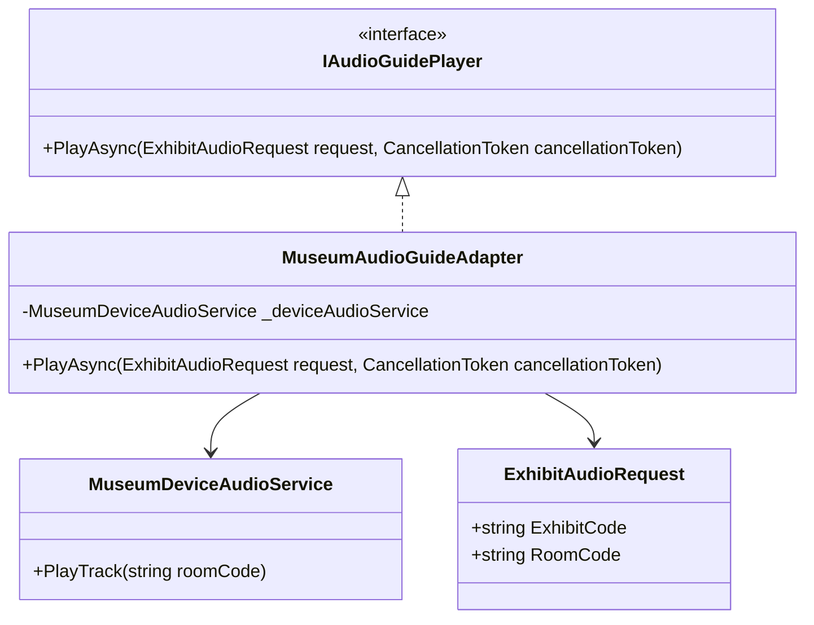

# Adapter

Adapter, birbirini anlamayan iki yapının arasına sakin ama çok yetenekli bir çevirmen yerleştirir. Bir taraf “bana `INotificationSender` ver” derken, diğer tarafta yalnızca eski bir servis ya da üçüncü parti SDK varsa, Adapter bu iki dünyanın birbirine çarpmadan konuşmasını sağlar.

## Kısa Tanım

Bu desen, mevcut sistemin beklediği arayüz ile eldeki bileşenin sunduğu arayüz uyuşmadığında devreye girer. Özellikle .NET projelerinde legacy servisler, üçüncü parti paketler, eski API istemcileri veya ekipler arası farklı sözleşmeler yüzünden ortaya çıkan uyumsuzlukları yönetmek için çok kullanışlıdır.

## Çözdüğü Problem

Bir uygulamanın iç katmanları çoğu zaman temiz, anlamlı ve test edilebilir kontratlarla çalışmak ister. Fakat dış dünya bu kadar kibar davranmaz:

- Bir kütüphane farklı method isimleri kullanır.
- Gelen veri modeli uygulamanın ihtiyaç duyduğu modelle birebir örtüşmez.
- Eski bir servis senkron çalışırken yeni akış asenkron ilerler.
- Üçüncü parti bir bağımlılığın teknik detayları domain veya application katmanına sızmaya başlar.

Bu durumda Adapter, dış sistemin karmaşasını içeri taşımadan bir dönüşüm katmanı kurar. Böylece uygulamanın geri kalanı hâlâ kendi konuştuğu dili konuşabilir.

## Ne Zaman Kullanılır?

- Mevcut bir sınıf işinizi görüyor ama arayüzü sisteminizin beklentisine uymuyorsa
- Dış servis ya da kütüphane değişimlerinden çekirdek iş akışını korumak istiyorsanız
- Uygulama içinde aynı çeviri mantığı farklı yerlerde tekrar etmeye başladıysa
- Legacy kodu tamamen yeniden yazmadan modern bir sözleşmeye bağlamak istiyorsanız
- Unit testlerde dış bağımlılığı kolayca taklit edilebilir bir arayüze dönüştürmek istiyorsanız

## Gerçek Hayat Senaryosu

Bir şehir müzesi için ziyaretçi deneyimi uygulaması geliştirdiğinizi düşünün. Uygulamanız, sergi salonuna giren ziyaretçiye doğru sesli rehber kaydını başlatmak istiyor. Yeni uygulama katmanı bunun için `IAudioGuidePlayer` arayüzünü kullanıyor.

Ancak binadaki mevcut cihaz entegrasyonu yıllar önce yazılmış bir SDK üzerinden geliyor ve yalnızca `MuseumDeviceAudioService.PlayTrack(string roomCode)` methodunu sunuyor. Uygulama oda bazlı bir `ExhibitAudioRequest` ile çalışırken, eski SDK sadece düz bir salon kodu biliyor.

Tam bu noktada Adapter devreye girer. Yeni akış değişmez, eski entegrasyon da yerinde kalır; sadece araya iki tarafın dilini bilen küçük bir sınıf girer.

## Yapısal Bakış



## C# Örnek Kodu

```csharp
using System;
using System.Threading;
using System.Threading.Tasks;

namespace PatternCraft.Structural.Adapter;

/// <summary>
/// Sesli rehber başlatma isteğini temsil eder.
/// </summary>
/// <param name="ExhibitCode">Ziyaretçinin bulunduğu sergi kodu.</param>
/// <param name="RoomCode">Cihaz entegrasyonunun beklediği salon kodu.</param>
public sealed record ExhibitAudioRequest(string ExhibitCode, string RoomCode);

/// <summary>
/// Uygulamanın sesli rehber oynatmak için kullandığı hedef arayüzdür.
/// </summary>
public interface IAudioGuidePlayer
{
    /// <summary>
    /// İstenen sergi için uygun ses kaydını başlatır.
    /// </summary>
    /// <param name="request">Sergi ve salon bilgisini taşıyan istek nesnesi.</param>
    /// <param name="cancellationToken">İşlemi iptal etmek için kullanılan token.</param>
    /// <returns>İşlem tamamlandığında dönen görev nesnesi.</returns>
    Task PlayAsync(ExhibitAudioRequest request, CancellationToken cancellationToken);
}

/// <summary>
/// Legacy cihaz SDK'sını temsil eder.
/// </summary>
public sealed class MuseumDeviceAudioService
{
    /// <summary>
    /// Verilen salon kodu için ilgili kaydı başlatır.
    /// </summary>
    /// <param name="roomCode">SDK'nın anlayabildiği salon kodu.</param>
    public void PlayTrack(string roomCode)
    {
        Console.WriteLine($"Playing audio track for room '{roomCode}'.");
    }
}

/// <summary>
/// Yeni uygulama kontratını legacy cihaz servisine uyarlayan adapter sınıfıdır.
/// </summary>
public sealed class MuseumAudioGuideAdapter : IAudioGuidePlayer
{
    private readonly MuseumDeviceAudioService _deviceAudioService;

    /// <summary>
    /// <see cref="MuseumAudioGuideAdapter"/> sınıfının yeni bir örneğini başlatır.
    /// </summary>
    /// <param name="deviceAudioService">Legacy cihaz servisi bağımlılığı.</param>
    /// <exception cref="ArgumentNullException">
    /// <paramref name="deviceAudioService"/> değeri null ise fırlatılır.
    /// </exception>
    public MuseumAudioGuideAdapter(MuseumDeviceAudioService deviceAudioService)
    {
        _deviceAudioService = deviceAudioService ?? throw new ArgumentNullException(nameof(deviceAudioService));
    }

    /// <inheritdoc />
    public Task PlayAsync(ExhibitAudioRequest request, CancellationToken cancellationToken)
    {
        ArgumentNullException.ThrowIfNull(request);
        cancellationToken.ThrowIfCancellationRequested();

        _deviceAudioService.PlayTrack(request.RoomCode);
        return Task.CompletedTask;
    }
}
```

Bu örnekte application katmanı yalnızca `IAudioGuidePlayer` bilir. Eğer yarın müzedeki cihaz altyapısı tamamen değişirse, etkilenecek yer büyük ihtimalle yalnızca adapter ve onun bağlandığı entegrasyon kodu olur.

## Avantajlar

- Dış bağımlılıkların teknik detaylarını uygulamanın çekirdek akışından uzak tutar.
- Legacy veya üçüncü parti kodu değiştirmeden sisteme dahil etmeyi kolaylaştırır.
- Aynı dönüştürme mantığını tek yerde toplayarak tekrar eden kodu azaltır.
- Dependency Injection ile birlikte kullanıldığında değiştirilebilir ve test edilebilir bir tasarım sunar.
- Yeni sözleşmeye geçiş sürecinde kademeli modernizasyon yapmayı mümkün kılar.

## Riskler ve Sınırlar

- Her uyumsuzluk için ayrı adapter üretmek, kontrolsüz kullanıldığında sınıf sayısını artırabilir.
- Adapter içine iş kuralı kaçarsa sınıf bir çevirmen olmaktan çıkıp gizli bir servis katmanına dönüşebilir.
- Çok katmanlı dönüşümler performans açısından küçük de olsa ek maliyet oluşturabilir.
- Dış bağımlılığın hataları yeterince soyutlanmazsa adapter yalnızca problemi başka bir dosyaya taşımış olur.

## Test Edilebilirlik Notları

Adapter genellikle test yazması keyifli desenlerden biridir; çünkü görevi nettir: gelen modeli alır, beklenen kontrata uygun davranışı üretir. Aşağıdaki kontroller çoğu senaryoda yeterlidir:

- İstek nesnesindeki alanların doğru bağımlılığa doğru sırayla aktarıldığı doğrulanır.
- Null girişler ve iptal edilmiş işlemler gibi koruyucu davranışlar test edilir.
- Dış servisin istisna fırlattığı durumda adapter'ın bunu nasıl yüzeye taşıdığı gözlemlenir.
- Application servisinin doğrudan legacy sınıfa değil, hedef arayüze bağımlı kaldığı test edilir.

Kısacası Adapter, “eskiyi çöpe atalım” ile “hiçbir şeye dokunmayalım” arasındaki olgun cevaptır. Doğru yerde kullanıldığında sistemi daha okunur, daha güvenli ve değişime daha dayanıklı hale getirir.
