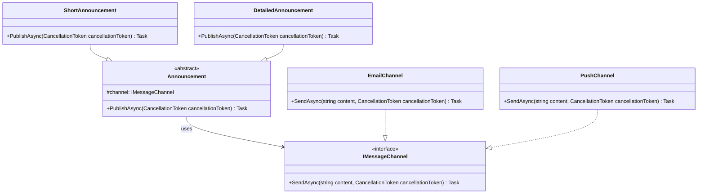

# Bridge

Bridge deseni, “ne yapıyorum?” sorusuyla “bunu nasıl yapıyorum?” sorusunu birbirinden ayırır. Böylece soyutlama (abstraction) ve implementasyon (implementation) kendi hızında evrilebilir.

## 1. Problem Tanımı

Bazı sistemlerde iki ayrı eksen aynı anda değişir:

- İş akışı (örn. rapor dışa aktarma, bildirim gönderme, içerik yayınlama)
- Teknik uygulama detayı (örn. PDF/HTML, e-posta/webhook, dosya/s3)

Bu iki eksen tek sınıf hiyerarşisinde birleşince sınıf sayısı patlar, değişiklik etkisi büyür ve test yazmak zorlaşır. Bridge, tam bu noktada devreye girer: akışı bir soyutlama altında toplar, teknik kısmı ayrı implementasyon olarak bağlar.

## 2. Ne Zaman Kullanılır?

- Soyutlama ve teknik detaylar birbirinden bağımsız değişiyorsa
- Yeni bir “iş davranışı” eklerken mevcut teknik kodlara dokunmak istemiyorsan
- Yeni bir “teknik implementasyon” eklerken iş akışlarını bozmamak gerekiyorsa
- Kalıtımla oluşan sınıf kombinasyonları artıyorsa (N x M problemi)

## 3. Gerçek Hayat Senaryosu

Bir **akıllı şehir etkinlik platformu** düşün: konser, atölye ve sergi duyuruları farklı formatlarda (kısa özet, detaylı bülten) hazırlanıyor; farklı kanallardan (mobil push, e-posta) gönderiliyor.

- İçerik formatı ayrı bir eksen
- Gönderim kanalı ayrı bir eksen

Bridge ile “duyuru hazırlama” tarafı, “hangi kanalla gönderildiği” bilgisinden ayrılır. Sonuç: yeni kanal eklendiğinde içerik sınıfları değişmez; yeni içerik türü eklendiğinde kanal sınıfları etkilenmez.

## 4. UML / Mermaid Diyagramı



## 5. C# Örnek Kod

```csharp
using System;
using System.Threading;
using System.Threading.Tasks;

namespace PatternCraft.Bridge;

/// <summary>
/// Mesajın hangi kanal üzerinden gönderileceğini tanımlar.
/// </summary>
public interface IMessageChannel
{
    /// <summary>
    /// Üretilen içerikleri hedef kanala iletir.
    /// </summary>
    /// <param name="content">Gönderilecek duyuru metni.</param>
    /// <param name="cancellationToken">İptal sinyali.</param>
    Task SendAsync(string content, CancellationToken cancellationToken);
}

/// <summary>
/// Duyuru soyutlamasının temelini temsil eder.
/// </summary>
public abstract class Announcement
{
    /// <summary>
    /// Announcement sınıfının yeni bir örneğini oluşturur.
    /// </summary>
    /// <param name="channel">Duyurunun gönderileceği kanal implementasyonu.</param>
    protected Announcement(IMessageChannel channel)
    {
        Channel = channel;
    }

    /// <summary>
    /// Kanal bağımlılığını saklar.
    /// </summary>
    protected IMessageChannel Channel { get; }

    /// <summary>
    /// Duyuruyu üretip kanala gönderir.
    /// </summary>
    /// <param name="cancellationToken">İptal sinyali.</param>
    public abstract Task PublishAsync(CancellationToken cancellationToken);
}

/// <summary>
/// Kısa ve hızlı okunabilir duyuru üretir.
/// </summary>
public sealed class ShortAnnouncement : Announcement
{
    private readonly string _content;

    /// <summary>
    /// ShortAnnouncement sınıfının yeni bir örneğini oluşturur.
    /// </summary>
    /// <param name="channel">Mesaj kanalı.</param>
    /// <param name="content">Yayınlanacak kısa duyuru metni.</param>
    public ShortAnnouncement(IMessageChannel channel, string content) : base(channel)
    {
        _content = content;
    }

    /// <inheritdoc />
    public override Task PublishAsync(CancellationToken cancellationToken)
    {
        var formatted = $"🎫 {_content}";
        return Channel.SendAsync(formatted, cancellationToken);
    }
}

/// <summary>
/// Daha detaylı etkinlik bülteni üretir.
/// </summary>
public sealed class DetailedAnnouncement : Announcement
{
    private readonly string _content;

    /// <summary>
    /// DetailedAnnouncement sınıfının yeni bir örneğini oluşturur.
    /// </summary>
    /// <param name="channel">Mesaj kanalı.</param>
    /// <param name="content">Yayınlanacak detaylı duyuru metni.</param>
    public DetailedAnnouncement(IMessageChannel channel, string content) : base(channel)
    {
        _content = content;
    }

    /// <inheritdoc />
    public override Task PublishAsync(CancellationToken cancellationToken)
    {
        var formatted = $"Etkinlik Bülteni: {_content}";
        return Channel.SendAsync(formatted, cancellationToken);
    }
}

/// <summary>
/// İçeriği e-posta ile ileten kanal.
/// </summary>
public sealed class EmailChannel : IMessageChannel
{
    /// <inheritdoc />
    public Task SendAsync(string content, CancellationToken cancellationToken)
    {
        Console.WriteLine($"[E-POSTA] {content}");
        return Task.CompletedTask;
    }
}

/// <summary>
/// İçeriği push bildirimi olarak ileten kanal.
/// </summary>
public sealed class PushChannel : IMessageChannel
{
    /// <inheritdoc />
    public Task SendAsync(string content, CancellationToken cancellationToken)
    {
        Console.WriteLine($"[PUSH] {content}");
        return Task.CompletedTask;
    }
}

/// <summary>
/// Bridge deseninin örnek kullanımını çalıştırır.
/// </summary>
public static class Demo
{
    /// <summary>
    /// Örnek duyuruları farklı kanal implementasyonları ile yayınlar.
    /// </summary>
    public static async Task RunAsync()
    {
        var cancellationToken = CancellationToken.None;

        Announcement shortByEmail = new ShortAnnouncement(
            new EmailChannel(),
            "Bu akşam şehir parkında canlı müzik var!");

        Announcement detailedByPush = new DetailedAnnouncement(
            new PushChannel(),
            "Cuma 20:00 konseri için kapılar 19:00'da açılıyor. Atölye kontenjanı sınırlıdır, uygulamadan kayıt olmayı unutmayın.");

        await shortByEmail.PublishAsync(cancellationToken);
        await detailedByPush.PublishAsync(cancellationToken);
    }
}
```

## 6. Avantajlar

- Soyutlama ve implementasyon ayrıldığı için değişiklik maliyeti düşer.
- Sınıf kombinasyonu patlaması engellenir.
- Yeni kanal veya yeni duyuru türü eklemek daha güvenli hale gelir.
- Testlerde fake/stub kanal enjekte edilerek davranış kolayca izole edilir.

## 7. Riskler ve Trade-off'lar

- Küçük ve hiç değişmeyecek sistemlerde gereksiz soyutlama maliyeti doğurabilir.
- Yanlış isimlendirme yapılırsa abstraction katmanı anlaşılmaz hale gelebilir.
- Ekip deseni tanımıyorsa ilk etapta öğrenme maliyeti oluşur.

## 8. Test Edilebilirlik Notları

Bridge, testlerde özellikle güçlüdür çünkü soyutlama tarafını teknik detaydan bağımsız doğrulayabilirsin:

- `IMessageChannel` için test doubles (fake/mock) kullanılır.
- `Announcement` türevlerinin doğru içerik ürettiği, kanal implementasyonundan bağımsız test edilir.
- Kanal testleri ayrı yazılarak I/O bağımlılıkları izole edilir.

Kısacası: davranış testleri ile entegrasyon testlerini temiz bir şekilde ayırmana yardımcı olur.
