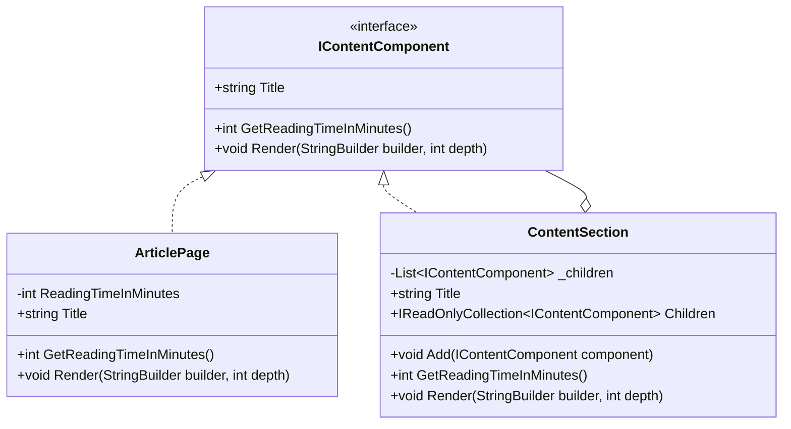

# Composite

**Kategori:** Application Design Patterns → Structural Patterns  
**Odak:** Tekil nesneleri ve nesne gruplarını aynı sözleşme üzerinden yönetmek

## 1. Kısa Tanım

Composite, ağaç benzeri yapılarda yer alan tek bir öğe ile o öğelerin oluşturduğu kümeyi aynı arayüzden ele almayı sağlar.

Bu desenin en güzel tarafı şudur: Kod, “bu bir yaprak mı, yoksa içinde başka parçalar da mı var?” sorusunu sürekli sormak zorunda kalmaz. Bir menü öğesi, bir klasör, bir sayfa bölümü ya da sahne akışındaki bir ana başlık; hepsi aynı kapıdan içeri girer.

## 2. Çözdüğü Problem

Hiyerarşik veriyle çalışan sistemlerde çoğu zaman iki ayrı yol oluşur:

- Tekil öğe için bir işleyiş
- Alt öğeler barındıran yapı için başka bir işleyiş

Bu ayrım büyüdükçe kodda `if/else` blokları çoğalır, dolaşım mantığı dağılır ve yeni bir düğüm tipi eklendiğinde mevcut akışlar kırılgan hale gelir.

Composite bu problemi, hem yaprakları hem de bileşik düğümleri aynı sözleşmeye oturtarak çözer. Böylece istemci kod, karşısındaki nesnenin tek başına mı durduğunu yoksa altında başka düğümler mi taşıdığını bilmeden çalışabilir.

## 3. Ne Zaman Kullanılır?

- Veri doğal olarak ağaç yapısında ilerliyorsa
- Tekil nesne ve nesne grubuna aynı operasyonlar uygulanacaksa
- UI menüsü, içerik ağacı, organizasyon şeması veya dosya yapısı gibi iç içe geçen modeller varsa
- Dolaşım, toplam hesaplama, görünürlük üretme veya çıktı oluşturma mantığını merkezi hale getirmek isteniyorsa
- Yeni düğüm türleri eklenirken istemci kodun mümkün olduğunca sabit kalması hedefleniyorsa

## 4. Gerçek Hayat Senaryosu

Bir dijital müze rehberi düşünün. Ziyaretçi uygulamasında “Sergiler” ana başlığı var. Bunun altında “Rönesans Salonu”, “Modern Sanat”, “Çocuk Atölyesi” gibi bölümler bulunuyor. Her bölümün içinde de bazen başka alt bölümler, bazen yalnızca tekil eser kartları yer alıyor.

Eğer her seviyeyi ayrı ayrı ele alırsanız, ekran üretimi kısa sürede dallanıp budaklanır. Ama her öğeyi `IContentComponent` gibi ortak bir yapı altında toplarsanız, sistem bir üst başlığı da tek bir eser kartını da aynı yöntemle gezebilir. Kullanıcı için pürüzsüz bir akış oluşur; geliştirici içinse daha sakin bir kod tabanı.

## 5. UML / Mermaid Diyagramı



## 6. C# Örnek Kodu

```csharp
using System;
using System.Collections.Generic;
using System.Linq;
using System.Text;

namespace PatternCraft.Structural.Composite;

/// <summary>
/// İçerik ağacındaki her düğüm için ortak davranışı tanımlar.
/// </summary>
public interface IContentComponent
{
    /// <summary>
    /// Düğümün ekranda görünen başlığını alır.
    /// </summary>
    string Title { get; }

    /// <summary>
    /// Düğüm ve varsa alt düğümleri için toplam okuma süresini hesaplar.
    /// </summary>
    /// <returns>Toplam okuma süresi.</returns>
    int GetReadingTimeInMinutes();

    /// <summary>
    /// Düğümü girintili metin olarak çıktılar.
    /// </summary>
    /// <param name="builder">Çıktının yazılacağı metin oluşturucu.</param>
    /// <param name="depth">Mevcut ağaç derinliği.</param>
    void Render(StringBuilder builder, int depth);
}

/// <summary>
/// Alt öğe içermeyen tekil içerik sayfasını temsil eder.
/// </summary>
public sealed class ArticlePage : IContentComponent
{
    /// <summary>
    /// <see cref="ArticlePage"/> sınıfının yeni bir örneğini başlatır.
    /// </summary>
    /// <param name="title">Sayfa başlığı.</param>
    /// <param name="readingTimeInMinutes">Sayfanın tahmini okuma süresi.</param>
    public ArticlePage(string title, int readingTimeInMinutes)
    {
        ArgumentException.ThrowIfNullOrWhiteSpace(title);

        if (readingTimeInMinutes < 0)
        {
            throw new ArgumentOutOfRangeException(nameof(readingTimeInMinutes));
        }

        Title = title;
        ReadingTimeInMinutes = readingTimeInMinutes;
    }

    /// <inheritdoc />
    public string Title { get; }

    private int ReadingTimeInMinutes { get; }

    /// <inheritdoc />
    public int GetReadingTimeInMinutes() => ReadingTimeInMinutes;

    /// <inheritdoc />
    public void Render(StringBuilder builder, int depth)
    {
        ArgumentNullException.ThrowIfNull(builder);

        builder.Append(' ', depth * 2);
        builder.AppendLine($"- {Title} ({ReadingTimeInMinutes} dakika)");
    }
}

/// <summary>
/// Alt düğümler taşıyabilen içerik bölümünü temsil eder.
/// </summary>
public sealed class ContentSection : IContentComponent
{
    private readonly List<IContentComponent> _children = [];

    /// <summary>
    /// <see cref="ContentSection"/> sınıfının yeni bir örneğini başlatır.
    /// </summary>
    /// <param name="title">Bölüm başlığı.</param>
    public ContentSection(string title)
    {
        ArgumentException.ThrowIfNullOrWhiteSpace(title);
        Title = title;
    }

    /// <inheritdoc />
    public string Title { get; }

    /// <summary>
    /// Bölümün alt düğümlerini salt okunur olarak döner.
    /// </summary>
    public IReadOnlyCollection<IContentComponent> Children => _children;

    /// <summary>
    /// Bölüme yeni bir alt düğüm ekler.
    /// </summary>
    /// <param name="component">Eklenecek içerik düğümü.</param>
    public void Add(IContentComponent component)
    {
        ArgumentNullException.ThrowIfNull(component);
        _children.Add(component);
    }

    /// <inheritdoc />
    public int GetReadingTimeInMinutes() => _children.Sum(child => child.GetReadingTimeInMinutes());

    /// <inheritdoc />
    public void Render(StringBuilder builder, int depth)
    {
        ArgumentNullException.ThrowIfNull(builder);

        builder.Append(' ', depth * 2);
        builder.AppendLine($"+ {Title}");

        foreach (IContentComponent child in _children)
        {
            child.Render(builder, depth + 1);
        }
    }
}

/// <summary>
/// Composite yapısının örnek kullanım çıktısını üretir.
/// </summary>
public static class Demo
{
    /// <summary>
    /// Müze rehberi ağacını oluşturur ve metin çıktısını döner.
    /// </summary>
    /// <returns>Örnek composite çıktısı.</returns>
    public static string BuildMuseumGuide()
    {
        ContentSection root = new("Müze Rehberi");
        ContentSection renaissanceHall = new("Rönesans Salonu");
        ContentSection modernArt = new("Modern Sanat");

        renaissanceHall.Add(new ArticlePage("Leonardo Köşesi", 4));
        renaissanceHall.Add(new ArticlePage("Renk ve Perspektif", 6));

        modernArt.Add(new ArticlePage("Soyut Formlar", 5));
        modernArt.Add(new ArticlePage("Işıkla Çizilen Oda", 3));

        root.Add(renaissanceHall);
        root.Add(modernArt);

        StringBuilder builder = new();
        root.Render(builder, depth: 0);
        builder.AppendLine($"Toplam süre: {root.GetReadingTimeInMinutes()} dakika");

        return builder.ToString();
    }
}
```

Bu örnekte `ArticlePage` bir yaprak düğümdür; `ContentSection` ise başka düğümler taşıyan composite yapıdır. İstemci kod, toplam süre hesabını da render işlemini de her iki tipe aynı sözleşme üzerinden uygular.

## 7. Avantajlar

- İstemci kodu, yaprak ve bileşik düğüm ayrımını daha az düşünür.
- Yeni alt seviye yapılar eklemek kolaylaşır.
- Recursive dolaşım ve toplama işlemleri merkezi hale gelir.
- Menü, içerik ağacı ve benzeri hiyerarşiler daha okunur modellenir.
- Birim testlerde hem tekil düğüm hem de ağaç davranışı ayrı ayrı doğrulanabilir.

## 8. Riskler ve Sınırlar

- Her düğüme aynı arayüzü vermek bazen yapraklar için anlamsız üyeler üretmeye itebilir.
- Çok derin ağaçlarda dolaşım maliyeti ve okunabilirlik dikkat ister.
- Yanlış kullanıldığında model, “her şeyi içine alan” soyut bir yapıya dönüşebilir.
- Çocuk yönetimi, sıralama ve silme kuralları iyi tanımlanmazsa composite sınıfı gereğinden fazla sorumluluk üstlenebilir.

## 9. Test Edilebilirlik Notları

Composite deseni test yazmayı kolaylaştırır; çünkü yaprak davranışı ile ağaç davranışı temiz biçimde ayrılır.

- `ArticlePage` için okuma süresi ve render çıktısı tek başına doğrulanabilir.
- `ContentSection` için alt düğümlerin toplam süreye doğru katkı verdiği test edilebilir.
- Boş bölüm, tek çocuklu bölüm ve çok seviyeli ağaç gibi kenar durumları rahatça kapsanabilir.
- Ortak arayüz sayesinde fake veya stub düğümler üretmek kolaydır.

Özellikle .NET tarafında xUnit, NUnit veya MSTest ile recursive çıktı ve toplam hesaplama senaryoları küçük, anlaşılır testler halinde modellenebilir.
