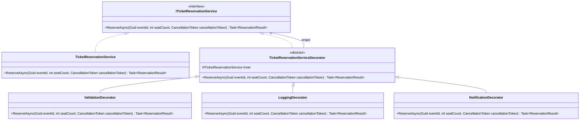

# Decorator

## 1. Kısa Tanım

Decorator, bir nesnenin gövdesine dokunmadan ona çalışma zamanında yeni davranışlar “katman katman” eklemeyi sağlar.  
Kısacası: aynı çekirdek davranış, farklı ihtiyaçlara göre farklı kombinasyonlarla zenginleşir.

## 2. Problem Tanımı

Zamanla servislerin içine loglama, doğrulama, metrik, cache ve benzeri çapraz kesen sorumluluklar dolmaya başlar.  
Sonuç: bir sınıf her işi yapan kalabalık bir merkeze dönüşür; okuması zorlaşır, değişiklik riski artar.

Decorator bu noktada devreye girer:

- Çekirdek davranış tek yerde kalır.
- Ek davranışlar küçük, bağımsız katmanlara ayrılır.
- İhtiyaca göre zincire yeni davranış eklemek kolaylaşır.

## 3. Ne Zaman Kullanılır?

- Aynı ek davranış farklı servislerde tekrar etmeye başladığında
- Yeni bir davranışı mevcut sınıfı büyütmeden eklemek istediğinizde
- Kalıtım ağacını genişletmeden esnek kombinasyonlar kurmak gerektiğinde
- Testlerde her davranışı ayrı ayrı doğrulamak istediğinizde

## 4. Gerçek Hayat Senaryosu (Finans Dışı)

Bir **etkinlik biletleme** sisteminde kullanıcı bilet rezervasyonu yapıyor.  
Rezervasyon akışına şu davranışları adım adım eklemek istiyoruz:

1. Giriş doğrulaması
2. Rezervasyon işlem logu
3. Başarılı işlem sonrası bildirim gönderimi

Çekirdek rezervasyon servisi yalnızca “rezervasyonu oluşturma” işini yapar.  
Doğrulama, loglama ve bildirim gibi ek sorumluluklar Decorator katmanları olarak zincire eklenir.

## 5. UML / Mermaid Diyagramı



## 6. C# Örnek Kod

```csharp
using System;
using System.Threading;
using System.Threading.Tasks;
using Microsoft.Extensions.Logging;

/// <summary>
/// Etkinlik bilet rezervasyon işlemleri için sözleşmeyi tanımlar.
/// </summary>
public interface ITicketReservationService
{
    /// <summary>
    /// Belirli bir etkinlik için istenen koltuk adedinde rezervasyon oluşturur.
    /// </summary>
    /// <param name="eventId">Rezervasyon yapılacak etkinliğin kimliği.</param>
    /// <param name="seatCount">Rezerve edilecek koltuk adedi.</param>
    /// <param name="cancellationToken">İptal belirteci.</param>
    /// <returns>Rezervasyon sonucunu döner.</returns>
    Task<ReservationResult> ReserveAsync(Guid eventId, int seatCount, CancellationToken cancellationToken);
}

/// <summary>
/// Rezervasyon servisinin temel uygulamasıdır.
/// </summary>
public sealed class TicketReservationService : ITicketReservationService
{
    /// <inheritdoc />
    public Task<ReservationResult> ReserveAsync(Guid eventId, int seatCount, CancellationToken cancellationToken)
    {
        var reservationCode = $"RSV-{eventId:N}-{seatCount}";
        return Task.FromResult(new ReservationResult(true, reservationCode));
    }
}

/// <summary>
/// Tüm rezervasyon decorator sınıfları için ortak temel sınıf sağlar.
/// </summary>
public abstract class TicketReservationServiceDecorator : ITicketReservationService
{
    /// <summary>
    /// Yeni bir <see cref="TicketReservationServiceDecorator"/> örneği oluşturur.
    /// </summary>
    /// <param name="inner">Sarmalanacak iç servis.</param>
    protected TicketReservationServiceDecorator(ITicketReservationService inner)
    {
        Inner = inner;
    }

    /// <summary>
    /// Sarmalanan iç servisi döner.
    /// </summary>
    protected ITicketReservationService Inner { get; }

    /// <inheritdoc />
    public virtual Task<ReservationResult> ReserveAsync(Guid eventId, int seatCount, CancellationToken cancellationToken)
    {
        return Inner.ReserveAsync(eventId, seatCount, cancellationToken);
    }
}

/// <summary>
/// Rezervasyon isteğini işleme almadan önce doğrulama yapan decorator sınıfıdır.
/// </summary>
public sealed class ValidationDecorator : TicketReservationServiceDecorator
{
    /// <summary>
    /// Yeni bir <see cref="ValidationDecorator"/> örneği oluşturur.
    /// </summary>
    /// <param name="inner">Sarmalanacak iç servis.</param>
    public ValidationDecorator(ITicketReservationService inner) : base(inner)
    {
    }

    /// <inheritdoc />
    public override Task<ReservationResult> ReserveAsync(Guid eventId, int seatCount, CancellationToken cancellationToken)
    {
        if (eventId == Guid.Empty)
        {
            throw new ArgumentException("Etkinlik kimliği boş olamaz.", nameof(eventId));
        }

        if (seatCount <= 0)
        {
            throw new ArgumentOutOfRangeException(nameof(seatCount), "Koltuk adedi sıfırdan büyük olmalıdır.");
        }

        return base.ReserveAsync(eventId, seatCount, cancellationToken);
    }
}

/// <summary>
/// Rezervasyon akışının giriş/çıkış loglarını yazan decorator sınıfıdır.
/// </summary>
public sealed class LoggingDecorator : TicketReservationServiceDecorator
{
    private readonly ILogger<LoggingDecorator> _logger;

    /// <summary>
    /// Yeni bir <see cref="LoggingDecorator"/> örneği oluşturur.
    /// </summary>
    /// <param name="inner">Sarmalanacak iç servis.</param>
    /// <param name="logger">Loglayıcı örneği.</param>
    public LoggingDecorator(ITicketReservationService inner, ILogger<LoggingDecorator> logger)
        : base(inner)
    {
        _logger = logger;
    }

    /// <inheritdoc />
    public override async Task<ReservationResult> ReserveAsync(Guid eventId, int seatCount, CancellationToken cancellationToken)
    {
        _logger.LogInformation("Rezervasyon başladı. EventId: {EventId}, SeatCount: {SeatCount}", eventId, seatCount);
        var result = await base.ReserveAsync(eventId, seatCount, cancellationToken);
        _logger.LogInformation("Rezervasyon bitti. Success: {Success}, Code: {Code}", result.Success, result.ReservationCode);
        return result;
    }
}

/// <summary>
/// Başarılı rezervasyon sonrası kullanıcıya bildirim gönderen decorator sınıfıdır.
/// </summary>
public sealed class NotificationDecorator : TicketReservationServiceDecorator
{
    /// <summary>
    /// Yeni bir <see cref="NotificationDecorator"/> örneği oluşturur.
    /// </summary>
    /// <param name="inner">Sarmalanacak iç servis.</param>
    public NotificationDecorator(ITicketReservationService inner) : base(inner)
    {
    }

    /// <inheritdoc />
    public override async Task<ReservationResult> ReserveAsync(Guid eventId, int seatCount, CancellationToken cancellationToken)
    {
        var result = await base.ReserveAsync(eventId, seatCount, cancellationToken);

        if (result.Success)
        {
            // Burada e-posta veya push bildirimi gönderimi tetiklenebilir.
        }

        return result;
    }
}

/// <summary>
/// Rezervasyon işleminin sonucunu temsil eder.
/// </summary>
/// <param name="Success">İşlemin başarılı olup olmadığını belirtir.</param>
/// <param name="ReservationCode">Oluşturulan rezervasyon kodu.</param>
public sealed record ReservationResult(bool Success, string ReservationCode);
```

## 7. Avantajlar

- Çekirdek iş kuralını sade tutar.
- Yeni davranış eklemeyi düşük riskli hale getirir.
- Davranışları küçük parçalara bölerek test yazmayı kolaylaştırır.
- Kalıtım yerine kompozisyonla daha esnek bir model sunar.

## 8. Olası Riskler

- Çok fazla katman, akışın izlenmesini zorlaştırabilir.
- Yanlış sıralanan decorator zinciri beklenmedik davranış üretebilir.
- Aşırı kullanımda basit bir akış gereksiz karmaşık hale gelebilir.

## 9. Test Edilebilirlik Notları

- Her decorator sınıfı, iç servisi mock’layarak bağımsız test edilebilir.
- Doğrulama, loglama ve bildirim adımları ayrı senaryolarla doğrulanabilir.
- Zincirin sırası için entegrasyon testi eklenerek davranış sıralaması güvence altına alınabilir.
