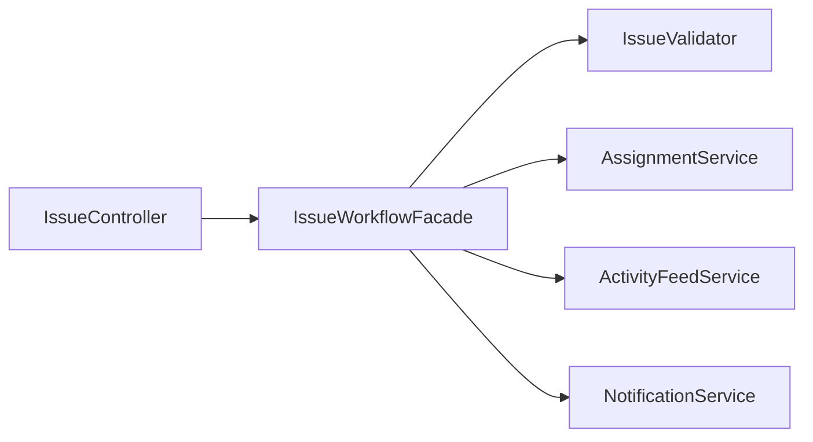

# Facade

## 1. Kısa Tanım

Facade, karmaşık alt sistemlerin dağınık sesini tek bir net komuta dönüştürür. Dışarıdan bakan biri onlarca teknik adımı görmek zorunda kalmaz; sadece ne istediğini söyler, Facade ise perde arkasındaki akışı düzenler.

## 2. Çözdüğü Problem

Gerçek projelerde akışlar büyüdükçe aynı sahne sık görülür: bir endpoint doğrulama yapar, başka bir servis veri hazırlar, bir başkası bildirim tetikler, diğeri log yazar. Birkaç sprint sonra kod, davranıştan çok operasyonel ayrıntı anlatmaya başlar.

Facade bu dağınıklığı toparlar ve özellikle şu noktalarda nefes aldırır:

- Controller/handler sınıflarını sadeleştirir.
- İş akışını tek bir giriş noktasında okunur hale getirir.
- Alt servis bağımlılıklarını çağıran katmandan gizler.
- Değişikliklerin etkisini daha dar bir alana toplar.

## 3. Ne Zaman Kullanılır?

- Aynı iş akışını birden fazla yerde tekrar yazmaya başladıysan
- Uygulama katmanındaki use-case akışı teknik detaylarla boğuluyorsa
- Dışa açık katmanlarda (API, application service) daha temiz bir arayüz istiyorsan
- Testlerde iş akışını tek bir nesne üzerinden doğrulamak istiyorsan

## 4. Ne Zaman Kullanılmamalıdır?

- Problem hâlâ çok küçük ve doğrudan çağrı daha anlaşılırsa
- Tek bir metotla çözülecek basit akış için gereksiz soyutlama oluşacaksa
- Ekip, Facade’in sorumluluğunu “her şeyi yapan sınıf”a çevirecekse

## 5. Avantajlar ve Riskler

### Avantajlar

- Karmaşık iş akışını daha anlaşılır hale getirir.
- Üst katmanların alt servisleri bilme ihtiyacını azaltır.
- Bakım maliyetini düşürür; değişiklikleri merkezileştirir.
- Test senaryolarını daha odaklı yazmayı kolaylaştırır.

### Riskler

- Facade zamanla aşırı büyüyüp “god class” haline gelebilir.
- Yanlış sınır çizilirse sadece ekstra katman etkisi yaratır.
- Alt servis sözleşmeleri çok sık değişiyorsa Facade kırılganlaşabilir.

## 6. UML / Mermaid Diyagramı



## 7. C# Örnek Kodu

```csharp
using System;
using System.Threading;
using System.Threading.Tasks;

namespace PatternCraft.Structural.Facade;

/// <summary>
/// Görev açma sürecindeki alt servisleri tek bir kullanım yüzeyinde toplar.
/// </summary>
public sealed class IssueWorkflowFacade
{
    private readonly IIssueValidator _validator;
    private readonly IAssignmentService _assignmentService;
    private readonly IActivityFeedService _activityFeedService;
    private readonly INotificationService _notificationService;

    /// <summary>
    /// <see cref="IssueWorkflowFacade"/> sınıfının yeni bir örneğini oluşturur.
    /// </summary>
    public IssueWorkflowFacade(
        IIssueValidator validator,
        IAssignmentService assignmentService,
        IActivityFeedService activityFeedService,
        INotificationService notificationService)
    {
        _validator = validator;
        _assignmentService = assignmentService;
        _activityFeedService = activityFeedService;
        _notificationService = notificationService;
    }

    /// <summary>
    /// Yeni bir görevi doğrular, atar, aktivite akışına yazar ve bildirim gönderir.
    /// </summary>
    public async Task<IssueResult> OpenIssueAsync(IssueDraft draft, CancellationToken cancellationToken)
    {
        _validator.Validate(draft);

        var issueId = await _assignmentService.CreateAndAssignAsync(draft, cancellationToken);
        await _activityFeedService.PublishAsync(issueId, "IssueOpened", cancellationToken);
        await _notificationService.NotifyAssigneeAsync(issueId, cancellationToken);

        return IssueResult.Success(issueId);
    }
}

/// <summary>
/// Görev açma isteğini temsil eder.
/// </summary>
public sealed record IssueDraft(string Title, string Description, string AssigneeEmail);

/// <summary>
/// İşlem sonucunu temsil eder.
/// </summary>
public sealed record IssueResult(bool IsSuccess, Guid IssueId)
{
    /// <summary>
    /// Başarılı sonuç üretir.
    /// </summary>
    public static IssueResult Success(Guid issueId) => new(true, issueId);
}

/// <summary>
/// Taslak verinin kurallara uygunluğunu denetler.
/// </summary>
public interface IIssueValidator
{
    /// <summary>
    /// Taslak veriyi doğrular.
    /// </summary>
    void Validate(IssueDraft draft);
}

/// <summary>
/// Görevin oluşturulması ve bir kişiye atanmasını yönetir.
/// </summary>
public interface IAssignmentService
{
    /// <summary>
    /// Görevi oluşturur ve atar.
    /// </summary>
    Task<Guid> CreateAndAssignAsync(IssueDraft draft, CancellationToken cancellationToken);
}

/// <summary>
/// Aktivite akışı kayıtlarını yayınlar.
/// </summary>
public interface IActivityFeedService
{
    /// <summary>
    /// İlgili olayı aktivite akışına yazar.
    /// </summary>
    Task PublishAsync(Guid issueId, string eventName, CancellationToken cancellationToken);
}

/// <summary>
/// Atanan kişiye bildirim gönderir.
/// </summary>
public interface INotificationService
{
    /// <summary>
    /// Atanan kişiyi bilgilendirir.
    /// </summary>
    Task NotifyAssigneeAsync(Guid issueId, CancellationToken cancellationToken);
}
```

## 8. Gerçek Hayat Senaryosu

Bir ekip içi görev takip platformu düşün: kullanıcı “Görev Aç” butonuna basıyor. O tek tıklamanın arkasında başlık doğrulama, uygun kişiye atama, ekip akışına olay yazma ve ilgili kişiye bildirim gönderme adımları var.

Facade burada sahne yöneticisi gibi çalışır. API katmanı sadece `OpenIssueAsync` çağırır; perde arkasındaki sıralama, koordinasyon ve alt servislerin birlikte çalışması Facade içinde kalır. Böylece üst katman sade kalır, alt sistemler ise kendi uzmanlığında gelişmeye devam eder.

## 9. Test Edilebilirlik Notları

- Facade’in bağımlılıklarını arayüzlerden aldığı için alt servisler kolayca mock’lanır.
- Başarılı akışta hangi servisin kaç kez çağrıldığını net biçimde doğrulayabilirsin.
- Hata senaryolarında (ör. doğrulama hatası) zincirin doğru noktada kesildiğini test etmek kolaylaşır.
- Facade testleri, use-case davranışını uçtan uca değil, akış koordinasyonu seviyesinde güvence altına alır.
