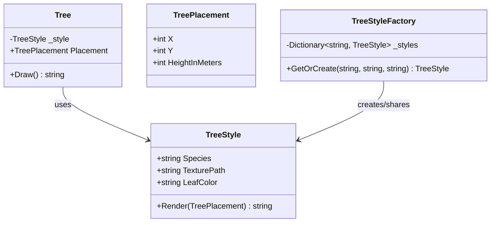

# Flyweight

Flyweight, sahnede birbirine benzeyen yüzlerce hatta binlerce nesne varsa, onların ortak taraflarını tek bir yerde tutup belleği ferahlatan bir desendir. Her nesne kendi kimliğini korur; ama tekrar tekrar taşınmasına gerek olmayan veriler paylaşıma açılır.

Bir başka deyişle: aynı ağacın gövde dokusunu, aynı ikonun SVG bilgisini ya da aynı etiket stilini her nesnenin sırtına yeniden yüklemek yerine, bunları ortak bir “hafif sıklet” nesnede toplarız. Nesnenin kendine özel konumu, sırası, zamanı veya durumu ise dışarıda kalır.

## Problem Tanımı

Bazı sistemlerde nesne sayısı hızla artar; fakat bu nesnelerin önemli bir bölümü aslında aynı iç veriyi taşır.

Örneğin:

- bir kampüs haritasında binlerce ağaç işaretleniyorsa,
- bir tasarım aracında aynı ikon farklı konumlarda tekrar tekrar çiziliyorsa,
- bir etkinlik alanında benzer koltuk tipleri çok sayıda örnekte gösteriliyorsa,

her örnek için aynı sabit veriyi yeniden üretmek gereksiz bellek tüketimine yol açar.

İşte Flyweight burada devreye girer. Nesnenin:

- **paylaşılabilir, değişmeyen kısmını** içsel durum (intrinsic state),
- **örneğe özel, dışarıdan gelen kısmını** dışsal durum (extrinsic state)

olarak ayırır.

Bu ayrım yapıldığında sistem hem daha hafif çalışır hem de tekrar eden veriyi daha kontrollü yönetir.

## Ne Zaman Kullanılır?

Flyweight özellikle şu durumlarda güçlü bir adaydır:

- Uygulama çok sayıda benzer nesne üretiyorsa
- Bu nesnelerin önemli bir bölümü aynı sabit veriyi paylaşıyorsa
- Bellek kullanımı görünür bir maliyet haline geldiyse
- Nesne oluşturma sayısı yüksek olduğu için performans baskısı oluşuyorsa
- Paylaşılan veriler immutable veya pratikte değişmez yapıdaysa

.NET tarafında bu desen; önbelleğe alınan görünüm tanımları, ortak referans verileri, ikon/meta veri katalogları, sabit stil tanımları ve rendering senaryolarında sıkça işe yarar.

## Ne Zaman Kullanılmamalıdır?

Her kalabalık nesne koleksiyonu Flyweight istemez.

Şu durumlarda desen gereksiz karmaşa üretebilir:

- Nesne sayısı düşükse
- Paylaşılacak veri zaten çok küçükse
- İçsel durum sık sık değişiyorsa
- Dışsal durumun taşınması kodu olduğundan daha karmaşık hale getiriyorsa
- Basit bir cache veya sözlük kullanımı problemi zaten çözüyor ise

Flyweight’in en büyük tuzağı, belleği azaltmaya çalışırken zihinsel yükü artırmaktır. Ölçülebilir bir kazanım yoksa desenin kendisi maliyete dönüşebilir.

## Gerçek Hayat Senaryosu

Bir şehir parkı planlama uygulaması düşünelim. Tasarım ekibi ekran üzerinde on binlerce ağaç yerleştiriyor:

- Meşe ağaçlarının yaprak rengi aynı
- Çam ağaçlarının doku bilgisi aynı
- Akçaağaçların görsel stili aynı

Ama her ağacın:

- haritadaki konumu,
- yüksekliği,
- rotasyonu,
- seçili olup olmaması

farklı.

Eğer her ağaç nesnesi kendi tür bilgisini, renk bilgisini ve doku yolunu ayrı ayrı taşırsa, sistem kısa sürede şişmeye başlar. Flyweight yaklaşımında ise “ağaç stili” tek yerde tutulur; her ağaç yalnızca kendine özgü dışsal bilgileri taşır. Böylece harita büyüdükçe bellek tüketimi doğrusal ama daha makul bir çizgide kalır.

## Yapısal Bakış



Bu diyagramdaki ana fikir nettir: `TreeStyle` paylaşılan veriyi taşır, `Tree` ise kendine özel konumu ve ölçüsünü tutar. Fabrika da aynı stili tekrar tekrar üretmek yerine paylaşımı organize eder.

## C# Örnek Kodu

Aşağıdaki örnek, .NET/C# odağında derlenebilir bir Flyweight uygulamasını gösterir:

```csharp
using System;
using System.Collections.Generic;

namespace PatternCraft.Structural.Flyweight;

/// <summary>
/// Paylaşılan ve değişmeyen ağaç stilini temsil eder.
/// </summary>
public sealed class TreeStyle
{
    /// <summary>
    /// <see cref="TreeStyle"/> sınıfının yeni bir örneğini başlatır.
    /// </summary>
    /// <param name="species">Ağaç türünü belirtir.</param>
    /// <param name="texturePath">Ağaç için kullanılacak doku yolunu belirtir.</param>
    /// <param name="leafColor">Yaprak rengini belirtir.</param>
    public TreeStyle(string species, string texturePath, string leafColor)
    {
        Species = species;
        TexturePath = texturePath;
        LeafColor = leafColor;
    }

    /// <summary>
    /// Ağaç türünü alır.
    /// </summary>
    public string Species { get; }

    /// <summary>
    /// Doku yolunu alır.
    /// </summary>
    public string TexturePath { get; }

    /// <summary>
    /// Yaprak rengini alır.
    /// </summary>
    public string LeafColor { get; }

    /// <summary>
    /// Paylaşılan stil ile dışsal konum bilgisini birleştirerek çizim sonucunu oluşturur.
    /// </summary>
    /// <param name="placement">Ağacın dışsal konum bilgisidir.</param>
    /// <returns>Çizim sonucunu temsil eden metni döner.</returns>
    public string Render(TreePlacement placement)
    {
        return $"{Species} ağacı ({placement.X}, {placement.Y}) noktasında, {placement.HeightInMeters} metre yükseklikle çizildi. " +
               $"Doku={TexturePath}, YaprakRengi={LeafColor}";
    }
}

/// <summary>
/// Ağaç için örneğe özel dışsal durumu temsil eder.
/// </summary>
/// <param name="X">X koordinatını belirtir.</param>
/// <param name="Y">Y koordinatını belirtir.</param>
/// <param name="HeightInMeters">Ağacın yüksekliğini belirtir.</param>
public readonly record struct TreePlacement(int X, int Y, int HeightInMeters);

/// <summary>
/// Paylaşılan ağaç stillerini üreten ve yeniden kullanan fabrikayı temsil eder.
/// </summary>
public sealed class TreeStyleFactory
{
    private readonly Dictionary<string, TreeStyle> _styles = new(StringComparer.OrdinalIgnoreCase);

    /// <summary>
    /// Verilen stil bilgileri için mevcut flyweight örneğini döner veya yenisini oluşturur.
    /// </summary>
    /// <param name="species">Ağaç türünü belirtir.</param>
    /// <param name="texturePath">Doku yolunu belirtir.</param>
    /// <param name="leafColor">Yaprak rengini belirtir.</param>
    /// <returns>Paylaşılan <see cref="TreeStyle"/> örneğini döner.</returns>
    public TreeStyle GetOrCreate(string species, string texturePath, string leafColor)
    {
        var key = $"{species}|{texturePath}|{leafColor}";

        if (_styles.TryGetValue(key, out var existingStyle))
        {
            return existingStyle;
        }

        var style = new TreeStyle(species, texturePath, leafColor);
        _styles[key] = style;
        return style;
    }
}

/// <summary>
/// Haritadaki tek bir ağaç örneğini temsil eder.
/// </summary>
public sealed class Tree
{
    private readonly TreeStyle _style;

    /// <summary>
    /// <see cref="Tree"/> sınıfının yeni bir örneğini başlatır.
    /// </summary>
    /// <param name="style">Paylaşılan ağaç stilini belirtir.</param>
    /// <param name="placement">Ağacın dışsal konum bilgisini belirtir.</param>
    public Tree(TreeStyle style, TreePlacement placement)
    {
        _style = style;
        Placement = placement;
    }

    /// <summary>
    /// Ağacın haritadaki konum bilgisini alır.
    /// </summary>
    public TreePlacement Placement { get; }

    /// <summary>
    /// Ağacı çizim için hazırlar.
    /// </summary>
    /// <returns>Çizim sonucunu temsil eden metni döner.</returns>
    public string Draw()
    {
        return _style.Render(Placement);
    }
}

/// <summary>
/// Flyweight deseninin kullanımını gösteren örnek akışı çalıştırır.
/// </summary>
public static class Demo
{
    /// <summary>
    /// Uygulama giriş noktasını çalıştırır.
    /// </summary>
    public static void Main()
    {
        var factory = new TreeStyleFactory();

        var oakStyle = factory.GetOrCreate("Meşe", "/textures/oak.png", "Yeşil");
        var anotherOakStyle = factory.GetOrCreate("Meşe", "/textures/oak.png", "Yeşil");

        var trees = new List<Tree>
        {
            new(oakStyle, new TreePlacement(10, 12, 6)),
            new(anotherOakStyle, new TreePlacement(18, 25, 7)),
            new(factory.GetOrCreate("Çam", "/textures/pine.png", "KoyuYeşil"), new TreePlacement(40, 8, 9))
        };

        Console.WriteLine($"Aynı stil paylaşılıyor mu? {ReferenceEquals(oakStyle, anotherOakStyle)}");

        foreach (var tree in trees)
        {
            Console.WriteLine(tree.Draw());
        }
    }
}
```

Bu örnekte `oakStyle` ile `anotherOakStyle` aynı nesneyi paylaşır. Yani ekranda iki ayrı meşe ağacı görünse de ortak stil bellekte tek kez tutulur.

## Avantajlar

- Büyük koleksiyonlarda bellek kullanımını azaltır
- Tekrarlanan sabit veriyi merkezi hale getirir
- Nesne oluşturma maliyetini düşürebilir
- Cache ve paylaşım mantığını görünür kılar
- Aynı veriyle çalışan çok sayıda nesnede tutarlılığı artırır

## Riskler ve Sınırlamalar

- İçsel ve dışsal durumu ayırmak ilk bakışta kodu daha karmaşık gösterebilir
- Yanlış ayrım yapılırsa paylaşılan veri beklenmedik şekilde değiştirilebilir
- Thread-safety düşünülmeden kurulan factory yapıları eşzamanlı erişimde sorun çıkarabilir
- Az sayıda nesne olan senaryolarda kazanç, ek soyutlamaya değmeyebilir

Flyweight’in güzel tarafı hafif olmasıdır; zor tarafı ise “neyi hafifleteceğini” doğru seçmektir.

## Test Edilebilirlik Notları

Flyweight doğru kurulduğunda test etmek oldukça rahattır. Özellikle şu doğrulamalar net biçimde yazılabilir:

- Aynı anahtarla istenen iki stilin aynı referansı döndürdüğü
- Farklı anahtarlarda yeni flyweight üretildiği
- Dışsal durum değiştiğinde çizim sonucunun değiştiği
- Paylaşılan stil verisinin nesneler arasında tutarlı kaldığı

Örneğin birim testte `ReferenceEquals(style1, style2)` kontrolü ile fabrikanın gerçekten paylaşım yapıp yapmadığı kolayca doğrulanabilir. Bu da deseni yalnızca teorik değil, ölçülebilir hale getirir.
