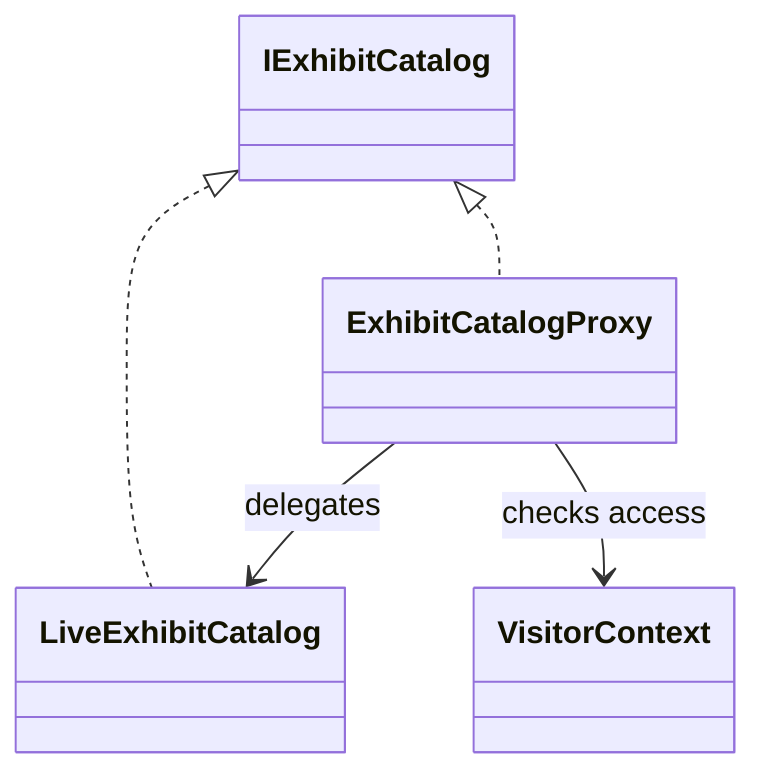

# Proxy

Proxy, gerçek nesnenin kapısında duran akıllı bir temsilci gibidir. İstek önce bu temsilciye uğrar; temsilci de duruma göre erişim izni verir, sonucu önbellekten döner, ek kayıt tutar ya da çağrıyı gerçek nesneye yönlendirir. Kısacası desenin özü şudur: **aynı arayüz korunur, ama erişim yolu daha kontrollü hale gelir.**

## Problem Tanımı

Bazı nesneler doğrudan kullanılmak için fazla pahalı, fazla hassas ya da fazla konuşkandır. Uzak bir servise giden çağrılar yavaş olabilir, her istekte yetki kontrolü gerekebilir ya da aynı veri tekrar tekrar okunuyorsa gereksiz yük oluşabilir. Bu tür durumlarda istemcinin her yerde aynı kontrol adımlarını tekrar etmesi kodu dağıtır, okunabilirliği bozar ve test etmeyi zorlaştırır.

Proxy deseni bu dağınıklığı toparlar. İstemci gerçek nesneyle konuştuğunu sanırken arada duran vekil nesne erişim kurallarını uygular ve ek davranışları tek noktada toplar.

## Ne Zaman Kullanılır?

- Erişim öncesinde yetki, kota, cache veya loglama gibi kurallar çalıştırılacaksa
- Gerçek nesne uzak bir servis, dosya sistemi ya da pahalı bir kaynakla konuşuyorsa
- Aynı arayüzü koruyup gerçek nesnenin kullanımını sınırlamak istiyorsanız
- İstemci kodunu sade tutarken teknik detayları görünmez kılmak istiyorsanız
- Testlerde gerçek bağımlılık yerine kontrollü bir vekil davranışı doğrulamak istiyorsanız

## Nasıl Çalışır?

Proxy ile gerçek nesne aynı sözleşmeyi uygular. Böylece istemci tarafında ek bir uyarlama gerekmez. İstek önce proxy'ye gelir; proxy kararını verir ve gerekirse gerçek servisi çağırır.



## Gerçek Hayattan Bir Senaryo

Bir dijital müze uygulaması düşünün. Ziyaretçiler sergideki eserlerin küçük önizlemelerini görebilir; ancak yüksek çözünürlüklü görseller yalnızca kayıtlı araştırmacılara açılır. Üstelik bu görseller uzak bir arşiv servisinden geldiği için her çağrı maliyetlidir.

Bu noktada `ExhibitCatalogProxy`, iki işi aynı anda yapar: önce ziyaretçinin yüksek çözünürlüklü içeriğe erişim hakkını kontrol eder, sonra da daha önce alınmış sonucu önbellekten döndürerek uzak servise gereksiz çağrıları engeller. İstemci kodu için ise sahnede tek bir oyuncu vardır: `IExhibitCatalog`.

## C# Örnek Kodu

```csharp
using System;
using System.Collections.Concurrent;
using System.Threading;
using System.Threading.Tasks;

namespace PatternCraft.Structural.Proxy;

/// <summary>
/// Sergi kataloğundan görsel bilgisi sağlayan sözleşmeyi tanımlar.
/// </summary>
public interface IExhibitCatalog
{
    /// <summary>
    /// Belirtilen eser için görsel bilgisini döndürür.
    /// </summary>
    /// <param name="exhibitCode">Eseri tanımlayan benzersiz kod.</param>
    /// <param name="cancellationToken">Asenkron işlemi iptal etmek için kullanılan belirteç.</param>
    /// <returns>Esere ait görsel bilgisi.</returns>
    Task<ExhibitImage> GetImageAsync(string exhibitCode, CancellationToken cancellationToken);
}

/// <summary>
/// Eser görselinin istemciye döndürülen temsilini tutar.
/// </summary>
/// <param name="ExhibitCode">Eser kodunu belirtir.</param>
/// <param name="Resolution">Görsel çözünürlüğünü belirtir.</param>
/// <param name="Source">Görselin geldiği kaynağı belirtir.</param>
public sealed record ExhibitImage(string ExhibitCode, string Resolution, string Source);

/// <summary>
/// Ziyaretçinin yüksek çözünürlüklü içeriğe erişim yetkisini taşır.
/// </summary>
/// <param name="VisitorId">Ziyaretçi kimliğini belirtir.</param>
/// <param name="CanAccessHighResolution">Yüksek çözünürlüklü içerik erişim iznini belirtir.</param>
public sealed record VisitorContext(Guid VisitorId, bool CanAccessHighResolution);

/// <summary>
/// Uzak arşiv servisinden görsel verisini çeken gerçek nesnedir.
/// </summary>
public sealed class LiveExhibitCatalog : IExhibitCatalog
{
    private const int SimulatedArchiveLatencyMs = 50;

    /// <inheritdoc />
    public async Task<ExhibitImage> GetImageAsync(string exhibitCode, CancellationToken cancellationToken)
    {
        await Task.Delay(TimeSpan.FromMilliseconds(SimulatedArchiveLatencyMs), cancellationToken);
        return new ExhibitImage(exhibitCode, "4K", "RemoteArchive");
    }
}

/// <summary>
/// Erişim kontrolü ve önbellekleme davranışını gerçek kataloğun önüne ekleyen proxy nesnesidir.
/// </summary>
public sealed class ExhibitCatalogProxy : IExhibitCatalog
{
    private readonly IExhibitCatalog _innerCatalog;
    private readonly VisitorContext _visitorContext;
    // Müze katalog kodları büyük-küçük harf farkı gözetmeden değerlendirilir.
    private readonly ConcurrentDictionary<string, ExhibitImage> _cache =
        new(StringComparer.OrdinalIgnoreCase);

    /// <summary>
    /// <see cref="ExhibitCatalogProxy"/> sınıfının yeni bir örneğini başlatır.
    /// </summary>
    /// <param name="innerCatalog">Çağrıların devredileceği gerçek katalog nesnesidir.</param>
    /// <param name="visitorContext">Geçerli ziyaretçiye ait erişim bilgisidir.</param>
    public ExhibitCatalogProxy(IExhibitCatalog innerCatalog, VisitorContext visitorContext)
    {
        _innerCatalog = innerCatalog ?? throw new ArgumentNullException(nameof(innerCatalog));
        _visitorContext = visitorContext ?? throw new ArgumentNullException(nameof(visitorContext));
    }

    /// <inheritdoc />
    public async Task<ExhibitImage> GetImageAsync(string exhibitCode, CancellationToken cancellationToken)
    {
        if (string.IsNullOrWhiteSpace(exhibitCode))
        {
            throw new ArgumentException("Exhibit code is required.", nameof(exhibitCode));
        }

        if (!_visitorContext.CanAccessHighResolution)
        {
            return new ExhibitImage(exhibitCode, "Preview", "ProxyFallback");
        }

        if (_cache.TryGetValue(exhibitCode, out var cachedImage))
        {
            return cachedImage;
        }

        var image = await _innerCatalog.GetImageAsync(exhibitCode, cancellationToken);
        _cache[exhibitCode] = image;
        return image;
    }
}
```

## Avantajlar

- Yetkilendirme, cache ve benzeri çapraz davranışları tek noktada toplar.
- İstemci ile gerçek nesne arasındaki bağımlılığı yumuşatır.
- Uzak veya pahalı kaynakların kullanımını daha kontrollü hale getirir.
- Aynı arayüz korunduğu için mevcut istemci kodunu daha az etkiler.
- Testlerde gerçek nesne yerine proxy davranışını ayrı ayrı doğrulamayı kolaylaştırır.

## Riskler ve Sınırlar

- Proxy sayısı arttıkça akışın nerede değiştiğini anlamak zorlaşabilir.
- Gereksiz kullanıldığında basit bir akışı fazla katmanlı hale getirebilir.
- Cache ya da yetki kuralları yanlış tasarlanırsa beklenmeyen veri tutarsızlıkları oluşabilir.
- Gerçek nesnenin performans sorunları bazen proxy arkasında görünmez hale gelebilir.

## Test Edilebilirlik Notları

Proxy deseni test tarafında oldukça dost canlısıdır; çünkü karar noktaları görünür hale gelir. Bu örnekte aşağıdaki senaryolar bağımsız biçimde test edilebilir:

- Yetkisi olmayan ziyaretçi için gerçek servis çağrısı yapılmadan `Preview` sonucu dönmesi
- Aynı eser iki kez istendiğinde ikinci çağrının önbellekten gelmesi
- Boş veya geçersiz eser kodunda uygun hata fırlatılması
- Yetkili ziyaretçide çağrının gerçek kataloğa devredilmesi

Bu yapı sayesinde hem proxy kararlarını hem de gerçek nesnenin kendi davranışını ayrı test paketlerinde ele almak mümkün olur.
